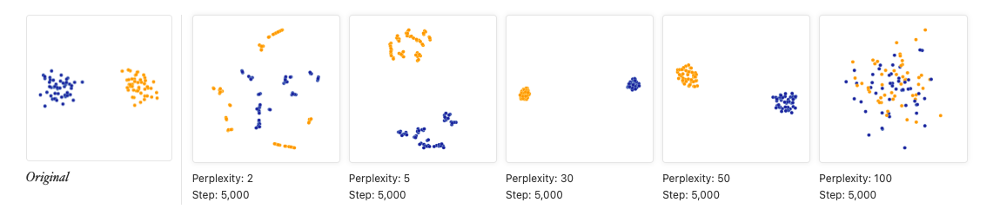
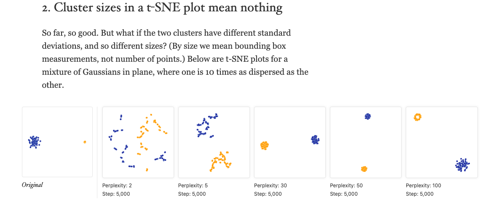
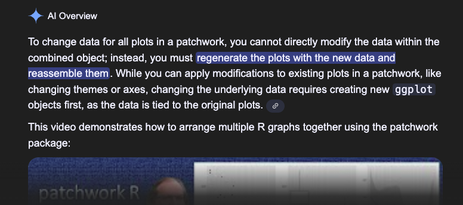
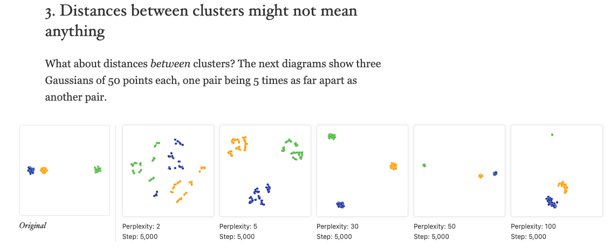
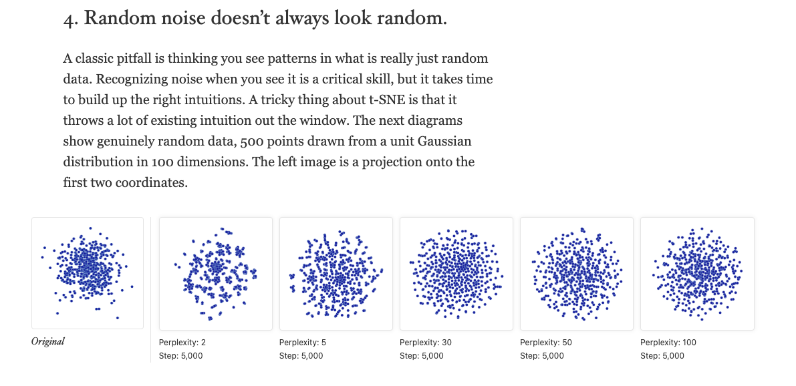

<!-- README.md is generated from README.Rmd. Please edit that file -->

```{r, include = FALSE}
knitr::opts_chunk$set(
  collapse = TRUE,
  comment = "#>"
)
```


<!-- badges: start -->

<!-- badges: end -->

```{r setup, include=FALSE}
knitr::opts_chunk$set(echo = TRUE)
options(tidyverse.quiet = TRUE)
```

## ggdims Intro Thoughts

ggplot2 lets you intuitively visualize data because you specify how each variable is to be communicated via a visual channel.   However this individual-variable-to-individual-visual-channel specification framework does not lend itself easily to the world of dimension reduction and the visualization that accompanies it. The one-var-to-one-aesthetic usual requirement means that if may not feel obvious how to extend ggplot2 for dimensionality reduction.  So even though using ggplot2 under-the-hood is common in the dim-red space, it feel like there may be less consistency across APIs, which could make getting quickly acquainted with a lot of techniques or doing comparative work more challenging that it needs to be. `ggdims` explores a new `dims()` and `dims_expand()` utility that might help with greater consistency across dim-red APIs and also with standard ggplots, and within the ggplot2 extension ecosystem.

ggdims proposes the following API:

```{r, eval = F}
ggplot(data = my_high_dimensional_data) + 
  aes(dims = dims(dim1:dim20, dim25)) +      # or similar
  geom_reduction_technique()                 # default dim-red to 2D

last_plot() + 
  aes(color = label)    # indicate category
```


## Supporting work and discussions

Here, doing some further thinking about a dimensionality reduction framework for ggplot2. Based on some previous work:  [2025-07-18](https://evamaerey.github.io/mytidytuesday/2025-07-18-seurat_tsne_plot/seurat_tsne_plot.html),   [2025-08-19](https://evamaerey.github.io/mytidytuesday/2025-08-19-umap/umap.html),   [2025-10-11](https://evamaerey.github.io/mytidytuesday/2025-10-11-ggdims/ggdims.html) and discussions    [ggplot-extension-club/discussions/117](https://github.com/ggplot2-extenders/ggplot-extension-club/discussions/117#discussioncomment-14565426) and [ggplot-extension-club/discussions/18](https://github.com/ggplot2-extenders/ggplot-extension-club/discussions/18#discussioncomment-13850709)

More related:

-   <https://distill.pub/2016/misread-tsne/>
-   McInnes Bluffer's guide <https://www.youtube.com/watch?v=9iol3Lk6kyU>
-   <https://satijalab.org/seurat/articles/seurat5_sketch_analysis>
-   McInnes Learning from Machine Learning <https://www.youtube.com/watch?v=6sSOr2Yaq80&t=759s>
-   <https://embed.tidymodels.org/>
- https://vimeo.com/483185503?fl=pl&fe=sh

This is in the experimental/proof of concept phase. 🤔🚧

## An implementation

<details>

```{r}
library(tidyverse)

dims <- function(...){}

iris |> 
  ggplot() + 
  aes(dims = dims(Sepal.Length:Sepal.Width, Petal.Width))

last_plot()$mapping
```

### but we need these expanded out

Our syntax will actually use mvars, specifying each variable individually and vars_unpack within our computation.

```{r, eval = F}
iris |> 
  ggplot() + 
  aes(dims = 
        mvars(Sepal.Length, Sepal.Width, 
                Petal.Length, Petal.Width),
      fill = Species) +
  geom_tsne0()

```

```{r}
mvars <- function(...) {
  
  varnames <- as.character(ensyms(...))
  vars <- list(...)
  listvec <- asplit(do.call(cbind, vars), 1)
  structure(listvec, varnames = varnames)

  }

vars_unpack <- function(x) {
  pca_vars <- x
  df <- do.call(rbind, pca_vars)
  colnames(df) <- attr(pca_vars, "varnames")
  as.data.frame(df)
  
}
```

### so let's use some ggplot_add to try to expand, and have these vars listed out individually

```{r}
iris |> 
  ggplot() + 
  aes(dims = dims(Sepal.Length:Petal.Length, Petal.Width))

p <- last_plot()

p$mapping$dims[[2]]  # the unexpanded expression

p$mapping$dims |> 
  as.character() |> 
  _[2] |> 
  stringr::str_extract("\\(.+") |> 
  stringr::str_remove_all("\\(|\\)") -> 
selected_var_names_expr

selected_var_names <- 
  selected_var_names_expr |> 
  str_split(", ") |> 
  _[[1]]
  
var_names <- c()

for(i in 1:length(selected_var_names)){

  new_var_names <- select(last_plot()$data, !!!list(rlang::parse_expr(selected_var_names[i]))) |> names()
  
var_names <- c(var_names, new_var_names)
  
}

expanded_vars <- var_names |> paste(collapse = ", ") 

new_dim_expr <- paste("mvars(", expanded_vars, ")")

p$mapping$dims[[2]] <- rlang::parse_expr(new_dim_expr)

p$mapping$dims[[2]]


```

### dims_expand

```{r}
#' @export
dims_expand <- function() {

  structure(
    list(
      # data_spec = data,
         # vars_spec = rlang::enquo(vars)
         ), 
    class = "dims_expand"
    )

}

#' @import ggplot2
#' @importFrom ggplot2 ggplot_add
#' @export
ggplot_add.dims_expand <- function(object, plot, object_name) {
  
plot$mapping$dims |> 
  as.character() |> 
  _[2] |> 
  stringr::str_extract("\\(.+") |> 
  stringr::str_remove_all("\\(|\\)") -> 
selected_var_names_expr

selected_var_names <- 
  selected_var_names_expr |> 
  str_split(", ") |> 
  _[[1]]
  
var_names <- c()

for(i in 1:length(selected_var_names)){

  new_var_names <- select(plot$data, !!!list(rlang::parse_expr(selected_var_names[i]))) |> names()
  
var_names <- c(var_names, new_var_names)
  
}

expanded_vars <- var_names |> paste(collapse = ", ") 

new_dim_expr <- paste("mvars(", expanded_vars, ")")

plot$mapping$dims[[2]] <- rlang::parse_expr(new_dim_expr)

plot

}
```

</details>

```{r}
p <- iris |> 
  ggplot() + 
  aes(dims = dims(Sepal.Length:Petal.Length, Petal.Width)) + 
  dims_expand()

p$mapping
```

## compute_tsne, geom_tsne

<details>

```{r}
# compute_tsne0 allows individually listed variables that are all of the same type
compute_tsne0 <- function(data, scales, perplexity = 20){
  
  set.seed(1345)
  
# identify duplicates just based on tsne data
data |>
  select(dims) |>
  mutate(vars_unpack(dims)) |>
  select(-dims) ->
data_unpacked ; data_unpacked

names_predictors <- names(data_unpacked); names_predictors

data_unpacked |>
   duplicated() ->
dups ; dups
# #
# # #
data_unpacked |>
    bind_cols(data) |>
     _[!dups,] |> 
  remove_missing() ->
clean_data ; clean_data
# # # 
clean_data |>
  _[names_predictors] |>
  as.matrix() |>
  Rtsne::Rtsne(perplexity = perplexity) |>
  _$Y |>
  as_tibble() |>
 rename(x = V1, y = V2) |>
 bind_cols(clean_data)
#   

}


iris |> 
  mutate(dims = mvars(Sepal.Length, Sepal.Width, 
                Petal.Length, Petal.Width)) |>
  select(dims) |>
  compute_tsne0()
  

StatTsne0 <- ggproto("StatTsne0", Stat, 
                     compute_panel = compute_tsne0)

GeomPointFill <- ggproto("GeomPointFill", 
                         GeomPoint,
                         default_aes = 
                           modifyList(GeomPoint$default_aes, 
                                      aes(shape = 21, 
                                          color = from_theme(paper),
                                          size = from_theme(pointsize * 2.5),
                                          alpha = .7,
                                          fill = from_theme(ink))))

geom_tsne0 <- make_constructor(GeomPointFill, stat = StatTsne0, perplexity = 30)

iris |> 
  ggplot() + 
  aes(dims = 
        mvars(Sepal.Length, Sepal.Width, 
                Petal.Length, Petal.Width),
      fill = Species) +
  geom_tsne0()


p$mapping$dims
p + 
  geom_tsne0() + 
  aes(fill = Species)


theme_dims <- function(ink = "black", paper = "white"){
  
  theme_grey() +
    theme(panel.background = element_blank(),
          panel.grid = element_blank(),
          axis.text = element_blank(),
          axis.ticks = element_blank(),
          panel.border = element_rect(color = ink) 
          )
  
}
```

```{r}
geom_tsne <- function(...){
  list(
    dims_expand(),
    geom_tsne0(...)
  )
}
```

</details>

```{r, fig.show='hold'}
iris |> 
  ggplot() + 
  aes(dims = dims(Sepal.Length:Petal.Length, Petal.Width)) +
  geom_tsne()

last_plot() + 
  aes(fill = Species)
```

### Different perplexity

```{r}
iris |> 
  ggplot() + 
  aes(dims = dims(Sepal.Length:Petal.Length, Petal.Width),
      fill = Species) +
  geom_tsne(perplexity = 10)
```

# A little UMAP

<details>

```{r}
compute_umap <- function(data, scales, n_components = 2, random_state = 15){
  
set.seed(1345)
  
# identify duplicates just based on tsne data
data |>
  select(dims) |>
  mutate(vars_unpack(dims)) |>
  select(-dims) ->
data_unpacked ; data_unpacked

names_predictors <- names(data_unpacked); names_predictors

data_unpacked |>
    bind_cols(data) |>
  remove_missing() ->
clean_data ; clean_data

# # # 
clean_data |>
  _[names_predictors] |>
  umap::umap(n_components = n_components, random_state = random_state)  |>
  _$layout |>
  as_tibble() |>
 rename(x = V1, y = V2) |>
 bind_cols(clean_data)
#   

}

iris |> 
  mutate(dims = 
        mvars(Sepal.Length, Sepal.Width, 
                Petal.Length, Petal.Width)) |>
  select(color = Species, dims) |>
  compute_umap()

StatUmap <- ggproto("StatUmap", Stat, 
                     compute_panel = compute_umap)

geom_umap0 <- make_constructor(GeomPointFill, stat = StatUmap, random_state = 15, n_components = 4)

geom_umap <- function(...){
  
  list(dims_expand(), 
       geom_umap0())
  
}
```

</details>

```{r}
iris |> 
  ggplot() + 
  aes(dims = dims(Sepal.Length:Petal.Width)) + 
  geom_umap()

last_plot() + 
  aes(fill = Species)

```

------------------------------------------------------------------------

# Try to reproduce some of observations and figures in the Distill paper: 'How to Use t-SNE Effectively' <https://distill.pub/2016/misread-tsne/>

### 1. 'Those hyperparameters really matter'

Let's try to reproduce the following with our `geom_tsne()`:



```{r}
hello_world_of_tsne <- data.frame(dim1 = rnorm(200) + 
                                    c(rep(-5, 100), rep(5, 100)),
                                  dim2 = rnorm(200),
                                  type = c(rep("A", 100), rep("B", 100)))

original <- hello_world_of_tsne |>
  ggplot() + 
  aes(x = dim1, 
      y = dim2) + 
  geom_point(shape = 21, color = "white",
             alpha = .5) + 
  labs(title = "Original") + 
  aes(fill = I("black"))

pp2 <- ggplot(data = hello_world_of_tsne) + 
  aes(dims = dims(dim1:dim2)) +
  geom_tsne(perplexity = 2) + 
  labs(title = "perplexity = 2"); pp2

pp5 <- ggplot(data = hello_world_of_tsne) + 
  aes(dims = dims(dim1:dim2)) +
  geom_tsne(perplexity = 5) + 
  labs(title = "perplexity = 5"); pp5

pp30 <- ggplot(data = hello_world_of_tsne) + 
  aes(dims = dims(dim1:dim2)) +
  geom_tsne(perplexity = 30) + 
  labs(title = "perplexity = 30"); pp30

pp50 <- ggplot(data = hello_world_of_tsne) + 
  aes(dims = dims(dim1:dim2)) +
  geom_tsne(perplexity = 50) + 
  labs(title = "perplexity = 50")

pp100 <- ggplot(data = hello_world_of_tsne) + 
  aes(dims = dims(dim1:dim2)) +
  geom_tsne(perplexity = 100) + 
  labs(title = "perplexity = 100")


library(patchwork)
original + pp2 + pp5 + pp30 + pp50 + pp100

# with group id
last_plot() & 
  aes(fill = type) &
  guides(fill = "none") &
  theme_dims() 


panel_of_six_tsne_two_cluster <- last_plot()

```

### 2. 'Cluster sizes in a t-SNE plot mean nothing'

Let's try to reproduce this (we'll shortcut but switching out the data across plot specifications): 

```{r}
big_and_small_cluster <- data.frame(dim1 = c(rnorm(100), rnorm(100, sd = .1)) + 
                                    c(rep(-5, 100), rep(5, 100)),
                                  dim2 = c(rnorm(100), rnorm(100, sd = .1)),
                                  type = c(rep("A", 100), rep("B", 100)))


panel_of_six_tsne_two_cluster & 
  ggplyr::data_replace(big_and_small_cluster)

```

#### Side note on ggplyr::data_replace  X google gemini quick search



### 3. 'Distances between clusters might not mean anything'

Now let's look at these three clusters, where one cluster is far out:



```{r}
two_close_and_one_far <- data.frame(dim1 = rnorm(150) + 
                                    c(rep(-5, 50), 
                                      rep(5, 50),
                                      rep(50, 50)),
                                    dim2 = rnorm(150),
                                    type = c(rep("A", 50), 
                                           rep("B", 50),
                                           rep("C", 50)))

panel_of_six_tsne_two_cluster & 
  ggplyr::data_replace(two_close_and_one_far)

```

### 4. 'Random noise doesn't always look random'



```{r}
random_noise <- data.frame(dim1 = rnorm(500),
                           dim2 = rnorm(500))

original + pp2 + pp5 + pp30 + pp50 + pp100 & 
  ggplyr::data_replace(random_noise) &
  aes(fill = I("darkblue")) &
  theme_dims()


```

------------------------------------------------------------------------

```{r, eval = F, echo = F}
palmerpenguins::penguins |> 
  sample_n(size = 200) |>
  remove_missing() |> 
  ggplot() + 
  aes(dims = dims(bill_length_mm:body_mass_g)) + 
  geom_umap() 

last_plot() + 
  aes(fill = species)
```

```{r, eval = F, echo = F}
unvotes::un_votes |> 
  mutate(num_vote = case_when(vote == "yes" ~ 1,
                              vote == "abstain" ~ .5,
                              vote == "no" ~ 0,
                              TRUE ~ .5 )) |>
  # filter(rcid %in% 1:30) |>
  pivot_wider(id_cols = c(country, country_code),
    names_from = rcid, 
              values_from = num_vote,
              values_fill = .5
            ) |>
  mutate(continent = country_code |> 
           countrycode::countrycode(origin = "iso2c", destination = "continent")) |>
  mutate(continent = continent |> is.na() |> ifelse("unknown", continent)) ->
un_ga_country_wide_rcid

names(un_ga_country_wide_rcid) <- paste0("rcid", names(un_ga_country_wide_rcid))
  

unvotes::un_votes$rcid |> max()

un_ga_country_wide_rcid |>
  ggplot() + 
  aes(dims = dims(rcid3:rcid9147)) + 
  geom_umap() +
  aes(fill = rcidcontinent)


```

------------------------------------------------------------------------
