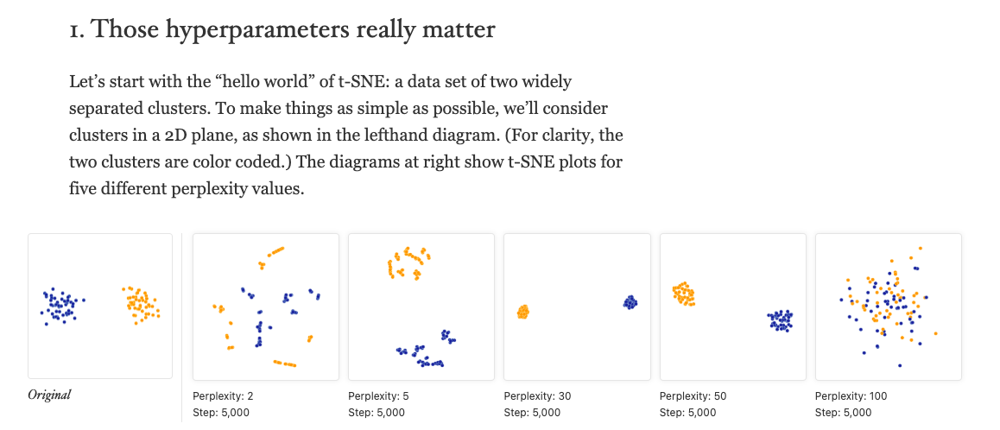
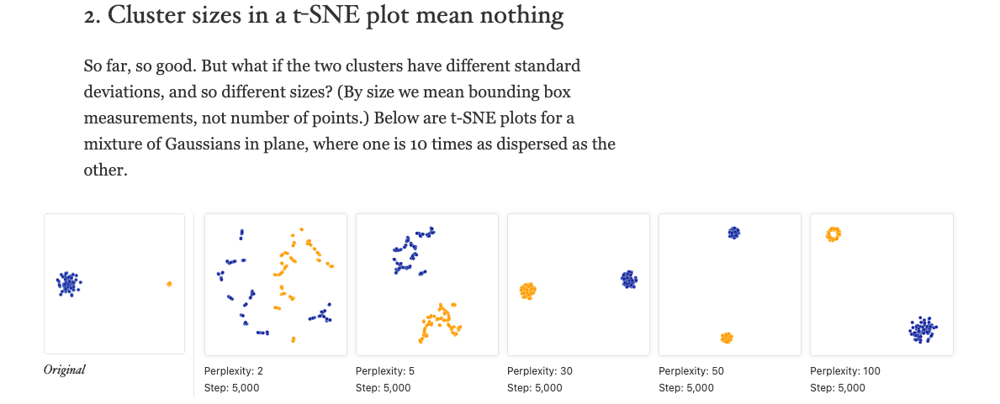
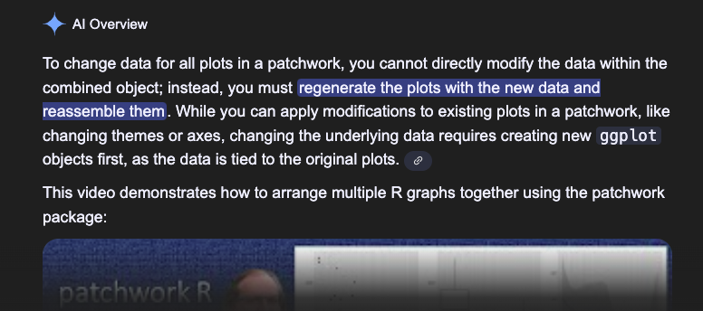
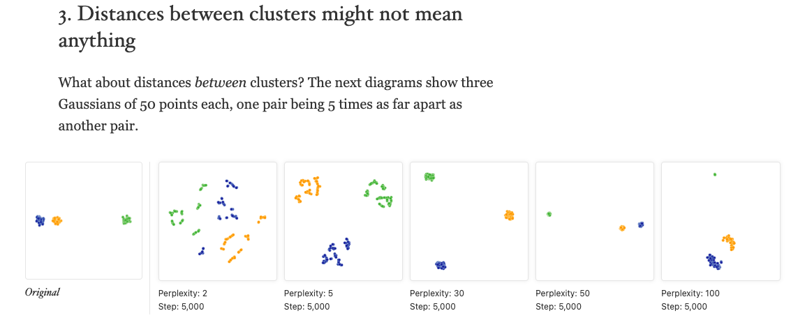
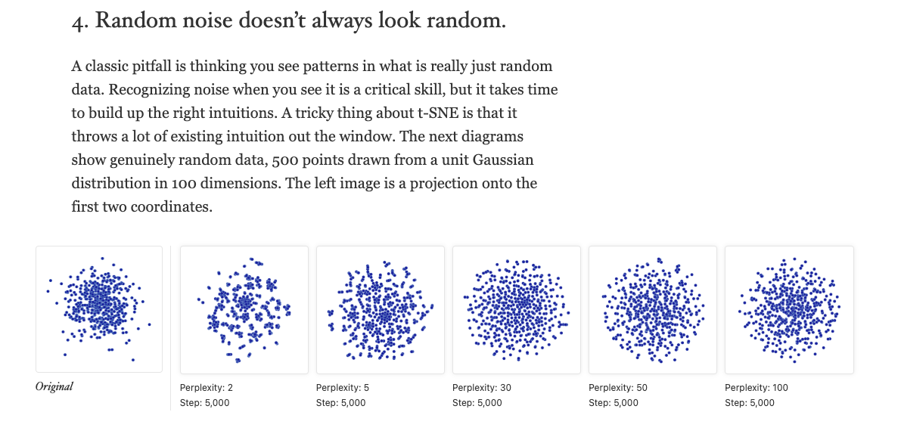

<!-- README.md is generated from README.Rmd. Please edit that file -->

```{r, include = FALSE}
knitr::opts_chunk$set(
  collapse = TRUE,
  comment = "#>",
  out.width = "55%",
  cache = F,
  warning = F,
  message = F
)
```

<!-- badges: start -->

<!-- badges: end -->

```{r setup, include=FALSE}
knitr::opts_chunk$set(echo = TRUE)
options(tidyverse.quiet = TRUE)
```

Go to [talk](https://evamaerey.github.io/ggdims/asa-cowy-fall-2025)

## ggdims Intro Thoughts

ggplot2 lets you intuitively translate variables to visual representation. You specify how variables (e.g. sex, age, employment status) are to be communicated via visual channels (x and y axis position, color, transparency, etc). However, in ggplot2 these specifications are individual-variable-to-individual-visual-channel which does not lend itself easily to visualizations in the world of dimension reduction (e.g. PCA, t-SNE, umap). The usual one-var-to-one-aesthetic requirement means that it may not feel obvious how to extend ggplot2 for dimensionality reduction visualization, which deals with characterizing *many* variables. So while using ggplot2 under-the-hood is common in the dim-red space, it feels like there may be less consistency across dim-red APIs. For users of these APIs, getting quickly acquainted with techniques (students) or doing comparative work (practitioners) may be more challenging than it needs to be. The {ggdims} package explores a new `dims()` and `dims_expand()` utility that could help with greater consistency across dim-red APIs, with standard ggplots, and within the ggplot2 extension ecosystem.

ggdims proposes the following API:

```{r, eval = F}
library(ggplot2)

ggplot(data = my_high_dimensional_data) + 
  aes(dims = dims(var1:var200, var205)) +      # or similar
  geom_reduction_technique()                 # default dim-red to 2D

last_plot() + 
  aes(color = label)    # indicate category
```

## Supporting work and discussions

Here, doing some further thinking about a dimensionality reduction framework for ggplot2. Based on some previous work: [2025-07-18](https://evamaerey.github.io/mytidytuesday/2025-07-18-seurat_tsne_plot/seurat_tsne_plot.html), [2025-08-19](https://evamaerey.github.io/mytidytuesday/2025-08-19-umap/umap.html), [2025-10-11](https://evamaerey.github.io/mytidytuesday/2025-10-11-ggdims/ggdims.html) and discussions [ggplot-extension-club/discussions/117](https://github.com/ggplot2-extenders/ggplot-extension-club/discussions/117#discussioncomment-14565426) and [ggplot-extension-club/discussions/18](https://github.com/ggplot2-extenders/ggplot-extension-club/discussions/18#discussioncomment-13850709)


```{r, warning=F, message=F}
library(tidyverse)

ggplot(data = cars) + 
  aes(x = speed, y = dist) ->
data_and_vars_plot_specs  
  
data_and_vars_plot_specs +
  geom_point() 
```


# examples... 

```{r, echo = F, message=F, warning=F}
library(tidyverse)

unvotes::un_votes |> 
  arrange(rcid) |>
  mutate(rcid = paste0("rc",rcid) |> fct_inorder()) |>
  mutate(num_vote = case_when(vote == "yes" ~ 1,
                              vote == "abstain" ~ .5,
                              vote == "no" ~ 0,
                              TRUE ~ .5 )) |>
  # filter(rcid %in% 1:30) |>
  pivot_wider(id_cols = c(country, country_code),
    names_from = rcid, 
              values_from = num_vote,
              values_fill = .5
            ) |>
  mutate(continent = country_code |> 
           countrycode::countrycode(origin = "iso2c", destination = "continent")) |>
  mutate(continent = continent |> is.na() |> ifelse("unknown", continent)) ->
unga_rcid_wide


names(unga_rcid_wide) |> tail()
```

```{r, out.width="100%"}
library(ggdims)

unga_rcid_wide[1:5, 1:5]

unga_pca <- unga_rcid_wide |>
  ggplot() + 
  aes(dims = dims(rc3:rc9147)) +
  geom_pca() + 
  aes(fill = continent) +
  labs(title = "PCA")

```

```{r}
unga_tsne <- ggplot(unga_rcid_wide) + 
  aes(dims = dims(rc3:rc9147)) +
  geom_tsne() + 
  aes(fill = continent) +
  labs(title = "t-SNE")
```

```{r}
unga_umap <- 
  ggplot(unga_rcid_wide) + 
  aes(dims = dims(rc3:rc9147)) +
  geom_umap() + 
  aes(fill = continent) +
  labs(title = "UMAP")
```

```{r, fig.width=10, fig.height=4}
library(patchwork)
unga_pca + unga_tsne + unga_umap + 
  plot_layout(guides = "collect") + 
  plot_annotation(title = "UN General Assembly voting country projections")
```


---

This is in the experimental/proof of concept phase. 🤔🚧

## An implementation

<details>

### `aes(dims = ?)` lets us capture an expression...

```{r}
library(tidyverse)

dims <- function(...){}

aes(dims = dims(Sepal.Length:Sepal.Width, Petal.Width))
```

Which means we can write something like this...

```{r, eval = F}
iris |> 
  ggplot() + 
  aes(dims = dims(Sepal.Length:Sepal.Width, Petal.Width)) + 
  geom_computation()
```

And maybe actually use an implied set of variables in our computation...

### To expanded to the `:` referenced variables...

Our strategy will actually use `dims_listed()` which takes vars individually specified, as described [here](https://github.com/ggplot2-extenders/ggplot-extension-club/discussions/18#discussioncomment-10219152). Then we'll `vars_unpack()` within our computation.

```{r, eval = F}
iris |> 
  ggplot() + 
  aes(dims = 
        dims_listed(Sepal.Length, Sepal.Width, 
                    Petal.Length, Petal.Width),
      fill = Species) +
  geom_tsne()
```

</details>

### so let's use some ggplot_add to try to expand, and have these individually specified vars

<details>

### an exercise/experiment

```{r}
library(tidyverse)

iris |> 
  ggplot() + 
  aes(dims = dims(Sepal.Length:Petal.Length, Petal.Width))


p <- last_plot()

p$mapping$dims[[2]]  # the unexpanded expression

p$mapping$dims |> 
  as.character() |> 
  _[2] |> 
  stringr::str_extract("\\(.+") |> 
  stringr::str_remove_all("\\(|\\)") -> 
selected_var_names_expr

selected_var_names <- 
  selected_var_names_expr |> 
  str_split(", ") |> 
  _[[1]]
  
var_names <- c()

for(i in 1:length(selected_var_names)){

  new_var_names <- select(last_plot()$data, !!!list(rlang::parse_expr(selected_var_names[i]))) |> names()
  
var_names <- c(var_names, new_var_names)
  
}

expanded_vars <- var_names |> paste(collapse = ", ") 

new_dim_expr <- paste("dims_listed(", expanded_vars, ")")

p$mapping <- modifyList(p$mapping, aes(dims0 = pi()))

p$mapping$dims0[[2]] <- rlang::parse_expr(new_dim_expr)

p$mapping$dims0[[2]]


```

</details>

### `dims_expand`

<details>

```{r dims_expand}
#' @export
dims <- function(...){}

#' @export
dims_expand <- function() {

  structure(
    list(), 
    class = "dims_expand"
    )

}

#' @import ggplot2
#' @importFrom ggplot2 ggplot_add
#' @export
ggplot_add.dims_expand <- function(object, plot, object_name) {
  
plot$mapping$dims |> 
  as.character() |> 
  _[2] |> 
  stringr::str_extract("\\(.+") |> 
  stringr::str_remove_all("\\(|\\)") -> 
selected_var_names_expr

selected_var_names <- 
  selected_var_names_expr |> 
  str_split(", ") |> 
  _[[1]]
  
var_names <- c()

for(i in 1:length(selected_var_names)){

  new_var_names <- select(plot$data,
                      !!!list(rlang::parse_expr(selected_var_names[i]))) |>
    names()
  
var_names <- c(var_names, new_var_names)
  
}

expanded_vars <- var_names |> paste(collapse = ", ") 

new_dim_expr <- paste("dims_listed(", expanded_vars, ")")

plot$mapping$dims[[2]] <- rlang::parse_expr(new_dim_expr)

plot

}
```

</details>

```{r}
p <- iris |> 
  ggplot() + 
  aes(dims = dims(Sepal.Length:Petal.Length, Petal.Width)) + 
  dims_expand()


p$mapping
```

## Now let's actually define `dims_listed()` and `vars_unpack`

<details>

```{r dims_listed}
#' @export
dims_listed <- function(...) {
  
  varnames <- as.character(ensyms(...))
  vars <- list(...)
  listvec <- asplit(do.call(cbind, vars), 1)
  structure(listvec, varnames = varnames)

  }

#' @export
vars_unpack <- function(x) {
  pack_vars <- x
  df <- do.call(rbind, pack_vars)
  colnames(df) <- attr(pack_vars, "varnames")
  as.data.frame(df)
  
}
```

```{r data_vars_unpack}
# utility uses data with the required aes 'dims'
#' @export
data_vars_unpack <- function(data){

# identify duplicates just based on tsne data
data |>
  select(dims) |>
  mutate(vars_unpack(dims)) |>
  select(-dims)

}
```

</details>


# compute_tsne, geom_tsne, using [`Rtsne::Rtsne`](https://github.com/jkrijthe/Rtsne)

<details>

```{r aaa_GeomPointFill}
#' @export
GeomPointFill <- ggproto("GeomPointFill", 
                         GeomPoint,
                         default_aes = 
                           modifyList(GeomPoint$default_aes, 
                                      aes(shape = 21, 
                                          color = from_theme(paper),
                                          size = from_theme(pointsize * 1.5),
                                          alpha = .7,
                                          fill = from_theme(ink))))
```

```{r compute_tsne}
tsne_layout_2d <- function(data, perplexity){
  
  data |> 
    as.matrix() |>
    Rtsne::Rtsne(perplexity = perplexity) |>
    _$Y |>
    as_tibble() |>
    rename(x = V1, y = V2)
  
}


# compute_tsne allows individually listed variables that are all of the same type
#' @export
compute_tsne <- function(data, scales, perplexity = 20){
  
  features <- data_vars_unpack(data)
  non_feature_data <- data |> dplyr::select(-dims)

  # allowable for dimred
  ind_not_dup <- !duplicated(features)
  ind_no_missing <- complete.cases(features)
  
  ind_allowed <- ind_not_dup & ind_no_missing

  set.seed(1345)
  features |>
    _[ind_allowed, ] |>
    tsne_layout_2d(perplexity = perplexity)  |>
    bind_cols(non_feature_data |>
                bind_cols(features) |>
                _[ind_allowed, ])

}

#' @export
compute_tsne_group_label <- function(data, scales, perplexity = 20, fun = mean){
  
  compute_tsne(data, scales, perplexity) |> 
    summarise(x = fun(x),
              y = fun(y),
              .by = label)
  
}

#' @export
StatTsne <- ggproto("StatTsne", Stat, 
                     compute_panel = compute_tsne)

#' @export
StatTsneGroup <- ggproto("StatTsneGroup", Stat, 
                         compute_panel = compute_tsne_group_label)


#' @export
geom_tsne0 <- make_constructor(GeomPointFill, 
                               stat = StatTsne, 
                               perplexity = 30)

#' @export
geom_tsne_label0 <- make_constructor(GeomLabel, 
                                     stat = StatTsneGroup,
                                     perplexity = 30)
```

```{r}
iris |> 
  mutate(dims = dims_listed(Sepal.Length, Sepal.Width, 
                Petal.Length, Petal.Width)) |>
  select(dims) |>
  compute_tsne()

iris |> 
  mutate(dims = dims_listed(Sepal.Length, Sepal.Width, 
                Petal.Length, Petal.Width)) |>
  select(dims, label = Species) |>
  compute_tsne_group_label()

```

```{r}
iris |> 
  ggplot() + 
  aes(dims = 
        dims_listed(Sepal.Length, Sepal.Width, 
                Petal.Length, Petal.Width),
      fill = Species,
      label = Species
      ) +
  geom_tsne0() + 
  geom_tsne_label0()


p$mapping$dims
p + 
  geom_tsne0() + 
  aes(fill = Species)
```

```{r theme_ggdims}
#' @export
theme_ggdims <- function(ink = "black", paper = "white"){
  
  theme_grey() +
    theme(panel.background = element_blank(),
          panel.grid = element_blank(),
          axis.text = element_blank(),
          axis.ticks = element_blank(),
          panel.border = element_rect(color = ink) 
          )
  
}
```

```{r geom_tsne}
#' @export
geom_tsne <- function(...){
  list(
    dims_expand(),
    geom_tsne0(...)
  )
}

#' @export
geom_tsne_label <- function(...){
  list(
    dims_expand(),
    geom_tsne_label0(...)
  )
}
```

</details>

```{r}
iris |> 
  ggplot() + 
  aes(dims = dims(Sepal.Length:Petal.Length, Petal.Width)) +
  geom_tsne()


last_plot() + 
  aes(fill = Species) 

last_plot() + 
  aes(label = Species) + 
  geom_tsne_label()
```

### Different perplexity

```{r}
iris |> 
  ggplot() + 
  aes(dims = dims(Sepal.Length:Petal.Length, Petal.Width),
      fill = Species) +
  geom_tsne(perplexity = 10)
```


# 'How to Use t-SNE Effectively' reproduction exercise

Try to reproduce some of observations and figures in the Distill paper: 'How to Use t-SNE Effectively' <https://distill.pub/2016/misread-tsne/> with some verbatim visuals from the paper.

```{r}
knitr::opts_chunk$set(out.width = NULL, fig.show = "asis")
```

### 1. 'Those hyperparameters really matter'

{width="900"}

<details>

```{r data-prep}
two_clusters <- data.frame(dim1 = 
                                    rnorm(101, mean = -.5,
                                          sd = .1) |>
                                    c(rnorm(101, mean = .5,
                                            sd = .1)),
                                   
                                  dim2 = rnorm(202, sd = .1),
                                  type = c(rep("A", 101), rep("B", 101)))


big_and_small_cluster <- data.frame(dim1 = c(rnorm(100, -.5, sd = .1),
                                             rnorm(100, .7, sd = .03)),
                                  dim2 = c(rnorm(100, sd = .1), 
                                           rnorm(100, sd = .03)),
                                  type = c(rep("A", 100), rep("B", 100)))


two_close_and_one_far <- data.frame(dim1 = 
                                    c(rnorm(150, -.75, .05), 
                                      rnorm(150, -.35, .05),
                                      rnorm(150, .75, .05)),
                                    dim2 = rnorm(450, sd = .05),
                                    type = c(rep("A", 150), 
                                           rep("B", 150),
                                           rep("C", 150)))

random_noise <- data.frame(dim1 = rnorm(500, sd = .3),
                           dim2 = rnorm(500, sd = .3),
                           type = "A")

```


```{r}
usethis::use_data(two_clusters, overwrite = T)
usethis::use_data(big_and_small_cluster, overwrite = T)
usethis::use_data(two_close_and_one_far, overwrite = T)
usethis::use_data(random_noise, overwrite = T)
```

</details>

Let's try to reproduce the following with our `geom_tsne()`:

```{r}
head(two_clusters)

pp2 <- ggplot(data = two_clusters) + 
  aes(dims = dims(dim1:dim2)) +
  geom_tsne(perplexity = 2) + 
  labs(title = "perplexity = 2")

pp5 <- ggplot(data = two_clusters) + 
  aes(dims = dims(dim1:dim2)) +
  geom_tsne(perplexity = 5) + 
  labs(title = "perplexity = 5")

pp30 <- ggplot(data = two_clusters) + 
  aes(dims = dims(dim1:dim2)) +
  geom_tsne(perplexity = 30) + 
  labs(title = "perplexity = 30")
```


<details>

```{r}
pp50 <- ggplot(data = two_clusters) + 
  aes(dims = dims(dim1:dim2)) +
  geom_tsne(perplexity = 50) + 
  labs(title = "perplexity = 50")

pp100 <- ggplot(data = two_clusters) + 
  aes(dims = dims(dim1:dim2)) +
  geom_tsne(perplexity = 100) + 
  labs(title = "perplexity = 100")

original <- two_clusters |>
  ggplot() + 
  aes(x = dim1, 
      y = dim2) + 
  geom_point(shape = 21, color = "white",
             alpha = .7, 
             aes(size = from_theme(pointsize * 1.5))) + 
  labs(title = "Original") + 
  aes(fill = I("black")) + 
  coord_equal(xlim = c(-1,1), ylim = c(-1,1))


```

</details>


```{r}
library(patchwork)
original + pp2 + pp5 + pp30 + pp50 + pp100 &
  theme_ggdims() 

# with group id
last_plot() & 
  aes(fill = type) &
  scale_fill_manual(values = c("darkblue", "darkgoldenrod1", "seagreen")) &
  guides(fill = "none")


panel_of_six_tsne_two_cluster <- last_plot()

```

### 2. 'Cluster sizes in a t-SNE plot mean nothing'

Let's try to reproduce this (we'll shortcut but switching out the data across plot specifications): 

```{r}
panel_of_six_tsne_two_cluster & 
  big_and_small_cluster

```

<!-- #### Side note on ggplyr::data_replace X google gemini quick search -->

<!--  -->

### 3. 'Distances between clusters might not mean anything'

Now let's look at these three clusters, where one cluster is far out:

{width="900"}

```{r}


panel_of_six_tsne_two_cluster & 
  two_close_and_one_far

```

### 4. 'Random noise doesn't always look random'



```{r}
panel_of_six_tsne_two_cluster & 
  random_noise
```


# A little UMAP using [`umap::umap`](https://github.com/tkonopka/umap)

<details>

```{r compute_umap}
umap_layout_2d <- function(data, n_components = 2, random_state = 15){
  
  data |> 
  umap::umap(n_components = n_components, 
             random_state = random_state)  |>
  _$layout |>
  as_tibble() |>
 rename(x = V1, y = V2) 
  
  
}


#' @export
compute_umap <- function(data, scales, n_components = 2, random_state = 15){
  
features <- data_vars_unpack(data)

clean_data <- features |>
  bind_cols(data) |>
  remove_missing()

set.seed(1345)
clean_data |>
 _[names(features)] |>
 umap_layout_2d(n_components, random_state) |>
 bind_cols(clean_data)

}

#' @export
StatUmap <- ggproto("StatUmap", 
                    Stat, 
                    compute_panel = compute_umap)

#' @export
geom_umap0 <- make_constructor(GeomPointFill, stat = StatUmap, random_state = 15, n_components = 4)


#' @export
geom_umap <- function(...){
  
  list(dims_expand(), 
       geom_umap0(...))
  
}
```

</details>

```{r}
iris |> 
  mutate(dims = 
        dims_listed(Sepal.Length, Sepal.Width, 
                Petal.Length, Petal.Width)) |>
  select(color = Species, dims) |>
  compute_umap()


iris |> 
  ggplot() + 
  aes(dims = dims(Sepal.Length:Petal.Width)) + 
  geom_umap()

last_plot() + 
  aes(fill = Species)

```

# A little PCA using `ordr::ordinate`

<details>

```{r compute_pca_rows}
pca_layout <- function(data){
  
  data |>
  ordr::ordinate(model = ~ prcomp(., scale. = TRUE)) |> 
  _[[5]] |> 
  as_tibble()
  
}


#' @export
compute_pca_rows <- function(data, scales){
  
  data_for_reduction <- data_vars_unpack(data)

clean_data <- data_for_reduction |>
  bind_cols(data) |>
  remove_missing()

set.seed(1345)

clean_data |>
  _[names(data_for_reduction)] |>
  pca_layout() |>
 bind_cols(clean_data)

}

#' @export
StatPcaRows <- ggproto("StatPcaRows", Stat,
                    compute_panel = compute_pca_rows,
                    default_aes = aes(x = after_stat(PC1), 
                                      y = after_stat(PC2))
                    )
#' @export
geom_pca0 <- make_constructor(GeomPointFill, stat = StatPcaRows)

#' @export
stat_pca0 <- make_constructor(StatPcaRows, geom = GeomPointFill)


#' @export
geom_pca <- function(...){
  
  list(
    dims_expand(),
    geom_pca0(...)
  )
  
}

#' @export
stat_pca <- function(...){
  
  list(
    dims_expand(),
    stat_pca0(...)
  )
  
}

```

```{r}

iris |> 
  mutate(dims = 
        dims_listed(Sepal.Length, Sepal.Width, 
                    Petal.Length, Petal.Width)) |>
  select(color = Species, dims) |>
  compute_pca_rows() 

```

</details>

```{r}
iris |> 
  ggplot() + 
  aes(dims = dims(Sepal.Length:Petal.Width)) + 
  geom_pca()

last_plot() + 
  aes(fill = Species)


last_plot() + 
  aes(y = after_stat(PC3))
```

```{r}
library(ggdims)

iris |> 
  ggplot() + 
  aes(dims = dims(Sepal.Length:Petal.Width)) + 
  geom_pca() + 
  aes(fill = Species) ->
iris_pca; iris_pca

ggplyr::last_plot_wipe() + 
  geom_tsne() ->
iris_tsne; iris_tsne

ggplyr::last_plot_wipe() + 
  geom_umap() ->
iris_umap; iris_umap
```

```{r, fig.width = 10, fig.height=4}
library(patchwork)
iris_pca + iris_tsne + iris_umap + patchwork::plot_layout(guides = "collect")
```

### w/ penguins

```{r}
palmerpenguins::penguins |>
  ggplot() +
  aes(dims = dims(bill_length_mm:body_mass_g)) +
  geom_pca()

last_plot() +
  aes(fill = species)

```


# UNGA voting patterns through PCA, t-SNE, and UMAP lenses

<details>

```{r}
unvotes::un_votes |> 
  arrange(rcid) |>
  mutate(rcid = paste0("rc",rcid) |> fct_inorder()) |>
  mutate(num_vote = case_when(vote == "yes" ~ 1,
                              vote == "abstain" ~ .5,
                              vote == "no" ~ 0,
                              TRUE ~ .5 )) |>
  # filter(rcid %in% 1:30) |>
  pivot_wider(id_cols = c(country, country_code),
    names_from = rcid, 
              values_from = num_vote,
              values_fill = .5
            ) |>
  mutate(continent = country_code |> 
           countrycode::countrycode(origin = "iso2c", destination = "continent")) |>
  mutate(continent = continent |> is.na() |> ifelse("unknown", continent)) ->
unga_rcid_wide


names(unga_rcid_wide) |> tail()
```

```{r}
# maybe too big?
# usethis::use_data(unga_rcid_wide, overwrite = T)
```

</details>

```{r, out.width="100%"}
dims_base <- 
  unga_rcid_wide |>
  ggplot() + 
  aes(dims = dims(rc3:rc9147), 
      fill = continent)
```


```{r, fig.width = 12, fig.height = 5}
library(patchwork)
(dims_base + geom_pca()  + labs(title = "PCA")) + 
(dims_base + geom_tsne() + labs(title = "t-SNE")) +  
(dims_base + geom_umap() + labs(title = "UMAP")) + 
  patchwork::plot_layout(guides = "collect") + 
  plot_annotation(title = "UN General Assembly voting country projections")

```


## A little Venn diagrams using [`ggVennDiagram`](https://github.com/gaospecial/ggVennDiagram)

<details>

```{r compute_venn}
library(ggVennDiagram)

df_conditions_inclusion_list <- function(df){

  conditions <- df |> names()
  
  out <- list()

  for(i in 1:length(conditions)){

    out[[i]] <- which(df[conditions[i]] |> pull())

  }

  out
  
}


features_to_venn <- function(features){
  
  df <- features |> 
    df_conditions_inclusion_list() |>
    ggVennDiagram:::Venn() |> 
    ggVennDiagram:::process_data(shape_id = NULL) 
  

  left_join(ggVennDiagram:::get_shape_regionedge(df),
            ggVennDiagram:::venn_region(df)) |> 
  rename(x = X,
         y = Y
          )
  
  
}

features_to_venn_label <- function(features){
  
  df <- features |> 
    df_conditions_inclusion_list() |>
    ggVennDiagram:::Venn() |> 
    ggVennDiagram:::process_data(shape_id = NULL) 

  names_features <- names(features)  

  left_join(ggVennDiagram:::get_shape_regionlabel(df),
            ggVennDiagram:::venn_regionlabel(df)) |> 
  rename(x = X,
         y = Y
          ) |> 
    mutate(id = id |> 
             str_replace("1", names_features[1])|> 
             str_replace("2", names_features[2])|> 
             str_replace("3", names_features[3])|> 
             str_replace("4", names_features[4])|> 
             str_replace("5", names_features[5])|> 
             str_replace_all("/", "&"))
  
  
}
```


```{r}
gene_data <- tribble(~A, ~B, ~C,
                      T, T, F, 
                      T, T, T,
                      T, F, T) 

features_to_venn(gene_data) |> head()

features_to_venn_label(gene_data)


```


```{r}
compute_panel_venn <- function(data, scales){
  
  features <- data_vars_unpack(data)
  
  clean_data <- features |>
  bind_cols(data) |>
  remove_missing()
  
  clean_data |>
     _[names(features)] |>
     features_to_venn()

}


compute_panel_venn_label <- function(data, scales){
  
  features <- data_vars_unpack(data)
  
  clean_data <- features |>
  bind_cols(data) |>
  remove_missing()
  
  clean_data |>
     _[names(features)] |>
     features_to_venn_label()

}

#' @export
StatVenn <- ggproto("StatVenn", 
                    Stat, 
                    compute_panel = compute_panel_venn,
                    default_aes = aes(fill = after_stat(count),
                                      group = after_stat(id) |> as.factor() |> as.numeric(),
                                      label = after_stat(id)))


StatVennLabel <- ggproto("StatVennLabel", 
                    Stat, 
                    compute_panel = compute_panel_venn_label,
                    default_aes = aes(fill = after_stat(count),
                                      group = after_stat(id) |> as.factor() |> as.numeric(),
                                      label = after_stat(id)))

#' @export
geom_venn0 <- make_constructor(GeomPolygon, 
                               stat = StatVenn, 
                               color = "lightgrey")

#' @export
geom_venn_label0 <- make_constructor(GeomLabel, 
                                     stat = StatVennLabel)


#' @export#' @exportGeomPolygon
geom_venn <- function(...){
  
  list(dims_expand(), 
       geom_venn0(...))
  
}

#' @export#' @exportGeomPolygon
geom_venn_label <- function(...){
  
  list(dims_expand(), 
       geom_venn_label0(...))
  
}


features <- function(...){
  
  list(aes(dims = dims(...)),
       dims_expand())
  
}

```


```{r}
df <- tribble(~A, ~B, ~C, ~combocount,
        T, T, F, 6,
        T, T, T, 11,
        T, F, T, 11,
        T, T, T, 20,
        F, F, F, 100) |> 
  uncount(combocount) 

df |>
  mutate(dims = 
         dims_listed(A,B)) |>
  select(dims) |>
  compute_panel_venn() |>
  head()

df |>
  mutate(dims = 
         dims_listed(A,B)) |>
  select(dims) |>
  compute_panel_venn_label() |>
  head()


titanic <- Titanic |>
  data.frame() |> 
  uncount(Freq) |> 
  mutate(
    female = Sex == "Female",
    survived = Survived == "Survived",
    child = Age == "Child",
    first_class = Class == "First",
    male = Sex == "Male",
    perished = Survived != "Survived")

head(titanic)

titanic |>
  ggplot() + 
  aes(dims = dims(female, survived)) + # indicator vars
  geom_venn() + 
  coord_equal() + 
  geom_venn_label(color = "white") + 
  scale_fill_viridis_c(option = "magma", begin = .2, end = .8)


titanic |>
  ggplot() + 
  aes(dims = dims(female:child)) + 
  geom_venn() + 
  coord_equal() + 
  geom_venn_label(color = "white") + 
  scale_fill_viridis_c(option = "magma", begin = .2, end = .8)

last_plot() + 
  aes(dims = dims(survived)) + dims_expand()

last_plot() + 
  aes(dims = dims(female:survived)) + dims_expand()

last_plot() + 
  aes(dims = dims(male, perished)) + dims_expand()

last_plot() + 
  aes(dims = dims(male, perished, child)) + dims_expand()
```

</details>

```{r}
titanic |>
  ggplot() + 
  aes(dims = dims(female, child, survived)) + 
  geom_venn() + 
  geom_venn_label(fill = "snow") +
  coord_equal()
```


# Minimal Packaging


```{r}
# knitrExtra::chunk_names_get()

knitrExtra::chunk_to_dir(
  c( "dims_expand" , "dims_listed", "data_vars_unpack", "compute_tsne",  "theme_ggdims", "geom_tsne", "compute_umap", "compute_pca_rows", "aaa_GeomPointFill" )
)

usethis::use_package("ggplot2")

devtools::document()
```

```{r, eval = F}
devtools::check(".")
devtools::install(".", upgrade = "never")
```

# a features() approach


```{r, eval = F}
# ggplot(alphabet) + 
#   features(a:b, z) + 
#   geom_dimred()


library(rlang)
features <- function(...){
 
    dots <- enquos(...)
    args <- c(dots)
    args <- Filter(Negate(rlang::quo_is_missing), args)
    local({
        aes <- function(...) NULL
        inject(aes(!!!args))
    })
    class_mapping(ggplot2:::rename_aes(args), env = parent.frame())
    
    out <- c()
    
    for(i in 1:length(args)){    
      
      out[i] <- args[[i]][2] |> as.character()
      
      }

    out 
      
# Then grab full list from data
    dims_expand()

    
# Then list all as class mappings feature1, feature2, etc..
    
    
}


features(a:b, x)


```


