- [ggdims Intro Thoughts](#ggdims-intro-thoughts)
- [Supporting work and discussions](#supporting-work-and-discussions)
- [An implementation](#an-implementation)
  - [`aes(dims = ?)` lets us capture an
    expression…](#aesdims---lets-us-capture-an-expression)
  - [To expanded to the `:` referenced
    variables…](#to-expanded-to-the--referenced-variables)
  - [so let’s use some ggplot_add to try to expand, and have these
    individually specified
    vars](#so-lets-use-some-ggplot_add-to-try-to-expand-and-have-these-individually-specified-vars)
  - [an exercise/experiment](#an-exerciseexperiment)
  - [`dims_expand`](#dims_expand)
- [Now let’s actually define `dims_listed()` and
  `vars_unpack`](#now-lets-actually-define-dims_listed-and-vars_unpack)
- [Applications: tsne, umap, PCA](#applications-tsne-umap-pca)
  - [compute_tsne, geom_tsne, using
    `Rtsne::Rtsne`](#compute_tsne-geom_tsne-using-rtsnertsne)
    - [Different perplexity](#different-perplexity)
  - [A little UMAP using `umap::umap`](#a-little-umap-using-umapumap)
  - [A little PCA using
    `ordr::ordinate`](#a-little-pca-using-ordrordinate)
    - [w/ penguins](#w-penguins)
- [Minimal Packaging](#minimal-packaging)
- [Reproduction exercise](#reproduction-exercise)
  - [1. ‘Those hyperparameters really
    matter’](#1-those-hyperparameters-really-matter)
  - [2. ‘Cluster sizes in a t-SNE plot mean
    nothing’](#2-cluster-sizes-in-a-t-sne-plot-mean-nothing)
  - [3. ‘Distances between clusters might not mean
    anything’](#3-distances-between-clusters-might-not-mean-anything)
  - [4. ‘Random noise doesn’t always look
    random’](#4-random-noise-doesnt-always-look-random)

<!-- README.md is generated from README.Rmd. Please edit that file -->
<!-- badges: start -->
<!-- badges: end -->

Go to [talk](https://evamaerey.github.io/ggdims/asa-cowy-fall-2025)

## ggdims Intro Thoughts

ggplot2 lets you intuitively translate variables to visual
representation. You specify how variables (e.g. sex, age, employment
status) are to be communicated via visual channels (x and y axis
position, color, transparency, etc). However, in ggplot2 these
specifications are individual-variable-to-individual-visual-channel
which does not lend itself easily to visualizations in the world of
dimension reduction (e.g. PCA, t-SNE, umap). The usual
one-var-to-one-aesthetic requirement means that it may not feel obvious
how to extend ggplot2 for dimensionality reduction visualization, which
deals with characterizing *many* variables. So while using ggplot2
under-the-hood is common in the dim-red space, it feels like there may
be less consistency across dim-red APIs. For users of these APIs,
getting quickly acquainted with techniques (students) or doing
comparative work (practitioners) may be more challenging than it needs
to be. The {ggdims} package explores a new `dims()` and `dims_expand()`
utility that could help with greater consistency across dim-red APIs,
with standard ggplots, and within the ggplot2 extension ecosystem.

ggdims proposes the following API:

``` r
library(ggplot2)

ggplot(data = my_high_dimensional_data) + 
  aes(dims = dims(var1:var200, var205)) +      # or similar
  geom_reduction_technique()                 # default dim-red to 2D

last_plot() + 
  aes(color = label)    # indicate category
```

## Supporting work and discussions

Here, doing some further thinking about a dimensionality reduction
framework for ggplot2. Based on some previous work:
[2025-07-18](https://evamaerey.github.io/mytidytuesday/2025-07-18-seurat_tsne_plot/seurat_tsne_plot.html),
[2025-08-19](https://evamaerey.github.io/mytidytuesday/2025-08-19-umap/umap.html),
[2025-10-11](https://evamaerey.github.io/mytidytuesday/2025-10-11-ggdims/ggdims.html)
and discussions
[ggplot-extension-club/discussions/117](https://github.com/ggplot2-extenders/ggplot-extension-club/discussions/117#discussioncomment-14565426)
and
[ggplot-extension-club/discussions/18](https://github.com/ggplot2-extenders/ggplot-extension-club/discussions/18#discussioncomment-13850709)

``` r
library(tidyverse)

ggplot(data = cars) + 
  aes(x = speed, y = dist) ->
data_and_vars_plot_specs  
  
data_and_vars_plot_specs +
  geom_point() 
```


`# geom_pca()`

``` r
palmerpenguins::penguins %>% 
  ggplot() + 
  aes(outcome = species, 
      a = bill_length_mm, 
      b = bill_depth_mm, 
      c = flipper_length_mm) +
  geom_pca_point()  
```

``` r
palmerpenguins::penguins %>% 
  ggplot() + 
  aes(outcome = species, 
      dims = vars(bill_length_mm,  
                  bill_depth_mm, 
                  flipper_length_mm)) +
  geom_pca_point()
```

``` r
library(ggplot2)

ggplot(data = my_high_dimensional_data) + 
  aes(dims = dims(var1:var200, 
                  var205)) + # or similar
  geom_reduction_technique()                 # default dim-red to 2D

last_plot() + 
  aes(color = label)    # indicate category
```

    #> [1] "rc9143"    "rc9144"    "rc9145"    "rc9146"    "rc9147"    "continent"

``` r
library(ggdims)

un_ga_country_wide_rcid[1:5, 1:5]
#> # A tibble: 5 × 5
#>   country            country_code   rc3   rc4   rc5
#>   <chr>              <chr>        <dbl> <dbl> <dbl>
#> 1 United States      US               1     0     0
#> 2 Canada             CA               0     0     0
#> 3 Cuba               CU               1     0     1
#> 4 Haiti              HT               1     0     0
#> 5 Dominican Republic DO               1     0     0

un_ga_country_wide_rcid |>
  ggplot() + 
  aes(dims = dims(rc3:rc9147)) +
  geom_pca() + 
  aes(fill = continent) +
  labs(title = "PCA") ->
unga_pca
```

``` r
library(ggdims)
ggplot(un_ga_country_wide_rcid) + 
  aes(dims = dims(rc3:rc9147)) +
  geom_tsne() + 
  aes(fill = continent) +
  labs(title = "PCA") ->
unga_tsne
```

``` r
library(ggdims)
ggplot(un_ga_country_wide_rcid) + 
  aes(dims = dims(rc3:rc9147)) +
  geom_tsne() + 
  aes(fill = continent) +
  labs(title = "t-SNE") ->
unga_tsne
```

``` r
library(ggdims)
ggplot(un_ga_country_wide_rcid) + 
  aes(dims = dims(rc3:rc9147)) +
  geom_umap() + 
  aes(fill = continent) +
  labs(title = "UMAP") ->
unga_umap
```

``` r
library(patchwork)
unga_pca + unga_tsne + unga_umap + 
  plot_layout(guides = "collect") + 
  plot_annotation(title = "UN General Assembly voting country projections")
```

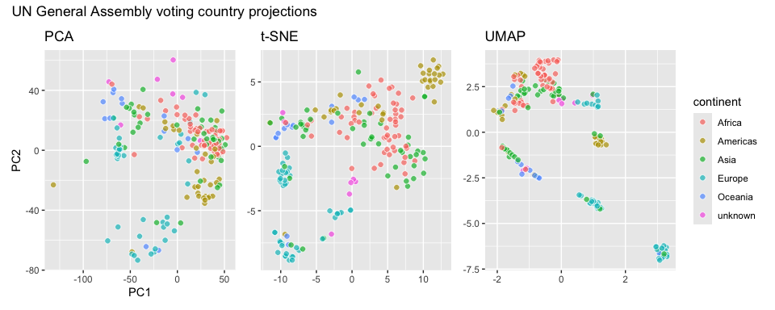

------------------------------------------------------------------------

This is in the experimental/proof of concept phase. 🤔🚧

## An implementation

<details>

### `aes(dims = ?)` lets us capture an expression…

``` r
library(tidyverse)

dims <- function(...){}

aes(dims = dims(Sepal.Length:Sepal.Width, Petal.Width))
#> Aesthetic mapping: 
#> * `dims` -> `dims(Sepal.Length:Sepal.Width, Petal.Width)`
```

Which means we can write something like this…

``` r
iris |> 
  ggplot() + 
  aes(dims = dims(Sepal.Length:Sepal.Width, Petal.Width)) + 
  geom_computation()
```

And maybe actually use an implied set of variables in our computation…

### To expanded to the `:` referenced variables…

Our strategy will actually use `dims_listed()` which takes vars
individually specified, as described
[here](https://github.com/ggplot2-extenders/ggplot-extension-club/discussions/18#discussioncomment-10219152).
Then we’ll `vars_unpack()` within our computation.

``` r
iris |> 
  ggplot() + 
  aes(dims = 
        dims_listed(Sepal.Length, Sepal.Width, 
                    Petal.Length, Petal.Width),
      fill = Species) +
  geom_tsne()
```

</details>

### so let’s use some ggplot_add to try to expand, and have these individually specified vars

<details>

### an exercise/experiment

``` r
library(tidyverse)

iris |> 
  ggplot() + 
  aes(dims = dims(Sepal.Length:Petal.Length, Petal.Width))
```

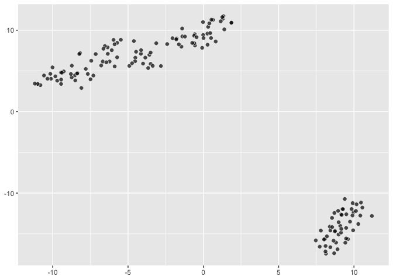

``` r

p <- last_plot()

p$mapping$dims[[2]]  # the unexpanded expression
#> dims(Sepal.Length:Petal.Length, Petal.Width)

p$mapping$dims |> 
  as.character() |> 
  _[2] |> 
  stringr::str_extract("\\(.+") |> 
  stringr::str_remove_all("\\(|\\)") -> 
selected_var_names_expr

selected_var_names <- 
  selected_var_names_expr |> 
  str_split(", ") |> 
  _[[1]]
  
var_names <- c()

for(i in 1:length(selected_var_names)){

  new_var_names <- select(last_plot()$data, !!!list(rlang::parse_expr(selected_var_names[i]))) |> names()
  
var_names <- c(var_names, new_var_names)
  
}

expanded_vars <- var_names |> paste(collapse = ", ") 

new_dim_expr <- paste("dims_listed(", expanded_vars, ")")

p$mapping <- modifyList(p$mapping, aes(dims0 = pi()))

p$mapping$dims0[[2]] <- rlang::parse_expr(new_dim_expr)

p$mapping$dims0[[2]]
#> dims_listed(Sepal.Length, Sepal.Width, Petal.Length, Petal.Width)
```

</details>

### `dims_expand`

<details>

``` r
#' @export
dims <- function(...){}


#' @export
dims_expand <- function() {

  structure(
    list(
      # data_spec = data,
         # vars_spec = rlang::enquo(vars)
         ), 
    class = "dims_expand"
    )

}

#' @import ggplot2
#' @importFrom ggplot2 ggplot_add
#' @export
ggplot_add.dims_expand <- function(object, plot, object_name) {
  
plot$mapping$dims |> 
  as.character() |> 
  _[2] |> 
  stringr::str_extract("\\(.+") |> 
  stringr::str_remove_all("\\(|\\)") -> 
selected_var_names_expr

selected_var_names <- 
  selected_var_names_expr |> 
  str_split(", ") |> 
  _[[1]]
  
var_names <- c()

for(i in 1:length(selected_var_names)){

  new_var_names <- select(plot$data, !!!list(rlang::parse_expr(selected_var_names[i]))) |> names()
  
var_names <- c(var_names, new_var_names)
  
}

expanded_vars <- var_names |> paste(collapse = ", ") 

new_dim_expr <- paste("dims_listed(", expanded_vars, ")")

plot$mapping$dims[[2]] <- rlang::parse_expr(new_dim_expr)

plot

}
```

</details>

``` r
p <- iris |> 
  ggplot() + 
  aes(dims = dims(Sepal.Length:Petal.Length, Petal.Width)) + 
  dims_expand()

p$mapping
#> Aesthetic mapping: 
#> * `dims` -> `dims_listed(Sepal.Length, Sepal.Width, Petal.Length, Petal.Width)`
```

## Now let’s actually define `dims_listed()` and `vars_unpack`

<details>

``` r
#' @export
dims_listed <- function(...) {
  
  varnames <- as.character(ensyms(...))
  vars <- list(...)
  listvec <- asplit(do.call(cbind, vars), 1)
  structure(listvec, varnames = varnames)

  }

#' @export
vars_unpack <- function(x) {
  pca_vars <- x
  df <- do.call(rbind, pca_vars)
  colnames(df) <- attr(pca_vars, "varnames")
  as.data.frame(df)
  
}
```

``` r
# utility uses data with the required aes 'dims'
#' @export
data_vars_unpack <- function(data){

# identify duplicates just based on tsne data
data |>
  select(dims) |>
  mutate(vars_unpack(dims)) |>
  select(-dims)

}
```

</details>

# Applications: tsne, umap, PCA

## compute_tsne, geom_tsne, using [`Rtsne::Rtsne`](https://github.com/jkrijthe/Rtsne)

<details>

``` r
#' @export
GeomPointFill <- ggproto("GeomPointFill", 
                         GeomPoint,
                         default_aes = 
                           modifyList(GeomPoint$default_aes, 
                                      aes(shape = 21, 
                                          color = from_theme(paper),
                                          size = from_theme(pointsize * 1.5),
                                          alpha = .7,
                                          fill = from_theme(ink))))
```

``` r
# compute_tsne allows individually listed variables that are all of the same type
#' @export
compute_tsne <- function(data, scales, perplexity = 20){
  
data_for_reduction <- data_vars_unpack(data)

dups <- data_for_reduction |>
   duplicated()

clean_data <- data_for_reduction |>
    bind_cols(data) |>
     _[!dups,] |> 
  remove_missing()

set.seed(1345)
clean_data |>
  _[names(data_for_reduction)] |>
  as.matrix() |>
  Rtsne::Rtsne(perplexity = perplexity) |>
  _$Y |>
  as_tibble() |>
 rename(x = V1, y = V2) |>
 bind_cols(clean_data)

}

#' @export
compute_tsne_group_label <- function(data, scales, perplexity = 20, fun = mean){
  
  compute_tsne(data, scales, perplexity) |> 
    summarise(x = fun(x),
              y = fun(y),
              .by = label)
  
}

#' @export
StatTsne <- ggproto("StatTsne", Stat, 
                     compute_panel = compute_tsne)

#' @export
StatTsneGroup <- ggproto("StatTsneGroup", Stat, 
                         compute_panel = compute_tsne_group_label)


#' @export
geom_tsne0 <- make_constructor(GeomPointFill, 
                               stat = StatTsne, 
                               perplexity = 30)

#' @export
geom_tsne_label0 <- make_constructor(GeomText, 
                                     stat = StatTsneGroup,
                                     perplexity = 30)
```

``` r
iris |> 
  mutate(dims = dims_listed(Sepal.Length, Sepal.Width, 
                Petal.Length, Petal.Width)) |>
  select(dims) |>
  compute_tsne()
#> # A tibble: 149 × 7
#>         x     y Sepal.Length Sepal.Width Petal.Length Petal.Width dims      
#>     <dbl> <dbl>        <dbl>       <dbl>        <dbl>       <dbl> <list[1d]>
#>  1 -10.3  -19.3          5.1         3.5          1.4         0.2 <dbl [4]> 
#>  2 -11.2  -15.4          4.9         3            1.4         0.2 <dbl [4]> 
#>  3  -9.61 -14.7          4.7         3.2          1.3         0.2 <dbl [4]> 
#>  4 -10.1  -14.5          4.6         3.1          1.5         0.2 <dbl [4]> 
#>  5  -9.57 -19.5          5           3.6          1.4         0.2 <dbl [4]> 
#>  6  -9.59 -22.1          5.4         3.9          1.7         0.4 <dbl [4]> 
#>  7  -8.80 -14.9          4.6         3.4          1.4         0.3 <dbl [4]> 
#>  8  -9.98 -18.2          5           3.4          1.5         0.2 <dbl [4]> 
#>  9 -10.4  -13.4          4.4         2.9          1.4         0.2 <dbl [4]> 
#> 10 -10.8  -15.9          4.9         3.1          1.5         0.1 <dbl [4]> 
#> # ℹ 139 more rows

iris |> 
  mutate(dims = dims_listed(Sepal.Length, Sepal.Width, 
                Petal.Length, Petal.Width)) |>
  select(dims, label = Species) |>
  compute_tsne_group_label()
#> # A tibble: 3 × 3
#>   label           x      y
#>   <fct>       <dbl>  <dbl>
#> 1 setosa     -9.98  -18.2 
#> 2 versicolor  0.857  13.1 
#> 3 virginica   9.31    5.22
```

``` r
iris |> 
  ggplot() + 
  aes(dims = 
        dims_listed(Sepal.Length, Sepal.Width, 
                Petal.Length, Petal.Width),
      fill = Species,
      label = Species
      ) +
  geom_tsne0() + 
  geom_tsne_label0()
```

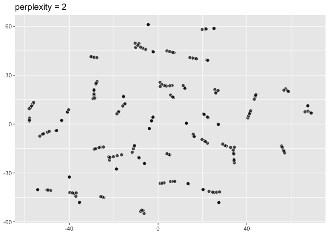

``` r


p$mapping$dims
#> <quosure>
#> expr: ^dims_listed(Sepal.Length, Sepal.Width, Petal.Length, Petal.Width)
#> env:  global
p + 
  geom_tsne0() + 
  aes(fill = Species)
```


``` r
#' @export
theme_ggdims <- function(ink = "black", paper = "white"){
  
  theme_grey() +
    theme(panel.background = element_blank(),
          panel.grid = element_blank(),
          axis.text = element_blank(),
          axis.ticks = element_blank(),
          panel.border = element_rect(color = ink) 
          )
  
}
```

``` r
#' @export
geom_tsne <- function(...){
  list(
    dims_expand(),
    geom_tsne0(...)
  )
}

#' @export
geom_tsne_label <- function(...){
  list(
    dims_expand(),
    geom_tsne_label0(...)
  )
}
```

</details>

``` r
iris |> 
  ggplot() + 
  aes(dims = dims(Sepal.Length:Petal.Length, Petal.Width)) +
  geom_tsne()
```

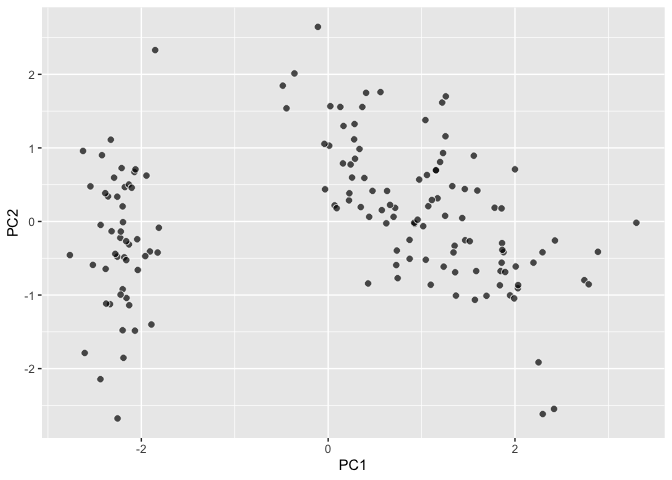

``` r

last_plot() + 
  aes(fill = Species) 
```

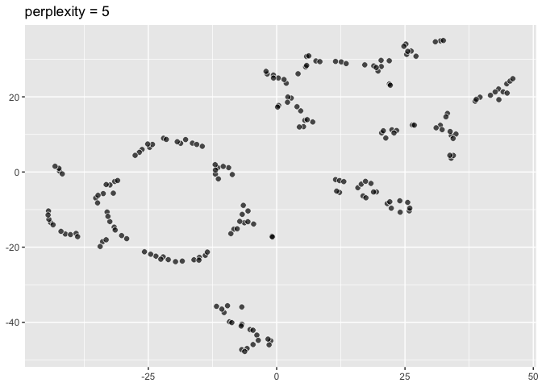

``` r

last_plot() + 
  aes(label = Species) + 
  geom_tsne_label()
```

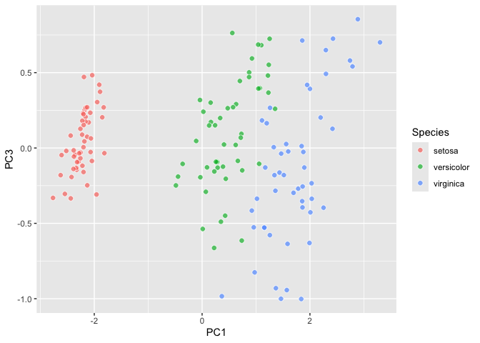

### Different perplexity

``` r
iris |> 
  ggplot() + 
  aes(dims = dims(Sepal.Length:Petal.Length, Petal.Width),
      fill = Species) +
  geom_tsne(perplexity = 10)
```


## A little UMAP using [`umap::umap`](https://github.com/tkonopka/umap)

<details>

``` r
#' @export
compute_umap <- function(data, scales, n_components = 2, random_state = 15){
  
data_for_reduction <- data_vars_unpack(data)

clean_data <- data_for_reduction |>
  bind_cols(data) |>
  remove_missing()

set.seed(1345)
clean_data |>
  _[names(data_for_reduction)] |>
  umap::umap(n_components = n_components, 
             random_state = random_state)  |>
  _$layout |>
  as_tibble() |>
 rename(x = V1, y = V2) |>
 bind_cols(clean_data)

}

#' @export
StatUmap <- ggproto("StatUmap", 
                    Stat, 
                    compute_panel = compute_umap)

#' @export
geom_umap0 <- make_constructor(GeomPointFill, stat = StatUmap, random_state = 15, n_components = 4)


#' @export
geom_umap <- function(...){
  
  list(dims_expand(), 
       geom_umap0(...))
  
}
```

</details>

``` r
iris |> 
  mutate(dims = 
        dims_listed(Sepal.Length, Sepal.Width, 
                Petal.Length, Petal.Width)) |>
  select(color = Species, dims) |>
  compute_umap()
#> # A tibble: 150 × 8
#>        x     y Sepal.Length Sepal.Width Petal.Length Petal.Width color  dims    
#>    <dbl> <dbl>        <dbl>       <dbl>        <dbl>       <dbl> <fct>  <list[1>
#>  1  15.7 -4.39          5.1         3.5          1.4         0.2 setosa <dbl[…]>
#>  2  13.7 -4.54          4.9         3            1.4         0.2 setosa <dbl[…]>
#>  3  14.1 -5.12          4.7         3.2          1.3         0.2 setosa <dbl[…]>
#>  4  13.8 -5.22          4.6         3.1          1.5         0.2 setosa <dbl[…]>
#>  5  15.4 -4.27          5           3.6          1.4         0.2 setosa <dbl[…]>
#>  6  15.9 -3.28          5.4         3.9          1.7         0.4 setosa <dbl[…]>
#>  7  14.2 -5.35          4.6         3.4          1.4         0.3 setosa <dbl[…]>
#>  8  15.3 -4.62          5           3.4          1.5         0.2 setosa <dbl[…]>
#>  9  13.5 -5.33          4.4         2.9          1.4         0.2 setosa <dbl[…]>
#> 10  13.8 -4.81          4.9         3.1          1.5         0.1 setosa <dbl[…]>
#> # ℹ 140 more rows


iris |> 
  ggplot() + 
  aes(dims = dims(Sepal.Length:Petal.Width)) + 
  geom_umap()
```

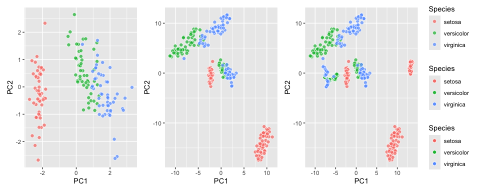

``` r

last_plot() + 
  aes(fill = Species)
```


## A little PCA using `ordr::ordinate`

<details>

``` r
#' @export
compute_pca_rows <- function(data, scales){
  
  data_for_reduction <- data_vars_unpack(data)

clean_data <- data_for_reduction |>
  bind_cols(data) |>
  remove_missing()

set.seed(1345)
reduced <- clean_data |>
  _[names(data_for_reduction)] |>
  ordr::ordinate(model = ~ prcomp(., scale. = TRUE)) |> 
  _[[5]] |> 
  as_tibble()

reduced |>
 bind_cols(clean_data)

}

#' @export
StatPcaRows <- ggproto("StatPcaRows", Stat,
                    compute_panel = compute_pca_rows,
                    default_aes = aes(x = after_stat(PC1), 
                                      y = after_stat(PC2))
                    )
#' @export
geom_pca0 <- make_constructor(GeomPointFill, stat = StatPcaRows)

#' @export
geom_pca <- function(...){
  
  list(
    dims_expand(),
    geom_pca0(...)
  )
  
}
```

``` r

iris |> 
  mutate(dims = 
        dims_listed(Sepal.Length, Sepal.Width, 
                Petal.Length, Petal.Width)) |>
  select(color = Species, dims) |>
  compute_pca_rows() 
#> # A tibble: 150 × 10
#>      PC1     PC2     PC3      PC4 Sepal.Length Sepal.Width Petal.Length
#>    <dbl>   <dbl>   <dbl>    <dbl>        <dbl>       <dbl>        <dbl>
#>  1 -2.26 -0.478   0.127   0.0241           5.1         3.5          1.4
#>  2 -2.07  0.672   0.234   0.103            4.9         3            1.4
#>  3 -2.36  0.341  -0.0441  0.0283           4.7         3.2          1.3
#>  4 -2.29  0.595  -0.0910 -0.0657           4.6         3.1          1.5
#>  5 -2.38 -0.645  -0.0157 -0.0358           5           3.6          1.4
#>  6 -2.07 -1.48   -0.0269  0.00659          5.4         3.9          1.7
#>  7 -2.44 -0.0475 -0.334  -0.0367           4.6         3.4          1.4
#>  8 -2.23 -0.222   0.0884 -0.0245           5           3.4          1.5
#>  9 -2.33  1.11   -0.145  -0.0268           4.4         2.9          1.4
#> 10 -2.18  0.467   0.253  -0.0398           4.9         3.1          1.5
#> # ℹ 140 more rows
#> # ℹ 3 more variables: Petal.Width <dbl>, color <fct>, dims <list[1d]>
```

</details>

``` r
iris |> 
  ggplot() + 
  aes(dims = dims(Sepal.Length:Petal.Width)) + 
  geom_pca()
```

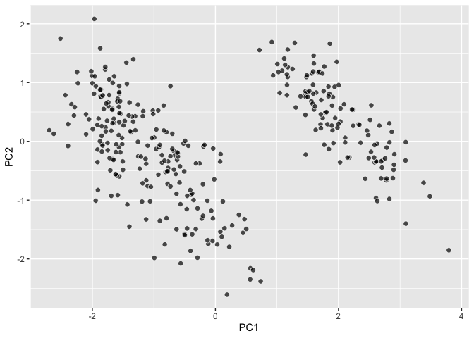

``` r

last_plot() + 
  aes(fill = Species)
```


``` r


last_plot() + 
  aes(y = after_stat(PC3))
```


``` r
library(ggdims)

iris |> 
  ggplot() + 
  aes(dims = dims(Sepal.Length:Petal.Width)) + 
  geom_pca() + 
  aes(fill = Species) ->
iris_pca; iris_pca
```

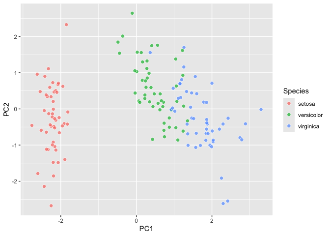

``` r

ggplyr::last_plot_wipe() + 
  geom_tsne() ->
iris_tsne; iris_tsne
```

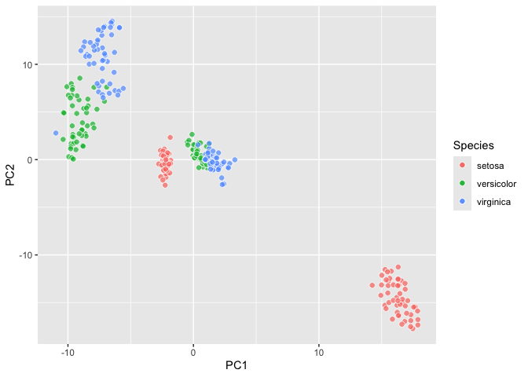

``` r

ggplyr::last_plot_wipe() + 
  geom_umap() ->
iris_umap; iris_umap
```

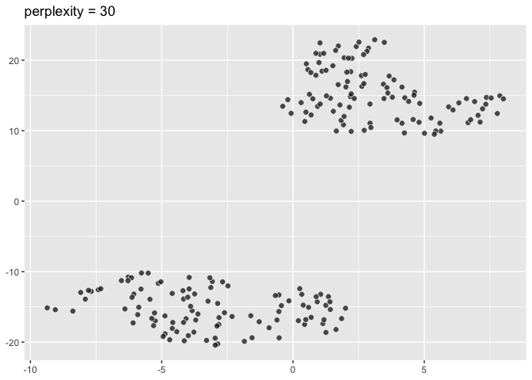

``` r
library(patchwork)
iris_pca + iris_tsne + iris_umap + patchwork::plot_layout(guides = "collect")
```


### w/ penguins

``` r
palmerpenguins::penguins |>
  ggplot() +
  aes(dims = dims(bill_length_mm:body_mass_g)) +
  geom_pca()
```


``` r

last_plot() +
  aes(fill = species)
```

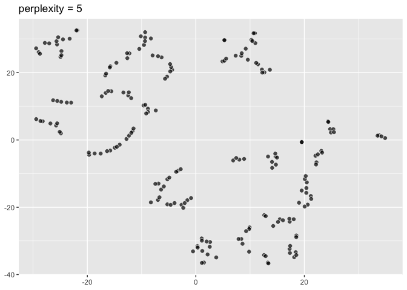

# Minimal Packaging

``` r
# knitrExtra::chunk_names_get()

knitrExtra::chunk_to_dir(
  c( "dims_expand" , "dims_listed", "data_vars_unpack", "compute_tsne",  "theme_ggdims", "geom_tsne", "compute_umap", "compute_pca_rows", "aaa_GeomPointFill" )
)

usethis::use_package("ggplot2")

devtools::document()
```

``` r
devtools::check(".")
devtools::install(".", upgrade = "never")
```

# Reproduction exercise

Try to reproduce some of observations and figures in the Distill paper:
‘How to Use t-SNE Effectively’ <https://distill.pub/2016/misread-tsne/>
with some verbatim visuals from the paper.

``` r
knitr::opts_chunk$set(out.width = NULL, fig.show = "asis")
```

### 1. ‘Those hyperparameters really matter’


Let’s try to reproduce the following with our `geom_tsne()`:

``` r
hello_world_of_tsne <- data.frame(dim1 = 
                                    rnorm(101, mean = -.5,
                                          sd = .1) |>
                                    c(rnorm(101, mean = .5,
                                            sd = .1)),
                                   
                                  dim2 = rnorm(202, sd = .1),
                                  type = c(rep("A", 101), rep("B", 101)))

dim(hello_world_of_tsne)
#> [1] 202   3

original <- hello_world_of_tsne |>
  ggplot() + 
  aes(x = dim1, 
      y = dim2) + 
  geom_point(shape = 21, color = "white",
             alpha = .7, 
             aes(size = from_theme(pointsize * 1.5))) + 
  labs(title = "Original") + 
  aes(fill = I("black")) + 
  coord_equal(xlim = c(-1,1), ylim = c(-1,1))

pp2 <- ggplot(data = hello_world_of_tsne) + 
  aes(dims = dims(dim1:dim2)) +
  geom_tsne(perplexity = 2) + 
  labs(title = "perplexity = 2"); pp2
```

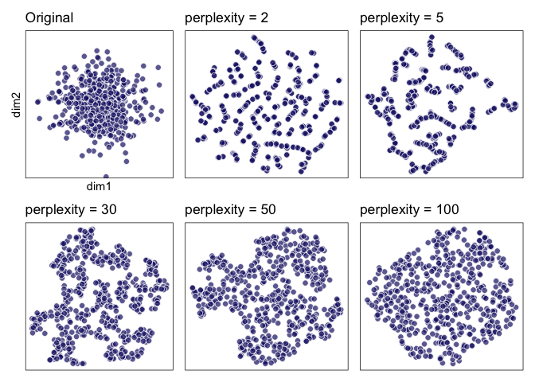

``` r

pp5 <- ggplot(data = hello_world_of_tsne) + 
  aes(dims = dims(dim1:dim2)) +
  geom_tsne(perplexity = 5) + 
  labs(title = "perplexity = 5"); pp5
```

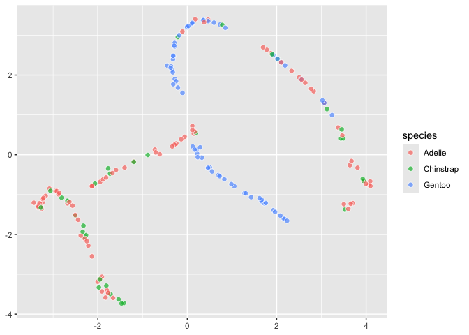

``` r

pp30 <- ggplot(data = hello_world_of_tsne) + 
  aes(dims = dims(dim1:dim2)) +
  geom_tsne(perplexity = 30) + 
  labs(title = "perplexity = 30"); pp30
```


``` r

pp50 <- ggplot(data = hello_world_of_tsne) + 
  aes(dims = dims(dim1:dim2)) +
  geom_tsne(perplexity = 50) + 
  labs(title = "perplexity = 50")


layer_data() |> dims()
#> NULL


pp100 <- ggplot(data = hello_world_of_tsne) + 
  aes(dims = dims(dim1:dim2)) +
  geom_tsne(perplexity = 100) + 
  labs(title = "perplexity = 100")


library(patchwork)
original + pp2 + pp5 + pp30 + pp50 + pp100 &
  theme_ggdims() 
```


``` r

# with group id
last_plot() & 
  aes(fill = type) &
  guides(fill = "none")
```


``` r


panel_of_six_tsne_two_cluster <- last_plot()
```

### 2. ‘Cluster sizes in a t-SNE plot mean nothing’

Let’s try to reproduce this (we’ll shortcut but switching out the data
across plot specifications): 

``` r
big_and_small_cluster <- data.frame(dim1 = c(rnorm(100, -.5, sd = .1),
                                             rnorm(100, .7, sd = .03)),
                                  dim2 = c(rnorm(100, sd = .1), 
                                           rnorm(100, sd = .03)),
                                  type = c(rep("A", 100), rep("B", 100)))


panel_of_six_tsne_two_cluster & 
  ggplyr::data_replace(big_and_small_cluster)
```

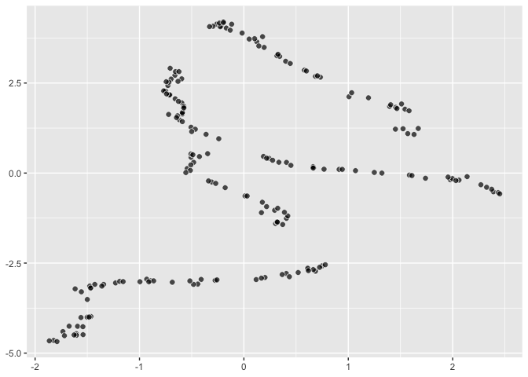

#### Side note on ggplyr::data_replace X google gemini quick search


### 3. ‘Distances between clusters might not mean anything’

Now let’s look at these three clusters, where one cluster is far out:


``` r
two_close_and_one_far <- data.frame(dim1 = 
                                    c(rnorm(150, -.75, .05), 
                                      rnorm(150, -.35, .05),
                                      rnorm(150, .75, .05)),
                                    dim2 = rnorm(450, sd = .05),
                                    type = c(rep("A", 150), 
                                           rep("B", 150),
                                           rep("C", 150)))

panel_of_six_tsne_two_cluster & 
  ggplyr::data_replace(two_close_and_one_far)
```


### 4. ‘Random noise doesn’t always look random’


``` r
random_noise <- data.frame(dim1 = rnorm(500, sd = .3),
                           dim2 = rnorm(500, sd = .3))

original + pp2 + pp5 + pp30 + pp50 + pp100 & 
  ggplyr::data_replace(random_noise) &
  aes(fill = I("darkblue")) &
  theme_ggdims()
```


------------------------------------------------------------------------

``` r
palmerpenguins::penguins |> 
  sample_n(size = 200) |>
  remove_missing() |> 
  ggplot() + 
  aes(dims = dims(bill_length_mm:body_mass_g)) + 
  geom_umap() 
```

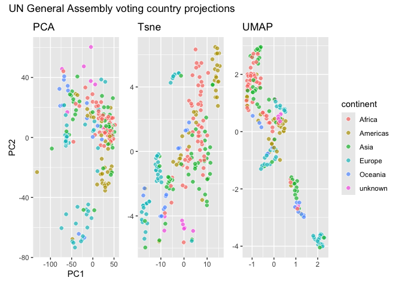

``` r

last_plot() + 
  aes(fill = species)
```


``` r
unvotes::un_votes |> 
  arrange(rcid) |>
  mutate(rcid = paste0("rc",rcid) |> fct_inorder()) |>
  mutate(num_vote = case_when(vote == "yes" ~ 1,
                              vote == "abstain" ~ .5,
                              vote == "no" ~ 0,
                              TRUE ~ .5 )) |>
  # filter(rcid %in% 1:30) |>
  pivot_wider(id_cols = c(country, country_code),
    names_from = rcid, 
              values_from = num_vote,
              values_fill = .5
            ) |>
  mutate(continent = country_code |> 
           countrycode::countrycode(origin = "iso2c", destination = "continent")) |>
  mutate(continent = continent |> is.na() |> ifelse("unknown", continent)) ->
un_ga_country_wide_rcid


names(un_ga_country_wide_rcid) |> tail()
#> [1] "rc9143"    "rc9144"    "rc9145"    "rc9146"    "rc9147"    "continent"
```

``` r
dims_specs <- 
  un_ga_country_wide_rcid |>
  ggplot() + 
  aes(dims = dims(rc3:rc9147), 
      fill = continent)
```

``` r
library(patchwork)
(dims_specs + geom_pca() + labs(title = "PCA")) + 
  (dims_specs + geom_tsne() + labs(title = "Tsne")) +  
  (dims_specs + geom_umap() + labs(title = "UMAP")) + 
  patchwork::plot_layout(guides = "collect") + 
  plot_annotation(title = "UN General Assembly voting country projections")
```


