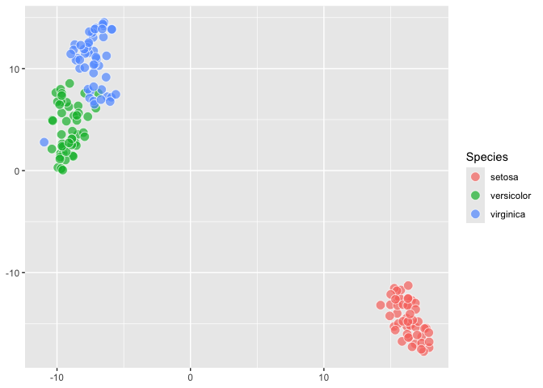
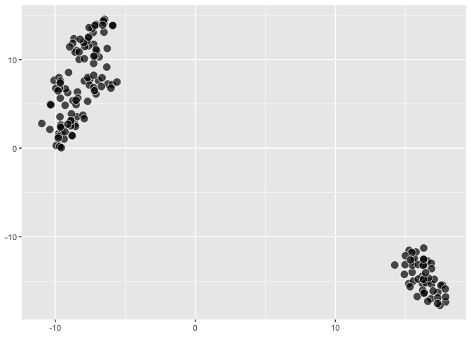
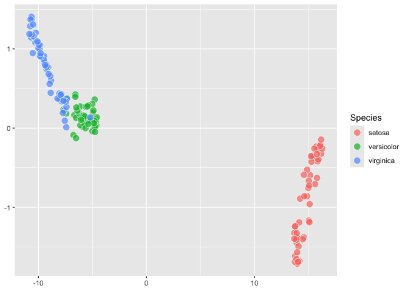

<!-- README.md is generated from README.Rmd. Please edit that file -->

Here, doing some further thinking about a dimensionality reduction
framework for ggplot2. Based on some previous work

- [2025-07-18](https://evamaerey.github.io/mytidytuesday/2025-07-18-seurat_tsne_plot/seurat_tsne_plot.html)
- [2025-08-19](https://evamaerey.github.io/mytidytuesday/2025-08-19-umap/umap.html)
- [2025-10-11](https://evamaerey.github.io/mytidytuesday/2025-10-11-ggdims/ggdims.html)

and discussions

- [ggplot-extension-club/discussions/117](https://github.com/ggplot2-extenders/ggplot-extension-club/discussions/117#discussioncomment-14565426)
- [ggplot-extension-club/discussions/18](https://github.com/ggplot2-extenders/ggplot-extension-club/discussions/18#discussioncomment-13850709)

This is in the experimental/proof of concept phase. 🤔🚧

# ggdims

<!-- badges: start -->
<!-- badges: end -->

## Intro Thoughts

So, ggplot2 seems to be not well suited to taking a dataframe and doing
dimensionality reduction within. The assumption is that you will specify
how each and every variable to be visualized will be visualized (which
feels very intuitive and is very nice to use!). But there’s a whole
world of dimension reduction and visualization that accompanies it, and
is everyone left to their own devices to try to figure out how that
should happen when using ggplot2 to plot this demensionality reduction?

## goal

<details>

### so we can certainly use aes to refer to some variables.

``` r
library(tidyverse)

dims <- function(...){}

iris |> 
  ggplot() + 
  aes(dims = dims(Sepal.Length:Sepal.Width, Petal.Width))
```

<!-- -->

``` r

last_plot()$mapping
#> Aesthetic mapping: 
#> * `dims` -> `dims(Sepal.Length:Sepal.Width, Petal.Width)`
```

### but we need these expanded out

Our syntax will actually use mvars, specifying each variable
individually and vars_unpack within our computation.

``` r
iris |> 
  ggplot() + 
  aes(dims = 
        mvars(Sepal.Length, Sepal.Width, 
                Petal.Length, Petal.Width),
      fill = Species) +
  geom_tsne0()
```

``` r
mvars <- function(...) {
  
  varnames <- as.character(ensyms(...))
  vars <- list(...)
  listvec <- asplit(do.call(cbind, vars), 1)
  structure(listvec, varnames = varnames)

  }

vars_unpack <- function(x) {
  pca_vars <- x
  df <- do.call(rbind, pca_vars)
  colnames(df) <- attr(pca_vars, "varnames")
  as.data.frame(df)
  
}
```

### so let’s use some ggplot_add to try to expand, and have these vars listed out individually

``` r
iris |> 
  ggplot() + 
  aes(dims = dims(Sepal.Length:Petal.Length, Petal.Width))
```

<!-- -->

``` r

p <- last_plot()

p$mapping$dims[[2]]  # the unexpanded expression
#> Warning: Subsetting quosures with `[[` is deprecated as of rlang 0.4.0
#> Please use `quo_get_expr()` instead.
#> This warning is displayed once every 8 hours.
#> dims(Sepal.Length:Petal.Length, Petal.Width)

p$mapping$dims |> 
  as.character() |> 
  _[2] |> 
  stringr::str_extract("\\(.+") |> 
  stringr::str_remove_all("\\(|\\)") -> 
selected_var_names_expr
#> Warning: Using `as.character()` on a quosure is deprecated as of rlang 0.3.0. Please use
#> `as_label()` or `as_name()` instead.
#> This warning is displayed once every 8 hours.

selected_var_names <- 
  selected_var_names_expr |> 
  str_split(", ") |> 
  _[[1]]
  
var_names <- c()

for(i in 1:length(selected_var_names)){

  new_var_names <- select(last_plot()$data, !!!list(rlang::parse_expr(selected_var_names[i]))) |> names()
  
var_names <- c(var_names, new_var_names)
  
}

expanded_vars <- var_names |> paste(collapse = ", ") 

new_dim_expr <- paste("mvars(", expanded_vars, ")")

p$mapping$dims[[2]] <- rlang::parse_expr(new_dim_expr)

p$mapping$dims[[2]]
#> mvars(Sepal.Length, Sepal.Width, Petal.Length, Petal.Width)
```

``` r
#' @export
dims_expand <- function() {

  structure(
    list(
      # data_spec = data,
         # vars_spec = rlang::enquo(vars)
         ), 
    class = "dims_expand"
    )

}

#' @import ggplot2
#' @importFrom ggplot2 ggplot_add
#' @export
ggplot_add.dims_expand <- function(object, plot, object_name) {
  
plot$mapping$dims |> 
  as.character() |> 
  _[2] |> 
  stringr::str_extract("\\(.+") |> 
  stringr::str_remove_all("\\(|\\)") -> 
selected_var_names_expr

selected_var_names <- 
  selected_var_names_expr |> 
  str_split(", ") |> 
  _[[1]]
  
var_names <- c()

for(i in 1:length(selected_var_names)){

  new_var_names <- select(plot$data, !!!list(rlang::parse_expr(selected_var_names[i]))) |> names()
  
var_names <- c(var_names, new_var_names)
  
}

expanded_vars <- var_names |> paste(collapse = ", ") 

new_dim_expr <- paste("mvars(", expanded_vars, ")")

plot$mapping$dims[[2]] <- rlang::parse_expr(new_dim_expr)

plot

}


iris |> 
  ggplot() + 
  aes(dims = dims(Sepal.Length:Petal.Length, Petal.Width)) + 
  dims_expand()
```

<!-- -->

``` r

last_plot()$mapping
#> Aesthetic mapping: 
#> * `dims` -> `mvars(Sepal.Length, Sepal.Width, Petal.Length, Petal.Width)`
```

``` r
# compute_tsne0 allows individually listed variables that are all of the same type
compute_tsne0 <- function(data, scales, perplexity = 20){
  
  set.seed(1345)
  
# identify duplicates just based on tsne data
data |>
  select(dims) |>
  mutate(vars_unpack(dims)) |>
  select(-dims) ->
data_unpacked ; data_unpacked

names_predictors <- names(data_unpacked); names_predictors

data_unpacked |>
   duplicated() ->
dups ; dups
# #
# # #
data_unpacked |>
    bind_cols(data) |>
     _[!dups,] |> 
  remove_missing() ->
clean_data ; clean_data
# # # 
clean_data |>
  _[names_predictors] |>
  as.matrix() |>
  Rtsne::Rtsne(perplexity = perplexity) |>
  _$Y |>
  as_tibble() |>
 rename(x = V1, y = V2) |>
 bind_cols(clean_data)
#   

}


iris |> 
  mutate(dims = mvars(Sepal.Length, Sepal.Width, 
                Petal.Length, Petal.Width)) |>
  select(dims) |>
  compute_tsne0()
#> Warning: The `x` argument of `as_tibble.matrix()` must have unique column names if
#> `.name_repair` is omitted as of tibble 2.0.0.
#> ℹ Using compatibility `.name_repair`.
#> This warning is displayed once every 8 hours.
#> Call `lifecycle::last_lifecycle_warnings()` to see where this warning was
#> generated.
#> # A tibble: 149 × 7
#>         x     y Sepal.Length Sepal.Width Petal.Length Petal.Width dims      
#>     <dbl> <dbl>        <dbl>       <dbl>        <dbl>       <dbl> <list[1d]>
#>  1 -10.3  -19.3          5.1         3.5          1.4         0.2 <dbl [4]> 
#>  2 -11.2  -15.4          4.9         3            1.4         0.2 <dbl [4]> 
#>  3  -9.61 -14.7          4.7         3.2          1.3         0.2 <dbl [4]> 
#>  4 -10.1  -14.5          4.6         3.1          1.5         0.2 <dbl [4]> 
#>  5  -9.57 -19.5          5           3.6          1.4         0.2 <dbl [4]> 
#>  6  -9.59 -22.1          5.4         3.9          1.7         0.4 <dbl [4]> 
#>  7  -8.80 -14.9          4.6         3.4          1.4         0.3 <dbl [4]> 
#>  8  -9.98 -18.2          5           3.4          1.5         0.2 <dbl [4]> 
#>  9 -10.4  -13.4          4.4         2.9          1.4         0.2 <dbl [4]> 
#> 10 -10.8  -15.9          4.9         3.1          1.5         0.1 <dbl [4]> 
#> # ℹ 139 more rows
  

StatTsne0 <- ggproto("StatTsne0", Stat, 
                     compute_panel = compute_tsne0)

GeomPointFill <- ggproto("GeomPointFill", 
                         GeomPoint,
                         default_aes = 
                           modifyList(GeomPoint$default_aes, 
                                      aes(shape = 21, 
                                          color = from_theme(paper),
                                          size = from_theme(pointsize * 2.5),
                                          alpha = .7,
                                          fill = from_theme(ink))))

geom_tsne0 <- make_constructor(GeomPointFill, stat = StatTsne0, perplexity = 30)

iris |> 
  ggplot() + 
  aes(dims = 
        mvars(Sepal.Length, Sepal.Width, 
                Petal.Length, Petal.Width),
      fill = Species) +
  geom_tsne0()
```

<!-- -->

``` r


p$mapping$dims
#> <quosure>
#> expr: ^mvars(Sepal.Length, Sepal.Width, Petal.Length, Petal.Width)
#> env:  global
p + 
  geom_tsne0() + 
  aes(fill = Species)
```

<!-- -->

``` r
geom_tsne <- function(...){
  list(
    dims_expand(),
    geom_tsne0(...)
  )
}
```

</details>

``` r
iris |> 
  ggplot() + 
  aes(dims = dims(Sepal.Length:Petal.Length, Petal.Width)) 
```

<!-- -->

``` r

last_plot() +
  geom_tsne()
```

<!-- -->

``` r

last_plot() + 
  aes(fill = Species)
```

<!-- -->

``` r
# 
# last_plot() + 
#   dims_expand() # stable...
```

# Now UMAP

<details>

``` r
compute_umap <- function(data, scales, n_components = 2, random_state = 15){
  
set.seed(1345)
  
# identify duplicates just based on tsne data
data |>
  select(dims) |>
  mutate(vars_unpack(dims)) |>
  select(-dims) ->
data_unpacked ; data_unpacked

names_predictors <- names(data_unpacked); names_predictors

data_unpacked |>
    bind_cols(data) |>
  remove_missing() ->
clean_data ; clean_data

# # # 
clean_data |>
  _[names_predictors] |>
  umap::umap(n_components = n_components, random_state = random_state)  |>
  _$layout |>
  as_tibble() |>
 rename(x = V1, y = V2) |>
 bind_cols(clean_data)
#   

}

iris |> 
  mutate(dims = 
        mvars(Sepal.Length, Sepal.Width, 
                Petal.Length, Petal.Width)) |>
  select(color = Species, dims) |>
  compute_umap()
#> # A tibble: 150 × 8
#>        x     y Sepal.Length Sepal.Width Petal.Length Petal.Width color  dims    
#>    <dbl> <dbl>        <dbl>       <dbl>        <dbl>       <dbl> <fct>  <list[1>
#>  1  15.7 -4.39          5.1         3.5          1.4         0.2 setosa <dbl[…]>
#>  2  13.7 -4.54          4.9         3            1.4         0.2 setosa <dbl[…]>
#>  3  14.1 -5.12          4.7         3.2          1.3         0.2 setosa <dbl[…]>
#>  4  13.8 -5.22          4.6         3.1          1.5         0.2 setosa <dbl[…]>
#>  5  15.4 -4.27          5           3.6          1.4         0.2 setosa <dbl[…]>
#>  6  15.9 -3.28          5.4         3.9          1.7         0.4 setosa <dbl[…]>
#>  7  14.2 -5.35          4.6         3.4          1.4         0.3 setosa <dbl[…]>
#>  8  15.3 -4.62          5           3.4          1.5         0.2 setosa <dbl[…]>
#>  9  13.5 -5.33          4.4         2.9          1.4         0.2 setosa <dbl[…]>
#> 10  13.8 -4.81          4.9         3.1          1.5         0.1 setosa <dbl[…]>
#> # ℹ 140 more rows

StatUmap <- ggproto("StatUmap", Stat, 
                     compute_panel = compute_umap)

geom_umap0 <- make_constructor(GeomPointFill, stat = StatUmap, random_state = 15, n_components = 4)

geom_umap <- function(...){
  
  list(dims_expand(), 
       geom_umap0())
  
}
```

</details>

``` r
iris |> 
  ggplot() + 
  aes(dims = dims(Sepal.Length:Petal.Width)) + 
  geom_umap()
```

<!-- -->

``` r

last_plot() + 
  aes(fill = Species)
```

<!-- -->

``` r
palmerpenguins::penguins |> 
  sample_n(size = 200) |>
  remove_missing() |> 
  ggplot() + 
  aes(dims = dims(bill_length_mm:body_mass_g)) + 
  geom_umap() 

last_plot() + 
  aes(fill = species)
```
