- [ggdims Intro Thoughts](#ggdims-intro-thoughts)
- [Supporting work and discussions](#supporting-work-and-discussions)
- [examples…](#examples)
  - [An implementation](#an-implementation)
    - [`aes(dims = ?)` lets us capture an
      expression…](#aesdims---lets-us-capture-an-expression)
    - [To expanded to the `:` referenced
      variables…](#to-expanded-to-the--referenced-variables)
    - [so let’s use some ggplot_add to try to expand, and have these
      individually specified
      vars](#so-lets-use-some-ggplot_add-to-try-to-expand-and-have-these-individually-specified-vars)
    - [an exercise/experiment](#an-exerciseexperiment)
    - [`dims_expand`](#dims_expand)
  - [Now let’s actually define `dims_listed()` and
    `vars_unpack`](#now-lets-actually-define-dims_listed-and-vars_unpack)
- [Applications: tsne, umap, PCA](#applications-tsne-umap-pca)
  - [compute_tsne, geom_tsne, using
    `Rtsne::Rtsne`](#compute_tsne-geom_tsne-using-rtsnertsne)
    - [Different perplexity](#different-perplexity)
  - [A little UMAP using `umap::umap`](#a-little-umap-using-umapumap)
  - [A little PCA using
    `ordr::ordinate`](#a-little-pca-using-ordrordinate)
    - [w/ penguins](#w-penguins)
  - [A little Venn diagrams using
    `ggVennDiagram`](#a-little-venn-diagrams-using-ggvenndiagram)
- [Minimal Packaging](#minimal-packaging)
- [Reproduction exercise](#reproduction-exercise)
  - [1. ‘Those hyperparameters really
    matter’](#1-those-hyperparameters-really-matter)
  - [2. ‘Cluster sizes in a t-SNE plot mean
    nothing’](#2-cluster-sizes-in-a-t-sne-plot-mean-nothing)
  - [3. ‘Distances between clusters might not mean
    anything’](#3-distances-between-clusters-might-not-mean-anything)
  - [4. ‘Random noise doesn’t always look
    random’](#4-random-noise-doesnt-always-look-random)
- [a features() approach](#a-features-approach)

<!-- README.md is generated from README.Rmd. Please edit that file -->

<!-- badges: start -->

<!-- badges: end -->

Go to [talk](https://evamaerey.github.io/ggdims/asa-cowy-fall-2025)

## ggdims Intro Thoughts

ggplot2 lets you intuitively translate variables to visual
representation. You specify how variables (e.g. sex, age, employment
status) are to be communicated via visual channels (x and y axis
position, color, transparency, etc). However, in ggplot2 these
specifications are individual-variable-to-individual-visual-channel
which does not lend itself easily to visualizations in the world of
dimension reduction (e.g. PCA, t-SNE, umap). The usual
one-var-to-one-aesthetic requirement means that it may not feel obvious
how to extend ggplot2 for dimensionality reduction visualization, which
deals with characterizing *many* variables. So while using ggplot2
under-the-hood is common in the dim-red space, it feels like there may
be less consistency across dim-red APIs. For users of these APIs,
getting quickly acquainted with techniques (students) or doing
comparative work (practitioners) may be more challenging than it needs
to be. The {ggdims} package explores a new `dims()` and `dims_expand()`
utility that could help with greater consistency across dim-red APIs,
with standard ggplots, and within the ggplot2 extension ecosystem.

ggdims proposes the following API:

``` r
library(ggplot2)

ggplot(data = my_high_dimensional_data) + 
  aes(dims = dims(var1:var200, var205)) +      # or similar
  geom_reduction_technique()                 # default dim-red to 2D

last_plot() + 
  aes(color = label)    # indicate category
```

## Supporting work and discussions

Here, doing some further thinking about a dimensionality reduction
framework for ggplot2. Based on some previous work:
[2025-07-18](https://evamaerey.github.io/mytidytuesday/2025-07-18-seurat_tsne_plot/seurat_tsne_plot.html),
[2025-08-19](https://evamaerey.github.io/mytidytuesday/2025-08-19-umap/umap.html),
[2025-10-11](https://evamaerey.github.io/mytidytuesday/2025-10-11-ggdims/ggdims.html)
and discussions
[ggplot-extension-club/discussions/117](https://github.com/ggplot2-extenders/ggplot-extension-club/discussions/117#discussioncomment-14565426)
and
[ggplot-extension-club/discussions/18](https://github.com/ggplot2-extenders/ggplot-extension-club/discussions/18#discussioncomment-13850709)

``` r
library(tidyverse)

ggplot(data = cars) + 
  aes(x = speed, y = dist) ->
data_and_vars_plot_specs  
  
data_and_vars_plot_specs +
  geom_point() 
```

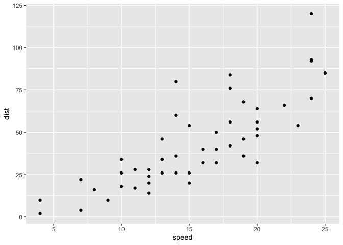

# examples…

    #> [1] "rc9143"    "rc9144"    "rc9145"    "rc9146"    "rc9147"    "continent"

``` r
library(ggdims)

unga_rcid_wide[1:5, 1:5]
#> # A tibble: 5 × 5
#>   country            country_code   rc3   rc4   rc5
#>   <chr>              <chr>        <dbl> <dbl> <dbl>
#> 1 United States      US               1     0     0
#> 2 Canada             CA               0     0     0
#> 3 Cuba               CU               1     0     1
#> 4 Haiti              HT               1     0     0
#> 5 Dominican Republic DO               1     0     0

unga_pca <- unga_rcid_wide |>
  ggplot() + 
  aes(dims = dims(rc3:rc9147)) +
  geom_pca() + 
  aes(fill = continent) +
  labs(title = "PCA")
```

``` r
unga_tsne <- ggplot(unga_rcid_wide) + 
  aes(dims = dims(rc3:rc9147)) +
  geom_tsne() + 
  aes(fill = continent) +
  labs(title = "t-SNE")
```

``` r
unga_umap <- 
  ggplot(unga_rcid_wide) + 
  aes(dims = dims(rc3:rc9147)) +
  geom_umap() + 
  aes(fill = continent) +
  labs(title = "UMAP")
```

``` r
library(patchwork)
unga_pca + unga_tsne + unga_umap + 
  plot_layout(guides = "collect") + 
  plot_annotation(title = "UN General Assembly voting country projections")
```

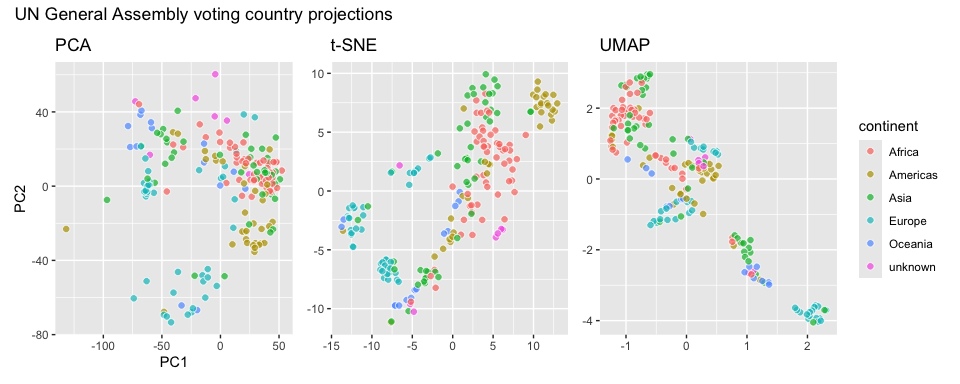

------------------------------------------------------------------------

This is in the experimental/proof of concept phase. 🤔🚧

## An implementation

<details>

### `aes(dims = ?)` lets us capture an expression…

``` r
library(tidyverse)

dims <- function(...){}

aes(dims = dims(Sepal.Length:Sepal.Width, Petal.Width))
#> Aesthetic mapping: 
#> * `dims` -> `dims(Sepal.Length:Sepal.Width, Petal.Width)`
```

Which means we can write something like this…

``` r
iris |> 
  ggplot() + 
  aes(dims = dims(Sepal.Length:Sepal.Width, Petal.Width)) + 
  geom_computation()
```

And maybe actually use an implied set of variables in our computation…

### To expanded to the `:` referenced variables…

Our strategy will actually use `dims_listed()` which takes vars
individually specified, as described
[here](https://github.com/ggplot2-extenders/ggplot-extension-club/discussions/18#discussioncomment-10219152).
Then we’ll `vars_unpack()` within our computation.

``` r
iris |> 
  ggplot() + 
  aes(dims = 
        dims_listed(Sepal.Length, Sepal.Width, 
                    Petal.Length, Petal.Width),
      fill = Species) +
  geom_tsne()
```

</details>

### so let’s use some ggplot_add to try to expand, and have these individually specified vars

<details>

### an exercise/experiment

``` r
library(tidyverse)

iris |> 
  ggplot() + 
  aes(dims = dims(Sepal.Length:Petal.Length, Petal.Width))
```

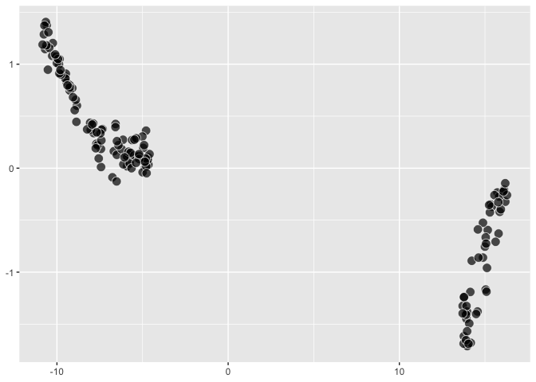

``` r


p <- last_plot()

p$mapping$dims[[2]]  # the unexpanded expression
#> dims(Sepal.Length:Petal.Length, Petal.Width)

p$mapping$dims |> 
  as.character() |> 
  _[2] |> 
  stringr::str_extract("\\(.+") |> 
  stringr::str_remove_all("\\(|\\)") -> 
selected_var_names_expr

selected_var_names <- 
  selected_var_names_expr |> 
  str_split(", ") |> 
  _[[1]]
  
var_names <- c()

for(i in 1:length(selected_var_names)){

  new_var_names <- select(last_plot()$data, !!!list(rlang::parse_expr(selected_var_names[i]))) |> names()
  
var_names <- c(var_names, new_var_names)
  
}

expanded_vars <- var_names |> paste(collapse = ", ") 

new_dim_expr <- paste("dims_listed(", expanded_vars, ")")

p$mapping <- modifyList(p$mapping, aes(dims0 = pi()))

p$mapping$dims0[[2]] <- rlang::parse_expr(new_dim_expr)

p$mapping$dims0[[2]]
#> dims_listed(Sepal.Length, Sepal.Width, Petal.Length, Petal.Width)
```

</details>

### `dims_expand`

<details>

``` r
#' @export
dims <- function(...){}

#' @export
dims_expand <- function() {

  structure(
    list(), 
    class = "dims_expand"
    )

}

#' @import ggplot2
#' @importFrom ggplot2 ggplot_add
#' @export
ggplot_add.dims_expand <- function(object, plot, object_name) {
  
plot$mapping$dims |> 
  as.character() |> 
  _[2] |> 
  stringr::str_extract("\\(.+") |> 
  stringr::str_remove_all("\\(|\\)") -> 
selected_var_names_expr

selected_var_names <- 
  selected_var_names_expr |> 
  str_split(", ") |> 
  _[[1]]
  
var_names <- c()

for(i in 1:length(selected_var_names)){

  new_var_names <- select(plot$data,
                      !!!list(rlang::parse_expr(selected_var_names[i]))) |>
    names()
  
var_names <- c(var_names, new_var_names)
  
}

expanded_vars <- var_names |> paste(collapse = ", ") 

new_dim_expr <- paste("dims_listed(", expanded_vars, ")")

plot$mapping$dims[[2]] <- rlang::parse_expr(new_dim_expr)

plot

}
```

</details>

``` r
p <- iris |> 
  ggplot() + 
  aes(dims = dims(Sepal.Length:Petal.Length, Petal.Width)) + 
  dims_expand()


p$mapping
#> Aesthetic mapping: 
#> * `dims` -> `dims_listed(Sepal.Length, Sepal.Width, Petal.Length, Petal.Width)`
```

## Now let’s actually define `dims_listed()` and `vars_unpack`

<details>

``` r
#' @export
dims_listed <- function(...) {
  
  varnames <- as.character(ensyms(...))
  vars <- list(...)
  listvec <- asplit(do.call(cbind, vars), 1)
  structure(listvec, varnames = varnames)

  }

#' @export
vars_unpack <- function(x) {
  pack_vars <- x
  df <- do.call(rbind, pack_vars)
  colnames(df) <- attr(pack_vars, "varnames")
  as.data.frame(df)
  
}
```

``` r
# utility uses data with the required aes 'dims'
#' @export
data_vars_unpack <- function(data){

# identify duplicates just based on tsne data
data |>
  select(dims) |>
  mutate(vars_unpack(dims)) |>
  select(-dims)

}
```

</details>

# Applications: tsne, umap, PCA

## compute_tsne, geom_tsne, using [`Rtsne::Rtsne`](https://github.com/jkrijthe/Rtsne)

<details>

``` r
#' @export
GeomPointFill <- ggproto("GeomPointFill", 
                         GeomPoint,
                         default_aes = 
                           modifyList(GeomPoint$default_aes, 
                                      aes(shape = 21, 
                                          color = from_theme(paper),
                                          size = from_theme(pointsize * 1.5),
                                          alpha = .7,
                                          fill = from_theme(ink))))
```

``` r
tsne_layout_2d <- function(data, perplexity){
  
  data |> 
    as.matrix() |>
    Rtsne::Rtsne(perplexity = perplexity) |>
    _$Y |>
    as_tibble() |>
    rename(x = V1, y = V2)
  
}


# compute_tsne allows individually listed variables that are all of the same type
#' @export
compute_tsne <- function(data, scales, perplexity = 20){
  
  features <- data_vars_unpack(data)
  non_feature_data <- data |> dplyr::select(-dims)

  # allowable for dimred
  ind_not_dup <- !duplicated(features)
  ind_no_missing <- complete.cases(features)
  
  ind_allowed <- ind_not_dup & ind_no_missing

  set.seed(1345)
  features |>
    _[ind_allowed, ] |>
    tsne_layout_2d(perplexity = perplexity)  |>
    bind_cols(non_feature_data |>
                bind_cols(features) |>
                _[ind_allowed, ])

}

#' @export
compute_tsne_group_label <- function(data, scales, perplexity = 20, fun = mean){
  
  compute_tsne(data, scales, perplexity) |> 
    summarise(x = fun(x),
              y = fun(y),
              .by = label)
  
}

#' @export
StatTsne <- ggproto("StatTsne", Stat, 
                     compute_panel = compute_tsne)

#' @export
StatTsneGroup <- ggproto("StatTsneGroup", Stat, 
                         compute_panel = compute_tsne_group_label)


#' @export
geom_tsne0 <- make_constructor(GeomPointFill, 
                               stat = StatTsne, 
                               perplexity = 30)

#' @export
geom_tsne_label0 <- make_constructor(GeomText, 
                                     stat = StatTsneGroup,
                                     perplexity = 30)
```

``` r
iris |> 
  mutate(dims = dims_listed(Sepal.Length, Sepal.Width, 
                Petal.Length, Petal.Width)) |>
  select(dims) |>
  compute_tsne()
#> # A tibble: 149 × 6
#>        x     y Sepal.Length Sepal.Width Petal.Length Petal.Width
#>    <dbl> <dbl>        <dbl>       <dbl>        <dbl>       <dbl>
#>  1 -7.69 -22.0          5.1         3.5          1.4         0.2
#>  2 -6.19 -17.9          4.9         3            1.4         0.2
#>  3 -7.82 -17.5          4.7         3.2          1.3         0.2
#>  4 -7.40 -17.2          4.6         3.1          1.5         0.2
#>  5 -8.37 -22.0          5           3.6          1.4         0.2
#>  6 -8.07 -24.8          5.4         3.9          1.7         0.4
#>  7 -8.66 -17.7          4.6         3.4          1.4         0.3
#>  8 -7.43 -20.9          5           3.4          1.5         0.2
#>  9 -7.35 -16.1          4.4         2.9          1.4         0.2
#> 10 -6.52 -18.4          4.9         3.1          1.5         0.1
#> # ℹ 139 more rows

iris |> 
  mutate(dims = dims_listed(Sepal.Length, Sepal.Width, 
                Petal.Length, Petal.Width)) |>
  select(dims, label = Species) |>
  compute_tsne_group_label()
#> # A tibble: 3 × 3
#>   label          x      y
#>   <fct>      <dbl>  <dbl>
#> 1 setosa     -7.45 -20.9 
#> 2 versicolor  2.48  15.8 
#> 3 virginica   5.07   5.17
```

``` r
iris |> 
  ggplot() + 
  aes(dims = 
        dims_listed(Sepal.Length, Sepal.Width, 
                Petal.Length, Petal.Width),
      fill = Species,
      label = Species
      ) +
  geom_tsne0() + 
  geom_tsne_label0()
```


``` r


p$mapping$dims
#> <quosure>
#> expr: ^dims_listed(Sepal.Length, Sepal.Width, Petal.Length, Petal.Width)
#> env:  global
p + 
  geom_tsne0() + 
  aes(fill = Species)
```

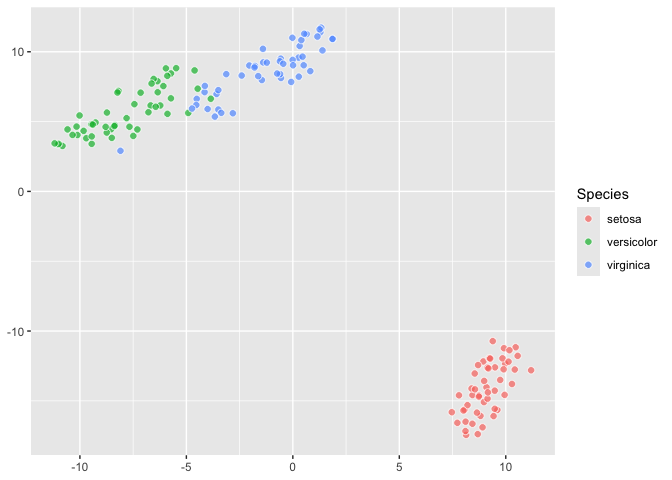

``` r
#' @export
theme_ggdims <- function(ink = "black", paper = "white"){
  
  theme_grey() +
    theme(panel.background = element_blank(),
          panel.grid = element_blank(),
          axis.text = element_blank(),
          axis.ticks = element_blank(),
          panel.border = element_rect(color = ink) 
          )
  
}
```

``` r
#' @export
geom_tsne <- function(...){
  list(
    dims_expand(),
    geom_tsne0(...)
  )
}

#' @export
geom_tsne_label <- function(...){
  list(
    dims_expand(),
    geom_tsne_label0(...)
  )
}
```

</details>

``` r
iris |> 
  ggplot() + 
  aes(dims = dims(Sepal.Length:Petal.Length, Petal.Width)) +
  geom_tsne()
```

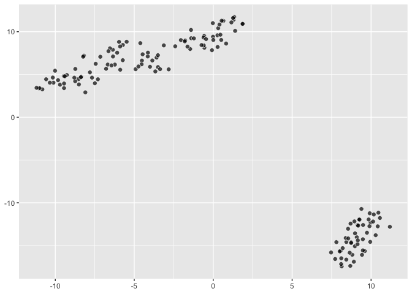

``` r


last_plot() + 
  aes(fill = Species) 
```


``` r

last_plot() + 
  aes(label = Species) + 
  geom_tsne_label()
```

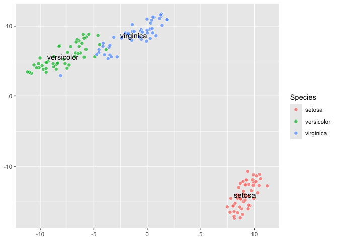

### Different perplexity

``` r
iris |> 
  ggplot() + 
  aes(dims = dims(Sepal.Length:Petal.Length, Petal.Width),
      fill = Species) +
  geom_tsne(perplexity = 10)
```

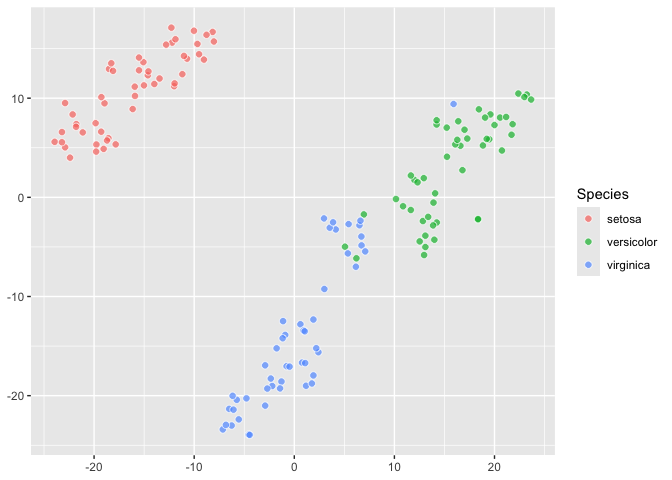

## A little UMAP using [`umap::umap`](https://github.com/tkonopka/umap)

<details>

``` r
umap_layout_2d <- function(data, n_components = 2, random_state = 15){
  
  data |> 
  umap::umap(n_components = n_components, 
             random_state = random_state)  |>
  _$layout |>
  as_tibble() |>
 rename(x = V1, y = V2) 
  
  
}


#' @export
compute_umap <- function(data, scales, n_components = 2, random_state = 15){
  
features <- data_vars_unpack(data)

clean_data <- features |>
  bind_cols(data) |>
  remove_missing()

set.seed(1345)
clean_data |>
 _[names(features)] |>
 umap_layout_2d(n_components, random_state) |>
 bind_cols(clean_data)

}

#' @export
StatUmap <- ggproto("StatUmap", 
                    Stat, 
                    compute_panel = compute_umap)

#' @export
geom_umap0 <- make_constructor(GeomPointFill, stat = StatUmap, random_state = 15, n_components = 4)


#' @export
geom_umap <- function(...){
  
  list(dims_expand(), 
       geom_umap0(...))
  
}
```

</details>

``` r
iris |> 
  mutate(dims = 
        dims_listed(Sepal.Length, Sepal.Width, 
                Petal.Length, Petal.Width)) |>
  select(color = Species, dims) |>
  compute_umap()
#> # A tibble: 150 × 8
#>        x     y Sepal.Length Sepal.Width Petal.Length Petal.Width color  dims    
#>    <dbl> <dbl>        <dbl>       <dbl>        <dbl>       <dbl> <fct>  <list[1>
#>  1  16.9  3.41          5.1         3.5          1.4         0.2 setosa <dbl[…]>
#>  2  15.2  3.21          4.9         3            1.4         0.2 setosa <dbl[…]>
#>  3  15.5  2.65          4.7         3.2          1.3         0.2 setosa <dbl[…]>
#>  4  15.3  2.47          4.6         3.1          1.5         0.2 setosa <dbl[…]>
#>  5  16.7  3.47          5           3.6          1.4         0.2 setosa <dbl[…]>
#>  6  17.7  2.83          5.4         3.9          1.7         0.4 setosa <dbl[…]>
#>  7  15.7  2.41          4.6         3.4          1.4         0.3 setosa <dbl[…]>
#>  8  16.5  3.35          5           3.4          1.5         0.2 setosa <dbl[…]>
#>  9  15.0  2.32          4.4         2.9          1.4         0.2 setosa <dbl[…]>
#> 10  15.1  2.89          4.9         3.1          1.5         0.1 setosa <dbl[…]>
#> # ℹ 140 more rows


iris |> 
  ggplot() + 
  aes(dims = dims(Sepal.Length:Petal.Width)) + 
  geom_umap()
```

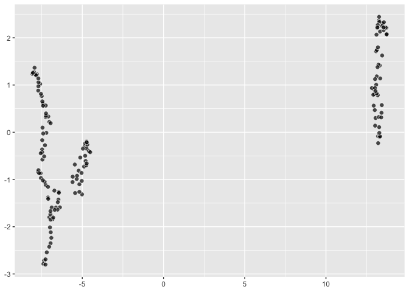

``` r

last_plot() + 
  aes(fill = Species)
```

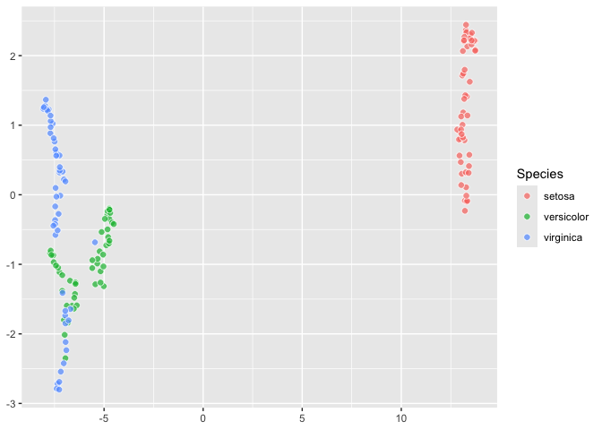

## A little PCA using `ordr::ordinate`

<details>

``` r
pca_layout <- function(data){
  
  data |>
  ordr::ordinate(model = ~ prcomp(., scale. = TRUE)) |> 
  _[[5]] |> 
  as_tibble()
  
}


#' @export
compute_pca_rows <- function(data, scales){
  
  data_for_reduction <- data_vars_unpack(data)

clean_data <- data_for_reduction |>
  bind_cols(data) |>
  remove_missing()

set.seed(1345)

clean_data |>
  _[names(data_for_reduction)] |>
  pca_layout() |>
 bind_cols(clean_data)

}

#' @export
StatPcaRows <- ggproto("StatPcaRows", Stat,
                    compute_panel = compute_pca_rows,
                    default_aes = aes(x = after_stat(PC1), 
                                      y = after_stat(PC2))
                    )
#' @export
geom_pca0 <- make_constructor(GeomPointFill, stat = StatPcaRows)

#' @export
stat_pca0 <- make_constructor(StatPcaRows, geom = GeomPointFill)


#' @export
geom_pca <- function(...){
  
  list(
    dims_expand(),
    geom_pca0(...)
  )
  
}

#' @export
stat_pca <- function(...){
  
  list(
    dims_expand(),
    stat_pca0(...)
  )
  
}
```

``` r

iris |> 
  mutate(dims = 
        dims_listed(Sepal.Length, Sepal.Width, 
                    Petal.Length, Petal.Width)) |>
  select(color = Species, dims) |>
  compute_pca_rows() 
#> # A tibble: 150 × 10
#>      PC1     PC2     PC3      PC4 Sepal.Length Sepal.Width Petal.Length
#>    <dbl>   <dbl>   <dbl>    <dbl>        <dbl>       <dbl>        <dbl>
#>  1 -2.26 -0.478   0.127   0.0241           5.1         3.5          1.4
#>  2 -2.07  0.672   0.234   0.103            4.9         3            1.4
#>  3 -2.36  0.341  -0.0441  0.0283           4.7         3.2          1.3
#>  4 -2.29  0.595  -0.0910 -0.0657           4.6         3.1          1.5
#>  5 -2.38 -0.645  -0.0157 -0.0358           5           3.6          1.4
#>  6 -2.07 -1.48   -0.0269  0.00659          5.4         3.9          1.7
#>  7 -2.44 -0.0475 -0.334  -0.0367           4.6         3.4          1.4
#>  8 -2.23 -0.222   0.0884 -0.0245           5           3.4          1.5
#>  9 -2.33  1.11   -0.145  -0.0268           4.4         2.9          1.4
#> 10 -2.18  0.467   0.253  -0.0398           4.9         3.1          1.5
#> # ℹ 140 more rows
#> # ℹ 3 more variables: Petal.Width <dbl>, color <fct>, dims <list[1d]>
```

</details>

``` r
iris |> 
  ggplot() + 
  aes(dims = dims(Sepal.Length:Petal.Width)) + 
  geom_pca()
```

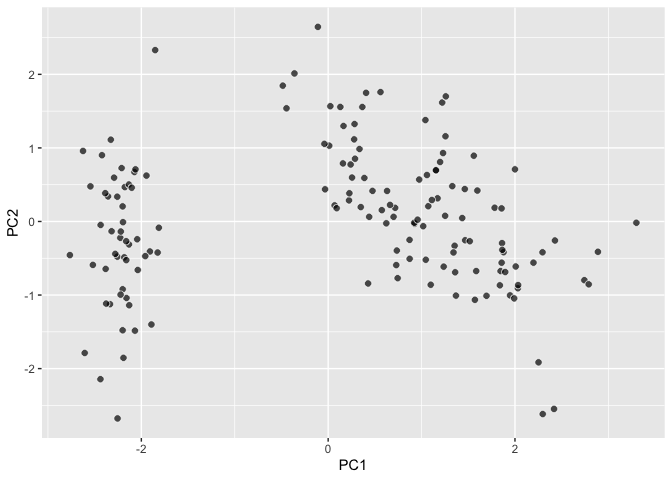

``` r

last_plot() + 
  aes(fill = Species)
```

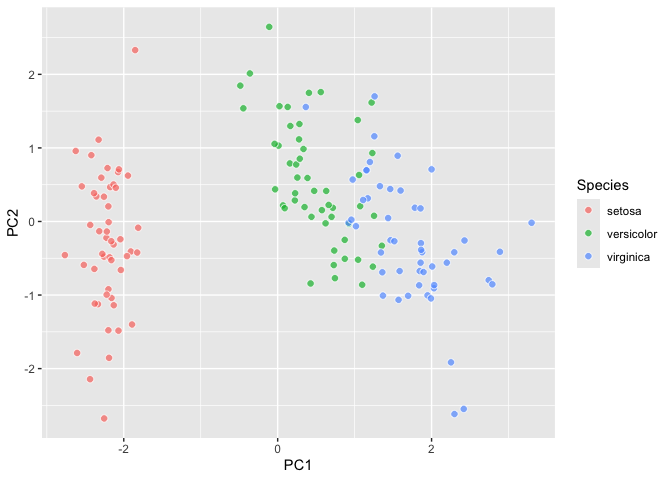

``` r


last_plot() + 
  aes(y = after_stat(PC3))
```

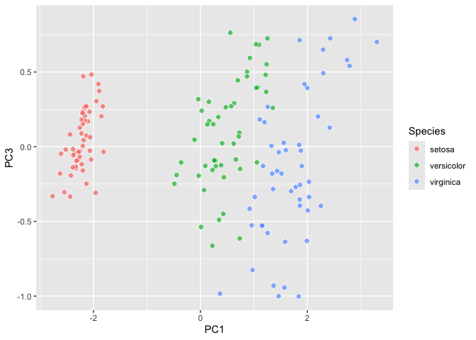

``` r
library(ggdims)

iris |> 
  ggplot() + 
  aes(dims = dims(Sepal.Length:Petal.Width)) + 
  geom_pca() + 
  aes(fill = Species) ->
iris_pca; iris_pca
```


``` r

ggplyr::last_plot_wipe() + 
  geom_tsne() ->
iris_tsne; iris_tsne
```

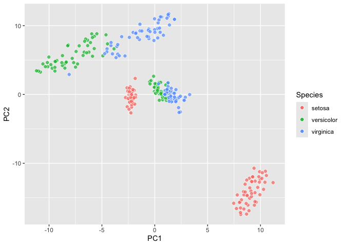

``` r

ggplyr::last_plot_wipe() + 
  geom_umap() ->
iris_umap; iris_umap
```

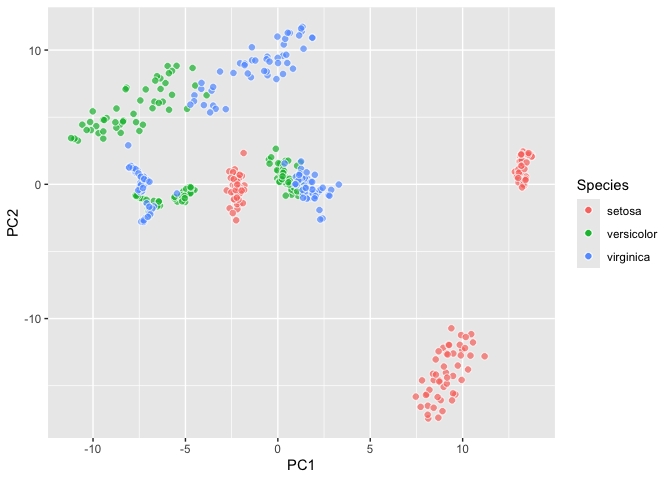

``` r
library(patchwork)
iris_pca + iris_tsne + iris_umap + patchwork::plot_layout(guides = "collect")
```

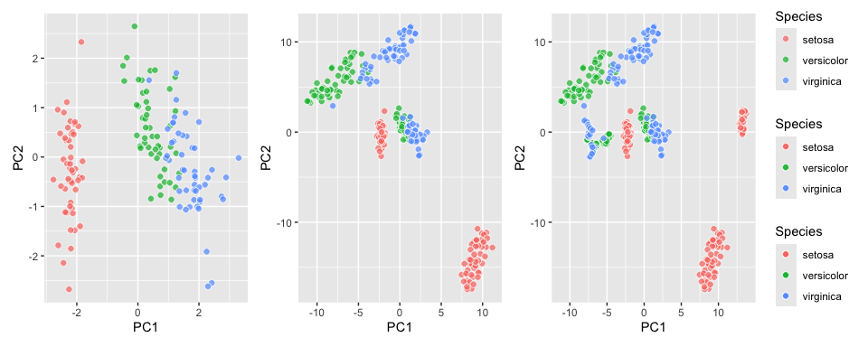

### w/ penguins

``` r
palmerpenguins::penguins |>
  ggplot() +
  aes(dims = dims(bill_length_mm:body_mass_g)) +
  geom_pca()
```

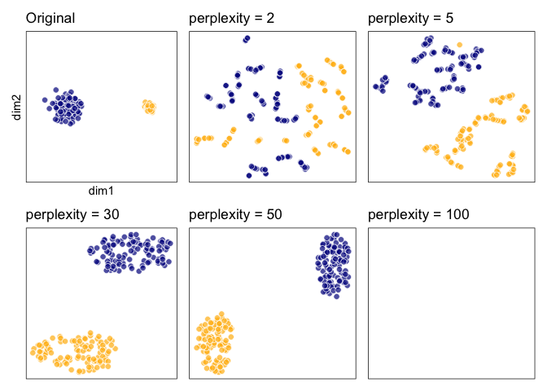

``` r

last_plot() +
  aes(fill = species)
```


## A little Venn diagrams using [`ggVennDiagram`](https://github.com/gaospecial/ggVennDiagram)

<details>

``` r
library(ggVennDiagram)

df_conditions_inclusion_list <- function(df){

  conditions <- df |> names()
  
  out <- list()

  for(i in 1:length(conditions)){

    out[[i]] <- which(df[conditions[i]] |> pull())

  }

  out
  
}


features_to_venn <- function(features){
  
  df <- features |> 
    df_conditions_inclusion_list() |>
    ggVennDiagram:::Venn() |> 
    ggVennDiagram:::process_data(shape_id = NULL) 
  

  left_join(ggVennDiagram:::get_shape_regionedge(df),
            ggVennDiagram:::venn_region(df)) |> 
  rename(x = X,
         y = Y
          )
  
  
}

features_to_venn_label <- function(features){
  
  df <- features |> 
    df_conditions_inclusion_list() |>
    ggVennDiagram:::Venn() |> 
    ggVennDiagram:::process_data(shape_id = NULL) 

  names_features <- names(features)  

  left_join(ggVennDiagram:::get_shape_regionlabel(df),
            ggVennDiagram:::venn_regionlabel(df)) |> 
  rename(x = X,
         y = Y
          ) |> 
    mutate(id = id |> 
             str_replace("1", names_features[1])|> 
             str_replace("2", names_features[2])|> 
             str_replace("3", names_features[3])|> 
             str_replace("4", names_features[4])|> 
             str_replace("5", names_features[5])|> 
             str_replace_all("/", "&"))
  
  
}
```

``` r
gene_data <- tribble(~A, ~B, ~C,
                      T, T, F, 
                      T, T, T,
                      T, F, T) 

features_to_venn(gene_data)
#>        id             x             y              name item count
#> 1       1  1.889084e+00  3.5258134538             Set_1          0
#> 2       1  1.998059e+00  3.4628970787             Set_1          0
#> 3       1  1.784320e+00  3.3302794185             Set_1          0
#> 4       1  1.577561e+00  3.1830473621             Set_1          0
#> 5       1  1.380557e+00  3.0229982974             Set_1          0
#> 6       1  1.194100e+00  2.8507766855             Set_1          0
#> 7       1  1.018942e+00  2.6670760021             Set_1          0
#> 8       1  8.557876e-01  2.4726359449             Set_1          0
#> 9       1  7.052937e-01  2.2682394555             Set_1          0
#> 10      1  5.680663e-01  2.0547095663             Set_1          0
#> 11      1  4.446582e-01  1.8329060869             Set_1          0
#> 12      1  3.355662e-01  1.6037221416             Set_1          0
#> 13      1  2.412295e-01  1.3680805733             Set_1          0
#> 14      1  1.620281e-01  1.1269302274             Set_1          0
#> 15      1  9.828085e-02  0.8812421311             Set_1          0
#> 16      1  5.024445e-02  0.6320055839             Set_1          0
#> 17      1  1.811231e-02  0.3802241732             Set_1          0
#> 18      1  2.013830e-03  0.1269117340             Set_1          0
#> 19      1  2.013830e-03 -0.1269117340             Set_1          0
#> 20      1  1.811231e-02 -0.3802241732             Set_1          0
#> 21      1  3.554863e-02 -0.5168518997             Set_1          0
#> 22      1 -8.881784e-16 -0.5358983849             Set_1          0
#> 23      1 -2.156803e-01 -0.6697205815             Set_1          0
#> 24      1 -4.224387e-01 -0.8169526379             Set_1          0
#> 25      1 -6.194429e-01 -0.9770017026             Set_1          0
#> 26      1 -8.058996e-01 -1.1492233145             Set_1          0
#> 27      1 -9.810578e-01 -1.3329239979             Set_1          0
#> 28      1 -1.144212e+00 -1.5273640551             Set_1          0
#> 29      1 -1.294706e+00 -1.7317605445             Set_1          0
#> 30      1 -1.431934e+00 -1.9452904337             Set_1          0
#> 31      1 -1.555342e+00 -2.1670939131             Set_1          0
#> 32      1 -1.664434e+00 -2.3962778584             Set_1          0
#> 33      1 -1.758770e+00 -2.6319194267             Set_1          0
#> 34      1 -1.837972e+00 -2.8730697726             Set_1          0
#> 35      1 -1.901719e+00 -3.1187578689             Set_1          0
#> 36      1 -1.949756e+00 -3.3679944161             Set_1          0
#> 37      1 -1.964451e+00 -3.4831481003             Set_1          0
#> 38      1 -2.000000e+00 -3.4641016151             Set_1          0
#> 39      1 -2.215680e+00 -3.3302794185             Set_1          0
#> 40      1 -2.422439e+00 -3.1830473621             Set_1          0
#> 41      1 -2.619443e+00 -3.0229982974             Set_1          0
#> 42      1 -2.805900e+00 -2.8507766855             Set_1          0
#> 43      1 -2.981058e+00 -2.6670760021             Set_1          0
#> 44      1 -3.144212e+00 -2.4726359449             Set_1          0
#> 45      1 -3.294706e+00 -2.2682394555             Set_1          0
#> 46      1 -3.431934e+00 -2.0547095663             Set_1          0
#> 47      1 -3.555342e+00 -1.8329060869             Set_1          0
#> 48      1 -3.664434e+00 -1.6037221416             Set_1          0
#> 49      1 -3.758770e+00 -1.3680805733             Set_1          0
#> 50      1 -3.837972e+00 -1.1269302274             Set_1          0
#> 51      1 -3.901719e+00 -0.8812421311             Set_1          0
#> 52      1 -3.949756e+00 -0.6320055839             Set_1          0
#> 53      1 -3.981888e+00 -0.3802241732             Set_1          0
#> 54      1 -3.997986e+00 -0.1269117340             Set_1          0
#> 55      1 -3.997986e+00  0.1269117340             Set_1          0
#> 56      1 -3.981888e+00  0.3802241732             Set_1          0
#> 57      1 -3.949756e+00  0.6320055839             Set_1          0
#> 58      1 -3.901719e+00  0.8812421311             Set_1          0
#> 59      1 -3.837972e+00  1.1269302274             Set_1          0
#> 60      1 -3.758770e+00  1.3680805733             Set_1          0
#> 61      1 -3.664434e+00  1.6037221416             Set_1          0
#> 62      1 -3.555342e+00  1.8329060869             Set_1          0
#> 63      1 -3.431934e+00  2.0547095663             Set_1          0
#> 64      1 -3.294706e+00  2.2682394555             Set_1          0
#> 65      1 -3.144212e+00  2.4726359449             Set_1          0
#> 66      1 -2.981058e+00  2.6670760021             Set_1          0
#> 67      1 -2.805900e+00  2.8507766855             Set_1          0
#> 68      1 -2.619443e+00  3.0229982974             Set_1          0
#> 69      1 -2.422439e+00  3.1830473621             Set_1          0
#> 70      1 -2.215680e+00  3.3302794185             Set_1          0
#> 71      1 -2.000000e+00  3.4641016151             Set_1          0
#> 72      1 -1.776266e+00  3.5839750972             Set_1          0
#> 73      1 -1.545381e+00  3.6894171764             Set_1          0
#> 74      1 -1.308272e+00  3.7800032749             Set_1          0
#> 75      1 -1.065895e+00  3.8553686342             Set_1          0
#> 76      1 -8.192267e-01  3.9152097849             Set_1          0
#> 77      1 -5.692594e-01  3.9592857675             Set_1          0
#> 78      1 -3.169998e-01  3.9874191038             Set_1          0
#> 79      1 -6.346386e-02  3.9994965107             Set_1          0
#> 80      1  1.903277e-01  3.9954693567             Set_1          0
#> 81      1  4.433528e-01  3.9753538578             Set_1          0
#> 82      1  6.945927e-01  3.9392310120             Set_1          0
#> 83      1  9.430357e-01  3.8872462733             Set_1          0
#> 84      1  1.187682e+00  3.8196089658             Set_1          0
#> 85      1  1.427545e+00  3.7365914411             Set_1          0
#> 86      1  1.661660e+00  3.6385279814             Set_1          0
#> 87      1  1.889084e+00  3.5258134538             Set_1          0
#> 88      2  8.000000e+00  0.0000000000             Set_2          0
#> 89      2  7.991947e+00 -0.2536956786             Set_2          0
#> 90      2  7.967819e+00 -0.5063698143             Set_2          0
#> 91      2  7.927715e+00 -0.7570049774             Set_2          0
#> 92      2  7.871795e+00 -1.0045919487             Set_2          0
#> 93      2  7.800284e+00 -1.2481337828             Set_2          0
#> 94      2  7.713472e+00 -1.4866498226             Set_2          0
#> 95      2  7.611706e+00 -1.7191796484             Set_2          0
#> 96      2  7.495398e+00 -1.9447869444             Set_2          0
#> 97      2  7.365014e+00 -2.1625632698             Set_2          0
#> 98      2  7.221081e+00 -2.3716317162             Set_2          0
#> 99      2  7.064178e+00 -2.5711504387             Set_2          0
#> 100     2  6.894936e+00 -2.7603160459             Set_2          0
#> 101     2  6.714038e+00 -2.9383668346             Set_2          0
#> 102     2  6.522211e+00 -3.1045858572             Set_2          0
#> 103     2  6.320228e+00 -3.2583038082             Set_2          0
#> 104     2  6.108902e+00 -3.3989017198             Set_2          0
#> 105     2  5.965875e+00 -3.4814784194             Set_2          0
#> 106     2  5.927715e+00 -3.2429950226             Set_2          0
#> 107     2  5.871795e+00 -2.9954080513             Set_2          0
#> 108     2  5.800284e+00 -2.7518662172             Set_2          0
#> 109     2  5.713472e+00 -2.5133501774             Set_2          0
#> 110     2  5.611706e+00 -2.2808203516             Set_2          0
#> 111     2  5.495398e+00 -2.0552130556             Set_2          0
#> 112     2  5.365014e+00 -1.8374367302             Set_2          0
#> 113     2  5.221081e+00 -1.6283682838             Set_2          0
#> 114     2  5.064178e+00 -1.4288495613             Set_2          0
#> 115     2  4.894936e+00 -1.2396839541             Set_2          0
#> 116     2  4.714038e+00 -1.0616331654             Set_2          0
#> 117     2  4.522211e+00 -0.8954141428             Set_2          0
#> 118     2  4.320228e+00 -0.7416961918             Set_2          0
#> 119     2  4.108902e+00 -0.6010982802             Set_2          0
#> 120     2  3.965875e+00 -0.5185215806             Set_2          0
#> 121     2  3.967819e+00 -0.5063698143             Set_2          0
#> 122     2  3.991947e+00 -0.2536956786             Set_2          0
#> 123     2  4.000000e+00  0.0000000000             Set_2          0
#> 124     2  3.991947e+00  0.2536956786             Set_2          0
#> 125     2  3.967819e+00  0.5063698143             Set_2          0
#> 126     2  3.927715e+00  0.7570049774             Set_2          0
#> 127     2  3.871795e+00  1.0045919487             Set_2          0
#> 128     2  3.800284e+00  1.2481337828             Set_2          0
#> 129     2  3.713472e+00  1.4866498226             Set_2          0
#> 130     2  3.611706e+00  1.7191796484             Set_2          0
#> 131     2  3.495398e+00  1.9447869444             Set_2          0
#> 132     2  3.365014e+00  2.1625632698             Set_2          0
#> 133     2  3.221081e+00  2.3716317162             Set_2          0
#> 134     2  3.064178e+00  2.5711504387             Set_2          0
#> 135     2  2.894936e+00  2.7603160459             Set_2          0
#> 136     2  2.714038e+00  2.9383668346             Set_2          0
#> 137     2  2.522211e+00  3.1045858572             Set_2          0
#> 138     2  2.320228e+00  3.2583038082             Set_2          0
#> 139     2  2.108902e+00  3.3989017198             Set_2          0
#> 140     2  1.998059e+00  3.4628970787             Set_2          0
#> 141     2  2.000000e+00  3.4641016151             Set_2          0
#> 142     2  2.223734e+00  3.5839750972             Set_2          0
#> 143     2  2.454619e+00  3.6894171764             Set_2          0
#> 144     2  2.691728e+00  3.7800032749             Set_2          0
#> 145     2  2.934105e+00  3.8553686342             Set_2          0
#> 146     2  3.180773e+00  3.9152097849             Set_2          0
#> 147     2  3.430741e+00  3.9592857675             Set_2          0
#> 148     2  3.683000e+00  3.9874191038             Set_2          0
#> 149     2  3.936536e+00  3.9994965107             Set_2          0
#> 150     2  4.190328e+00  3.9954693567             Set_2          0
#> 151     2  4.443353e+00  3.9753538578             Set_2          0
#> 152     2  4.694593e+00  3.9392310120             Set_2          0
#> 153     2  4.943036e+00  3.8872462733             Set_2          0
#> 154     2  5.187682e+00  3.8196089658             Set_2          0
#> 155     2  5.427545e+00  3.7365914411             Set_2          0
#> 156     2  5.661660e+00  3.6385279814             Set_2          0
#> 157     2  5.889084e+00  3.5258134538             Set_2          0
#> 158     2  6.108902e+00  3.3989017198             Set_2          0
#> 159     2  6.320228e+00  3.2583038082             Set_2          0
#> 160     2  6.522211e+00  3.1045858572             Set_2          0
#> 161     2  6.714038e+00  2.9383668346             Set_2          0
#> 162     2  6.894936e+00  2.7603160459             Set_2          0
#> 163     2  7.064178e+00  2.5711504387             Set_2          0
#> 164     2  7.221081e+00  2.3716317162             Set_2          0
#> 165     2  7.365014e+00  2.1625632698             Set_2          0
#> 166     2  7.495398e+00  1.9447869444             Set_2          0
#> 167     2  7.611706e+00  1.7191796484             Set_2          0
#> 168     2  7.713472e+00  1.4866498226             Set_2          0
#> 169     2  7.800284e+00  1.2481337828             Set_2          0
#> 170     2  7.871795e+00  1.0045919487             Set_2          0
#> 171     2  7.927715e+00  0.7570049774             Set_2          0
#> 172     2  7.967819e+00  0.5063698143             Set_2          0
#> 173     2  7.991947e+00  0.2536956786             Set_2          0
#> 174     2  8.000000e+00  0.0000000000             Set_2          0
#> 175     3  6.000000e+00 -4.0000000000             Set_3          0
#> 176     3  5.991947e+00 -4.2536956786             Set_3          0
#> 177     3  5.967819e+00 -4.5063698143             Set_3          0
#> 178     3  5.927715e+00 -4.7570049774             Set_3          0
#> 179     3  5.871795e+00 -5.0045919487             Set_3          0
#> 180     3  5.800284e+00 -5.2481337828             Set_3          0
#> 181     3  5.713472e+00 -5.4866498226             Set_3          0
#> 182     3  5.611706e+00 -5.7191796484             Set_3          0
#> 183     3  5.495398e+00 -5.9447869444             Set_3          0
#> 184     3  5.365014e+00 -6.1625632698             Set_3          0
#> 185     3  5.221081e+00 -6.3716317162             Set_3          0
#> 186     3  5.064178e+00 -6.5711504387             Set_3          0
#> 187     3  4.894936e+00 -6.7603160459             Set_3          0
#> 188     3  4.714038e+00 -6.9383668346             Set_3          0
#> 189     3  4.522211e+00 -7.1045858572             Set_3          0
#> 190     3  4.320228e+00 -7.2583038082             Set_3          0
#> 191     3  4.108902e+00 -7.3989017198             Set_3          0
#> 192     3  3.889084e+00 -7.5258134538             Set_3          0
#> 193     3  3.661660e+00 -7.6385279814             Set_3          0
#> 194     3  3.427545e+00 -7.7365914411             Set_3          0
#> 195     3  3.187682e+00 -7.8196089658             Set_3          0
#> 196     3  2.943036e+00 -7.8872462733             Set_3          0
#> 197     3  2.694593e+00 -7.9392310120             Set_3          0
#> 198     3  2.443353e+00 -7.9753538578             Set_3          0
#> 199     3  2.190328e+00 -7.9954693567             Set_3          0
#> 200     3  1.936536e+00 -7.9994965107             Set_3          0
#> 201     3  1.683000e+00 -7.9874191038             Set_3          0
#> 202     3  1.430741e+00 -7.9592857675             Set_3          0
#> 203     3  1.180773e+00 -7.9152097849             Set_3          0
#> 204     3  9.341047e-01 -7.8553686342             Set_3          0
#> 205     3  6.917281e-01 -7.7800032749             Set_3          0
#> 206     3  4.546195e-01 -7.6894171764             Set_3          0
#> 207     3  2.237335e-01 -7.5839750972             Set_3          0
#> 208     3  1.554312e-15 -7.4641016151             Set_3          0
#> 209     3 -2.156803e-01 -7.3302794185             Set_3          0
#> 210     3 -4.224387e-01 -7.1830473621             Set_3          0
#> 211     3 -6.194429e-01 -7.0229982974             Set_3          0
#> 212     3 -8.058996e-01 -6.8507766855             Set_3          0
#> 213     3 -9.810578e-01 -6.6670760021             Set_3          0
#> 214     3 -1.144212e+00 -6.4726359449             Set_3          0
#> 215     3 -1.294706e+00 -6.2682394555             Set_3          0
#> 216     3 -1.431934e+00 -6.0547095663             Set_3          0
#> 217     3 -1.555342e+00 -5.8329060869             Set_3          0
#> 218     3 -1.664434e+00 -5.6037221416             Set_3          0
#> 219     3 -1.758770e+00 -5.3680805733             Set_3          0
#> 220     3 -1.837972e+00 -5.1269302274             Set_3          0
#> 221     3 -1.901719e+00 -4.8812421311             Set_3          0
#> 222     3 -1.949756e+00 -4.6320055839             Set_3          0
#> 223     3 -1.981888e+00 -4.3802241732             Set_3          0
#> 224     3 -1.997986e+00 -4.1269117340             Set_3          0
#> 225     3 -1.997986e+00 -3.8730882660             Set_3          0
#> 226     3 -1.981888e+00 -3.6197758268             Set_3          0
#> 227     3 -1.964451e+00 -3.4831481003             Set_3          0
#> 228     3 -1.776266e+00 -3.5839750972             Set_3          0
#> 229     3 -1.545381e+00 -3.6894171764             Set_3          0
#> 230     3 -1.308272e+00 -3.7800032749             Set_3          0
#> 231     3 -1.065895e+00 -3.8553686342             Set_3          0
#> 232     3 -8.192267e-01 -3.9152097849             Set_3          0
#> 233     3 -5.692594e-01 -3.9592857675             Set_3          0
#> 234     3 -3.169998e-01 -3.9874191038             Set_3          0
#> 235     3 -6.346386e-02 -3.9994965107             Set_3          0
#> 236     3  1.903277e-01 -3.9954693567             Set_3          0
#> 237     3  4.433528e-01 -3.9753538578             Set_3          0
#> 238     3  6.945927e-01 -3.9392310120             Set_3          0
#> 239     3  9.430357e-01 -3.8872462733             Set_3          0
#> 240     3  1.187682e+00 -3.8196089658             Set_3          0
#> 241     3  1.427545e+00 -3.7365914411             Set_3          0
#> 242     3  1.661660e+00 -3.6385279814             Set_3          0
#> 243     3  1.889084e+00 -3.5258134538             Set_3          0
#> 244     3  1.998059e+00 -3.4628970787             Set_3          0
#> 245     3  2.000000e+00 -3.4641016151             Set_3          0
#> 246     3  2.223734e+00 -3.5839750972             Set_3          0
#> 247     3  2.454619e+00 -3.6894171764             Set_3          0
#> 248     3  2.691728e+00 -3.7800032749             Set_3          0
#> 249     3  2.934105e+00 -3.8553686342             Set_3          0
#> 250     3  3.180773e+00 -3.9152097849             Set_3          0
#> 251     3  3.430741e+00 -3.9592857675             Set_3          0
#> 252     3  3.683000e+00 -3.9874191038             Set_3          0
#> 253     3  3.936536e+00 -3.9994965107             Set_3          0
#> 254     3  4.190328e+00 -3.9954693567             Set_3          0
#> 255     3  4.443353e+00 -3.9753538578             Set_3          0
#> 256     3  4.694593e+00 -3.9392310120             Set_3          0
#> 257     3  4.943036e+00 -3.8872462733             Set_3          0
#> 258     3  5.187682e+00 -3.8196089658             Set_3          0
#> 259     3  5.427545e+00 -3.7365914411             Set_3          0
#> 260     3  5.661660e+00 -3.6385279814             Set_3          0
#> 261     3  5.889084e+00 -3.5258134538             Set_3          0
#> 262     3  5.965875e+00 -3.4814784194             Set_3          0
#> 263     3  5.967819e+00 -3.4936301857             Set_3          0
#> 264     3  5.991947e+00 -3.7463043214             Set_3          0
#> 265     3  6.000000e+00 -4.0000000000             Set_3          0
#> 266   1/2  2.320228e+00  3.2583038082       Set_1/Set_2    1     1
#> 267   1/2  2.522211e+00  3.1045858572       Set_1/Set_2    1     1
#> 268   1/2  2.714038e+00  2.9383668346       Set_1/Set_2    1     1
#> 269   1/2  2.894936e+00  2.7603160459       Set_1/Set_2    1     1
#> 270   1/2  3.064178e+00  2.5711504387       Set_1/Set_2    1     1
#> 271   1/2  3.221081e+00  2.3716317162       Set_1/Set_2    1     1
#> 272   1/2  3.365014e+00  2.1625632698       Set_1/Set_2    1     1
#> 273   1/2  3.495398e+00  1.9447869444       Set_1/Set_2    1     1
#> 274   1/2  3.611706e+00  1.7191796484       Set_1/Set_2    1     1
#> 275   1/2  3.713472e+00  1.4866498226       Set_1/Set_2    1     1
#> 276   1/2  3.800284e+00  1.2481337828       Set_1/Set_2    1     1
#> 277   1/2  3.871795e+00  1.0045919487       Set_1/Set_2    1     1
#> 278   1/2  3.927715e+00  0.7570049774       Set_1/Set_2    1     1
#> 279   1/2  3.967819e+00  0.5063698143       Set_1/Set_2    1     1
#> 280   1/2  3.991947e+00  0.2536956786       Set_1/Set_2    1     1
#> 281   1/2  4.000000e+00  0.0000000000       Set_1/Set_2    1     1
#> 282   1/2  3.991947e+00 -0.2536956786       Set_1/Set_2    1     1
#> 283   1/2  3.967819e+00 -0.5063698143       Set_1/Set_2    1     1
#> 284   1/2  3.965875e+00 -0.5185215806       Set_1/Set_2    1     1
#> 285   1/2  3.889084e+00 -0.4741865462       Set_1/Set_2    1     1
#> 286   1/2  3.661660e+00 -0.3614720186       Set_1/Set_2    1     1
#> 287   1/2  3.427545e+00 -0.2634085589       Set_1/Set_2    1     1
#> 288   1/2  3.187682e+00 -0.1803910342       Set_1/Set_2    1     1
#> 289   1/2  2.943036e+00 -0.1127537267       Set_1/Set_2    1     1
#> 290   1/2  2.694593e+00 -0.0607689880       Set_1/Set_2    1     1
#> 291   1/2  2.443353e+00 -0.0246461422       Set_1/Set_2    1     1
#> 292   1/2  2.190328e+00 -0.0045306433       Set_1/Set_2    1     1
#> 293   1/2  1.936536e+00 -0.0005034893       Set_1/Set_2    1     1
#> 294   1/2  1.683000e+00 -0.0125808962       Set_1/Set_2    1     1
#> 295   1/2  1.430741e+00 -0.0407142325       Set_1/Set_2    1     1
#> 296   1/2  1.180773e+00 -0.0847902151       Set_1/Set_2    1     1
#> 297   1/2  9.341047e-01 -0.1446313658       Set_1/Set_2    1     1
#> 298   1/2  6.917281e-01 -0.2199967251       Set_1/Set_2    1     1
#> 299   1/2  4.546195e-01 -0.3105828236       Set_1/Set_2    1     1
#> 300   1/2  2.237335e-01 -0.4160249028       Set_1/Set_2    1     1
#> 301   1/2  3.554863e-02 -0.5168518997       Set_1/Set_2    1     1
#> 302   1/2  1.811231e-02 -0.3802241732       Set_1/Set_2    1     1
#> 303   1/2  2.013830e-03 -0.1269117340       Set_1/Set_2    1     1
#> 304   1/2  2.013830e-03  0.1269117340       Set_1/Set_2    1     1
#> 305   1/2  1.811231e-02  0.3802241732       Set_1/Set_2    1     1
#> 306   1/2  5.024445e-02  0.6320055839       Set_1/Set_2    1     1
#> 307   1/2  9.828085e-02  0.8812421311       Set_1/Set_2    1     1
#> 308   1/2  1.620281e-01  1.1269302274       Set_1/Set_2    1     1
#> 309   1/2  2.412295e-01  1.3680805733       Set_1/Set_2    1     1
#> 310   1/2  3.355662e-01  1.6037221416       Set_1/Set_2    1     1
#> 311   1/2  4.446582e-01  1.8329060869       Set_1/Set_2    1     1
#> 312   1/2  5.680663e-01  2.0547095663       Set_1/Set_2    1     1
#> 313   1/2  7.052937e-01  2.2682394555       Set_1/Set_2    1     1
#> 314   1/2  8.557876e-01  2.4726359449       Set_1/Set_2    1     1
#> 315   1/2  1.018942e+00  2.6670760021       Set_1/Set_2    1     1
#> 316   1/2  1.194100e+00  2.8507766855       Set_1/Set_2    1     1
#> 317   1/2  1.380557e+00  3.0229982974       Set_1/Set_2    1     1
#> 318   1/2  1.577561e+00  3.1830473621       Set_1/Set_2    1     1
#> 319   1/2  1.784320e+00  3.3302794185       Set_1/Set_2    1     1
#> 320   1/2  1.998059e+00  3.4628970787       Set_1/Set_2    1     1
#> 321   1/2  2.108902e+00  3.3989017198       Set_1/Set_2    1     1
#> 322   1/2  2.320228e+00  3.2583038082       Set_1/Set_2    1     1
#> 323   1/3  1.889084e+00 -3.5258134538       Set_1/Set_3    3     1
#> 324   1/3  1.661660e+00 -3.6385279814       Set_1/Set_3    3     1
#> 325   1/3  1.427545e+00 -3.7365914411       Set_1/Set_3    3     1
#> 326   1/3  1.187682e+00 -3.8196089658       Set_1/Set_3    3     1
#> 327   1/3  9.430357e-01 -3.8872462733       Set_1/Set_3    3     1
#> 328   1/3  6.945927e-01 -3.9392310120       Set_1/Set_3    3     1
#> 329   1/3  4.433528e-01 -3.9753538578       Set_1/Set_3    3     1
#> 330   1/3  1.903277e-01 -3.9954693567       Set_1/Set_3    3     1
#> 331   1/3 -6.346386e-02 -3.9994965107       Set_1/Set_3    3     1
#> 332   1/3 -3.169998e-01 -3.9874191038       Set_1/Set_3    3     1
#> 333   1/3 -5.692594e-01 -3.9592857675       Set_1/Set_3    3     1
#> 334   1/3 -8.192267e-01 -3.9152097849       Set_1/Set_3    3     1
#> 335   1/3 -1.065895e+00 -3.8553686342       Set_1/Set_3    3     1
#> 336   1/3 -1.308272e+00 -3.7800032749       Set_1/Set_3    3     1
#> 337   1/3 -1.545381e+00 -3.6894171764       Set_1/Set_3    3     1
#> 338   1/3 -1.776266e+00 -3.5839750972       Set_1/Set_3    3     1
#> 339   1/3 -1.964451e+00 -3.4831481003       Set_1/Set_3    3     1
#> 340   1/3 -1.949756e+00 -3.3679944161       Set_1/Set_3    3     1
#> 341   1/3 -1.901719e+00 -3.1187578689       Set_1/Set_3    3     1
#> 342   1/3 -1.837972e+00 -2.8730697726       Set_1/Set_3    3     1
#> 343   1/3 -1.758770e+00 -2.6319194267       Set_1/Set_3    3     1
#> 344   1/3 -1.664434e+00 -2.3962778584       Set_1/Set_3    3     1
#> 345   1/3 -1.555342e+00 -2.1670939131       Set_1/Set_3    3     1
#> 346   1/3 -1.431934e+00 -1.9452904337       Set_1/Set_3    3     1
#> 347   1/3 -1.294706e+00 -1.7317605445       Set_1/Set_3    3     1
#> 348   1/3 -1.144212e+00 -1.5273640551       Set_1/Set_3    3     1
#> 349   1/3 -9.810578e-01 -1.3329239979       Set_1/Set_3    3     1
#> 350   1/3 -8.058996e-01 -1.1492233145       Set_1/Set_3    3     1
#> 351   1/3 -6.194429e-01 -0.9770017026       Set_1/Set_3    3     1
#> 352   1/3 -4.224387e-01 -0.8169526379       Set_1/Set_3    3     1
#> 353   1/3 -2.156803e-01 -0.6697205815       Set_1/Set_3    3     1
#> 354   1/3 -8.881784e-16 -0.5358983849       Set_1/Set_3    3     1
#> 355   1/3  3.554863e-02 -0.5168518997       Set_1/Set_3    3     1
#> 356   1/3  5.024445e-02 -0.6320055839       Set_1/Set_3    3     1
#> 357   1/3  9.828085e-02 -0.8812421311       Set_1/Set_3    3     1
#> 358   1/3  1.620281e-01 -1.1269302274       Set_1/Set_3    3     1
#> 359   1/3  2.412295e-01 -1.3680805733       Set_1/Set_3    3     1
#> 360   1/3  3.355662e-01 -1.6037221416       Set_1/Set_3    3     1
#> 361   1/3  4.446582e-01 -1.8329060869       Set_1/Set_3    3     1
#> 362   1/3  5.680663e-01 -2.0547095663       Set_1/Set_3    3     1
#> 363   1/3  7.052937e-01 -2.2682394555       Set_1/Set_3    3     1
#> 364   1/3  8.557876e-01 -2.4726359449       Set_1/Set_3    3     1
#> 365   1/3  1.018942e+00 -2.6670760021       Set_1/Set_3    3     1
#> 366   1/3  1.194100e+00 -2.8507766855       Set_1/Set_3    3     1
#> 367   1/3  1.380557e+00 -3.0229982974       Set_1/Set_3    3     1
#> 368   1/3  1.577561e+00 -3.1830473621       Set_1/Set_3    3     1
#> 369   1/3  1.784320e+00 -3.3302794185       Set_1/Set_3    3     1
#> 370   1/3  1.998059e+00 -3.4628970787       Set_1/Set_3    3     1
#> 371   1/3  1.889084e+00 -3.5258134538       Set_1/Set_3    3     1
#> 372   2/3  5.661660e+00 -3.6385279814       Set_2/Set_3          0
#> 373   2/3  5.427545e+00 -3.7365914411       Set_2/Set_3          0
#> 374   2/3  5.187682e+00 -3.8196089658       Set_2/Set_3          0
#> 375   2/3  4.943036e+00 -3.8872462733       Set_2/Set_3          0
#> 376   2/3  4.694593e+00 -3.9392310120       Set_2/Set_3          0
#> 377   2/3  4.443353e+00 -3.9753538578       Set_2/Set_3          0
#> 378   2/3  4.190328e+00 -3.9954693567       Set_2/Set_3          0
#> 379   2/3  3.936536e+00 -3.9994965107       Set_2/Set_3          0
#> 380   2/3  3.683000e+00 -3.9874191038       Set_2/Set_3          0
#> 381   2/3  3.430741e+00 -3.9592857675       Set_2/Set_3          0
#> 382   2/3  3.180773e+00 -3.9152097849       Set_2/Set_3          0
#> 383   2/3  2.934105e+00 -3.8553686342       Set_2/Set_3          0
#> 384   2/3  2.691728e+00 -3.7800032749       Set_2/Set_3          0
#> 385   2/3  2.454619e+00 -3.6894171764       Set_2/Set_3          0
#> 386   2/3  2.223734e+00 -3.5839750972       Set_2/Set_3          0
#> 387   2/3  2.000000e+00 -3.4641016151       Set_2/Set_3          0
#> 388   2/3  1.998059e+00 -3.4628970787       Set_2/Set_3          0
#> 389   2/3  2.108902e+00 -3.3989017198       Set_2/Set_3          0
#> 390   2/3  2.320228e+00 -3.2583038082       Set_2/Set_3          0
#> 391   2/3  2.522211e+00 -3.1045858572       Set_2/Set_3          0
#> 392   2/3  2.714038e+00 -2.9383668346       Set_2/Set_3          0
#> 393   2/3  2.894936e+00 -2.7603160459       Set_2/Set_3          0
#> 394   2/3  3.064178e+00 -2.5711504387       Set_2/Set_3          0
#> 395   2/3  3.221081e+00 -2.3716317162       Set_2/Set_3          0
#> 396   2/3  3.365014e+00 -2.1625632698       Set_2/Set_3          0
#> 397   2/3  3.495398e+00 -1.9447869444       Set_2/Set_3          0
#> 398   2/3  3.611706e+00 -1.7191796484       Set_2/Set_3          0
#> 399   2/3  3.713472e+00 -1.4866498226       Set_2/Set_3          0
#> 400   2/3  3.800284e+00 -1.2481337828       Set_2/Set_3          0
#> 401   2/3  3.871795e+00 -1.0045919487       Set_2/Set_3          0
#> 402   2/3  3.927715e+00 -0.7570049774       Set_2/Set_3          0
#> 403   2/3  3.965875e+00 -0.5185215806       Set_2/Set_3          0
#> 404   2/3  4.108902e+00 -0.6010982802       Set_2/Set_3          0
#> 405   2/3  4.320228e+00 -0.7416961918       Set_2/Set_3          0
#> 406   2/3  4.522211e+00 -0.8954141428       Set_2/Set_3          0
#> 407   2/3  4.714038e+00 -1.0616331654       Set_2/Set_3          0
#> 408   2/3  4.894936e+00 -1.2396839541       Set_2/Set_3          0
#> 409   2/3  5.064178e+00 -1.4288495613       Set_2/Set_3          0
#> 410   2/3  5.221081e+00 -1.6283682838       Set_2/Set_3          0
#> 411   2/3  5.365014e+00 -1.8374367302       Set_2/Set_3          0
#> 412   2/3  5.495398e+00 -2.0552130556       Set_2/Set_3          0
#> 413   2/3  5.611706e+00 -2.2808203516       Set_2/Set_3          0
#> 414   2/3  5.713472e+00 -2.5133501774       Set_2/Set_3          0
#> 415   2/3  5.800284e+00 -2.7518662172       Set_2/Set_3          0
#> 416   2/3  5.871795e+00 -2.9954080513       Set_2/Set_3          0
#> 417   2/3  5.927715e+00 -3.2429950226       Set_2/Set_3          0
#> 418   2/3  5.965875e+00 -3.4814784194       Set_2/Set_3          0
#> 419   2/3  5.889084e+00 -3.5258134538       Set_2/Set_3          0
#> 420   2/3  5.661660e+00 -3.6385279814       Set_2/Set_3          0
#> 421 1/2/3  3.927715e+00 -0.7570049774 Set_1/Set_2/Set_3    2     1
#> 422 1/2/3  3.871795e+00 -1.0045919487 Set_1/Set_2/Set_3    2     1
#> 423 1/2/3  3.800284e+00 -1.2481337828 Set_1/Set_2/Set_3    2     1
#> 424 1/2/3  3.713472e+00 -1.4866498226 Set_1/Set_2/Set_3    2     1
#> 425 1/2/3  3.611706e+00 -1.7191796484 Set_1/Set_2/Set_3    2     1
#> 426 1/2/3  3.495398e+00 -1.9447869444 Set_1/Set_2/Set_3    2     1
#> 427 1/2/3  3.365014e+00 -2.1625632698 Set_1/Set_2/Set_3    2     1
#> 428 1/2/3  3.221081e+00 -2.3716317162 Set_1/Set_2/Set_3    2     1
#> 429 1/2/3  3.064178e+00 -2.5711504387 Set_1/Set_2/Set_3    2     1
#> 430 1/2/3  2.894936e+00 -2.7603160459 Set_1/Set_2/Set_3    2     1
#> 431 1/2/3  2.714038e+00 -2.9383668346 Set_1/Set_2/Set_3    2     1
#> 432 1/2/3  2.522211e+00 -3.1045858572 Set_1/Set_2/Set_3    2     1
#> 433 1/2/3  2.320228e+00 -3.2583038082 Set_1/Set_2/Set_3    2     1
#> 434 1/2/3  2.108902e+00 -3.3989017198 Set_1/Set_2/Set_3    2     1
#> 435 1/2/3  1.998059e+00 -3.4628970787 Set_1/Set_2/Set_3    2     1
#> 436 1/2/3  1.784320e+00 -3.3302794185 Set_1/Set_2/Set_3    2     1
#> 437 1/2/3  1.577561e+00 -3.1830473621 Set_1/Set_2/Set_3    2     1
#> 438 1/2/3  1.380557e+00 -3.0229982974 Set_1/Set_2/Set_3    2     1
#> 439 1/2/3  1.194100e+00 -2.8507766855 Set_1/Set_2/Set_3    2     1
#> 440 1/2/3  1.018942e+00 -2.6670760021 Set_1/Set_2/Set_3    2     1
#> 441 1/2/3  8.557876e-01 -2.4726359449 Set_1/Set_2/Set_3    2     1
#> 442 1/2/3  7.052937e-01 -2.2682394555 Set_1/Set_2/Set_3    2     1
#> 443 1/2/3  5.680663e-01 -2.0547095663 Set_1/Set_2/Set_3    2     1
#> 444 1/2/3  4.446582e-01 -1.8329060869 Set_1/Set_2/Set_3    2     1
#> 445 1/2/3  3.355662e-01 -1.6037221416 Set_1/Set_2/Set_3    2     1
#> 446 1/2/3  2.412295e-01 -1.3680805733 Set_1/Set_2/Set_3    2     1
#> 447 1/2/3  1.620281e-01 -1.1269302274 Set_1/Set_2/Set_3    2     1
#> 448 1/2/3  9.828085e-02 -0.8812421311 Set_1/Set_2/Set_3    2     1
#> 449 1/2/3  5.024445e-02 -0.6320055839 Set_1/Set_2/Set_3    2     1
#> 450 1/2/3  3.554863e-02 -0.5168518997 Set_1/Set_2/Set_3    2     1
#> 451 1/2/3  2.237335e-01 -0.4160249028 Set_1/Set_2/Set_3    2     1
#> 452 1/2/3  4.546195e-01 -0.3105828236 Set_1/Set_2/Set_3    2     1
#> 453 1/2/3  6.917281e-01 -0.2199967251 Set_1/Set_2/Set_3    2     1
#> 454 1/2/3  9.341047e-01 -0.1446313658 Set_1/Set_2/Set_3    2     1
#> 455 1/2/3  1.180773e+00 -0.0847902151 Set_1/Set_2/Set_3    2     1
#> 456 1/2/3  1.430741e+00 -0.0407142325 Set_1/Set_2/Set_3    2     1
#> 457 1/2/3  1.683000e+00 -0.0125808962 Set_1/Set_2/Set_3    2     1
#> 458 1/2/3  1.936536e+00 -0.0005034893 Set_1/Set_2/Set_3    2     1
#> 459 1/2/3  2.190328e+00 -0.0045306433 Set_1/Set_2/Set_3    2     1
#> 460 1/2/3  2.443353e+00 -0.0246461422 Set_1/Set_2/Set_3    2     1
#> 461 1/2/3  2.694593e+00 -0.0607689880 Set_1/Set_2/Set_3    2     1
#> 462 1/2/3  2.943036e+00 -0.1127537267 Set_1/Set_2/Set_3    2     1
#> 463 1/2/3  3.187682e+00 -0.1803910342 Set_1/Set_2/Set_3    2     1
#> 464 1/2/3  3.427545e+00 -0.2634085589 Set_1/Set_2/Set_3    2     1
#> 465 1/2/3  3.661660e+00 -0.3614720186 Set_1/Set_2/Set_3    2     1
#> 466 1/2/3  3.889084e+00 -0.4741865462 Set_1/Set_2/Set_3    2     1
#> 467 1/2/3  3.965875e+00 -0.5185215806 Set_1/Set_2/Set_3    2     1
#> 468 1/2/3  3.927715e+00 -0.7570049774 Set_1/Set_2/Set_3    2     1

features_to_venn_label(gene_data)
#>      id          x          y              name item count
#> 1     A -1.6065776  0.8434905             Set_1          0
#> 2     B  5.6065745  0.8434950             Set_2          0
#> 3     C  1.9999951 -5.6001306             Set_3          0
#> 4   A&B  1.9999941  1.2574728       Set_1/Set_2    1     1
#> 5   A&C -0.2505876 -2.6921958       Set_1/Set_3    3     1
#> 6   B&C  4.2505961 -2.6922103       Set_2/Set_3          0
#> 7 A&B&C  2.0000074 -1.4464996 Set_1/Set_2/Set_3    2     1
```

``` r
compute_panel_venn <- function(data, scales){
  
  features <- data_vars_unpack(data)
  
  clean_data <- features |>
  bind_cols(data) |>
  remove_missing()
  
  clean_data |>
     _[names(features)] |>
     features_to_venn()

}


compute_panel_venn_label <- function(data, scales){
  
  features <- data_vars_unpack(data)
  
  clean_data <- features |>
  bind_cols(data) |>
  remove_missing()
  
  clean_data |>
     _[names(features)] |>
     features_to_venn_label()

}

#' @export
StatVenn <- ggproto("StatVenn", 
                    Stat, 
                    compute_panel = compute_panel_venn,
                    default_aes = aes(fill = after_stat(count),
                                      group = after_stat(id) |> as.factor() |> as.numeric(),
                                      label = after_stat(id)))


StatVennLabel <- ggproto("StatVennLabel", 
                    Stat, 
                    compute_panel = compute_panel_venn_label,
                    default_aes = aes(fill = after_stat(count),
                                      group = after_stat(id) |> as.factor() |> as.numeric(),
                                      label = after_stat(id)))

#' @export
geom_venn0 <- make_constructor(GeomPolygon, 
                               stat = StatVenn, 
                               color = "lightgrey")

#' @export
geom_venn_label0 <- make_constructor(GeomLabel, 
                                     stat = StatVennLabel)


#' @export#' @exportGeomPolygon
geom_venn <- function(...){
  
  list(dims_expand(), 
       geom_venn0(...))
  
}

#' @export#' @exportGeomPolygon
geom_venn_label <- function(...){
  
  list(dims_expand(), 
       geom_venn_label0(...))
  
}


features <- function(...){
  
  list(aes(dims = dims(...)),
       dims_expand())
  
}
```

</details>

``` r
df <- tribble(~A, ~B, ~C, ~combocount,
        T, T, F, 6,
        T, T, T, 11,
        T, F, T, 11,
        T, T, T, 20,
        F, F, F, 100) |> 
  uncount(combocount) 

df |>
  mutate(dims = 
         dims_listed(A,B)) |>
  select(dims) |>
  compute_panel_venn() |>
  head()
#>   id        x          y  name                                       item count
#> 1  1 4.000000  0.0000000 Set_1 18, 19, 20, 21, 22, 23, 24, 25, 26, 27, 28    11
#> 2  1 3.991947 -0.2536957 Set_1 18, 19, 20, 21, 22, 23, 24, 25, 26, 27, 28    11
#> 3  1 3.967819 -0.5063698 Set_1 18, 19, 20, 21, 22, 23, 24, 25, 26, 27, 28    11
#> 4  1 3.927715 -0.7570050 Set_1 18, 19, 20, 21, 22, 23, 24, 25, 26, 27, 28    11
#> 5  1 3.871795 -1.0045919 Set_1 18, 19, 20, 21, 22, 23, 24, 25, 26, 27, 28    11
#> 6  1 3.800284 -1.2481338 Set_1 18, 19, 20, 21, 22, 23, 24, 25, 26, 27, 28    11

df |>
  mutate(dims = 
         dims_listed(A,B)) |>
  select(dims) |>
  compute_panel_venn_label() |>
  head()
#>    id             x         y        name
#> 1   A  1.445696e-05 -1.283086       Set_1
#> 2   B  1.445696e-05  5.283086       Set_2
#> 3 A&B -2.253466e-05  2.000000 Set_1/Set_2
#>                                                                                                                                        item
#> 1                                                                                                18, 19, 20, 21, 22, 23, 24, 25, 26, 27, 28
#> 2                                                                                                                                          
#> 3 1, 2, 3, 4, 5, 6, 7, 8, 9, 10, 11, 12, 13, 14, 15, 16, 17, 29, 30, 31, 32, 33, 34, 35, 36, 37, 38, 39, 40, 41, 42, 43, 44, 45, 46, 47, 48
#>   count
#> 1    11
#> 2     0
#> 3    37


titanic <- Titanic |>
  data.frame() |> 
  uncount(Freq) |> 
  mutate(
    female = Sex == "Female",
    survived = Survived == "Survived",
    child = Age == "Child",
    first_class = Class == "First",
    male = Sex == "Male",
    perished = Survived != "Survived")

head(titanic)
#>   Class  Sex   Age Survived female survived child first_class male perished
#> 1   3rd Male Child       No  FALSE    FALSE  TRUE       FALSE TRUE     TRUE
#> 2   3rd Male Child       No  FALSE    FALSE  TRUE       FALSE TRUE     TRUE
#> 3   3rd Male Child       No  FALSE    FALSE  TRUE       FALSE TRUE     TRUE
#> 4   3rd Male Child       No  FALSE    FALSE  TRUE       FALSE TRUE     TRUE
#> 5   3rd Male Child       No  FALSE    FALSE  TRUE       FALSE TRUE     TRUE
#> 6   3rd Male Child       No  FALSE    FALSE  TRUE       FALSE TRUE     TRUE

titanic |>
  ggplot() + 
  aes(dims = dims(female, survived)) + # indicator vars
  geom_venn() + 
  coord_equal() + 
  geom_venn_label(color = "white") + 
  scale_fill_viridis_c(option = "magma", begin = .2, end = .8)
```


``` r


titanic |>
  ggplot() + 
  aes(dims = dims(female:child)) + 
  geom_venn() + 
  coord_equal() + 
  geom_venn_label(color = "white") + 
  scale_fill_viridis_c(option = "magma", begin = .2, end = .8)
```

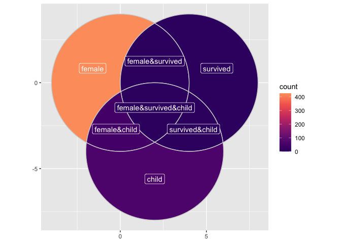

``` r

last_plot() + 
  aes(dims = dims(survived)) + dims_expand()
```


``` r

last_plot() + 
  aes(dims = dims(female:survived)) + dims_expand()
```

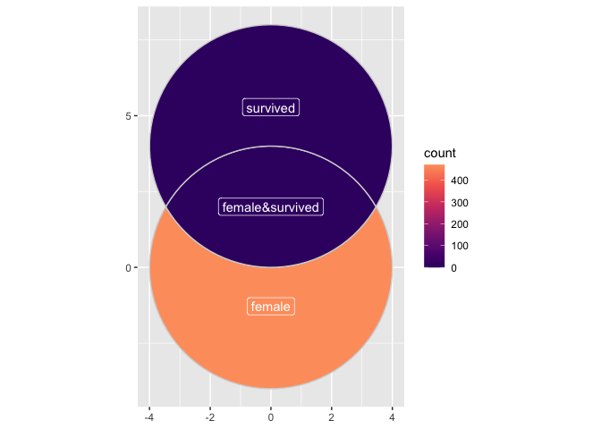

``` r

last_plot() + 
  aes(dims = dims(male, perished)) + dims_expand()
```

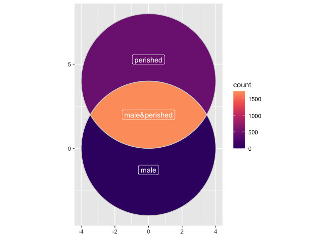

``` r

last_plot() + 
  aes(dims = dims(male, perished, child)) + dims_expand()
```

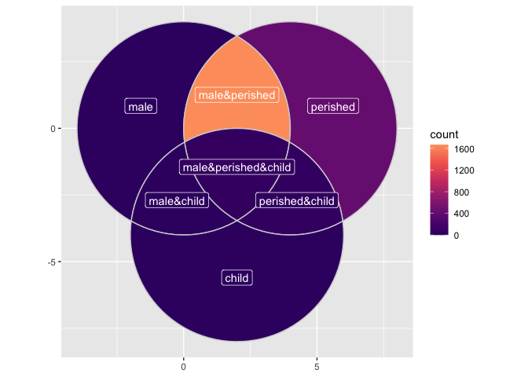

``` r

titanic |>
  ggplot() + 
  aes(dims = dims(female:child)) + 
  geom_venn() + 
  coord_equal() + 
  dims_expand() +
  geom_venn_label0() +
  aes(color = I("green"))
```

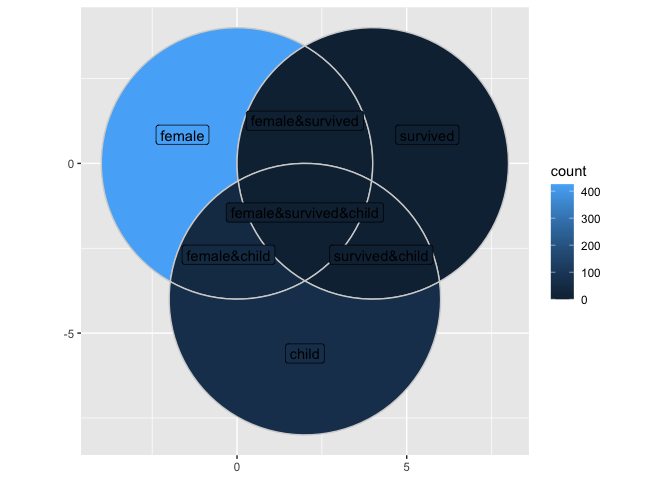

``` r

  

ggplot(mtcars) + 
  aes(cyl, mpg,
      label = cyl) + 
  geom_point() + 
  stat_summary(geom = "label") + 
  aes(color = "red" |> I())
```

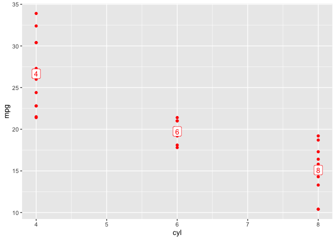

# Minimal Packaging

``` r
# knitrExtra::chunk_names_get()

knitrExtra::chunk_to_dir(
  c( "dims_expand" , "dims_listed", "data_vars_unpack", "compute_tsne",  "theme_ggdims", "geom_tsne", "compute_umap", "compute_pca_rows", "aaa_GeomPointFill" )
)

usethis::use_package("ggplot2")

devtools::document()
```

``` r
devtools::check(".")
devtools::install(".", upgrade = "never")
```

# Reproduction exercise

Try to reproduce some of observations and figures in the Distill paper:
‘How to Use t-SNE Effectively’ <https://distill.pub/2016/misread-tsne/>
with some verbatim visuals from the paper.

``` r
knitr::opts_chunk$set(out.width = NULL, fig.show = "asis")
```

### 1. ‘Those hyperparameters really matter’


``` r
two_clusters <- data.frame(dim1 = 
                                    rnorm(101, mean = -.5,
                                          sd = .1) |>
                                    c(rnorm(101, mean = .5,
                                            sd = .1)),
                                   
                                  dim2 = rnorm(202, sd = .1),
                                  type = c(rep("A", 101), rep("B", 101)))


big_and_small_cluster <- data.frame(dim1 = c(rnorm(100, -.5, sd = .1),
                                             rnorm(100, .7, sd = .03)),
                                  dim2 = c(rnorm(100, sd = .1), 
                                           rnorm(100, sd = .03)),
                                  type = c(rep("A", 100), rep("B", 100)))


two_close_and_one_far <- data.frame(dim1 = 
                                    c(rnorm(150, -.75, .05), 
                                      rnorm(150, -.35, .05),
                                      rnorm(150, .75, .05)),
                                    dim2 = rnorm(450, sd = .05),
                                    type = c(rep("A", 150), 
                                           rep("B", 150),
                                           rep("C", 150)))

random_noise <- data.frame(dim1 = rnorm(500, sd = .3),
                           dim2 = rnorm(500, sd = .3),
                           type = "A")
```

``` r
usethis::use_data(two_clusters, overwrite = T)
usethis::use_data(big_and_small_cluster, overwrite = T)
usethis::use_data(two_close_and_one_far, overwrite = T)
usethis::use_data(random_noise, overwrite = T)
```

Let’s try to reproduce the following with our `geom_tsne()`:

``` r
dim(two_clusters)
#> [1] 202   3

original <- two_clusters |>
  ggplot() + 
  aes(x = dim1, 
      y = dim2) + 
  geom_point(shape = 21, color = "white",
             alpha = .7, 
             aes(size = from_theme(pointsize * 1.5))) + 
  labs(title = "Original") + 
  aes(fill = I("black")) + 
  coord_equal(xlim = c(-1,1), ylim = c(-1,1))

pp2 <- ggplot(data = two_clusters) + 
  aes(dims = dims(dim1:dim2)) +
  geom_tsne(perplexity = 2) + 
  labs(title = "perplexity = 2"); pp2
```

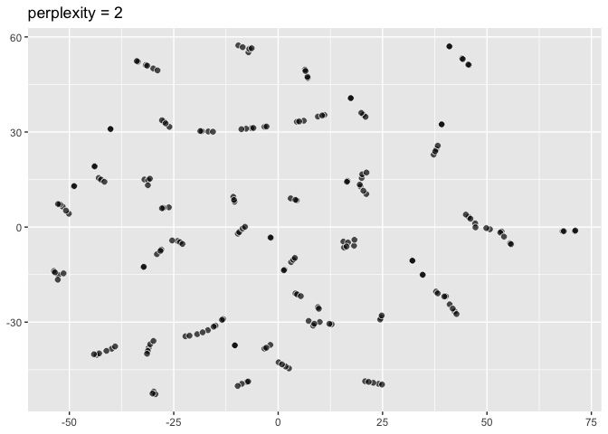<!-- -->

``` r

pp5 <- ggplot(data = two_clusters) + 
  aes(dims = dims(dim1:dim2)) +
  geom_tsne(perplexity = 5) + 
  labs(title = "perplexity = 5"); pp5
```

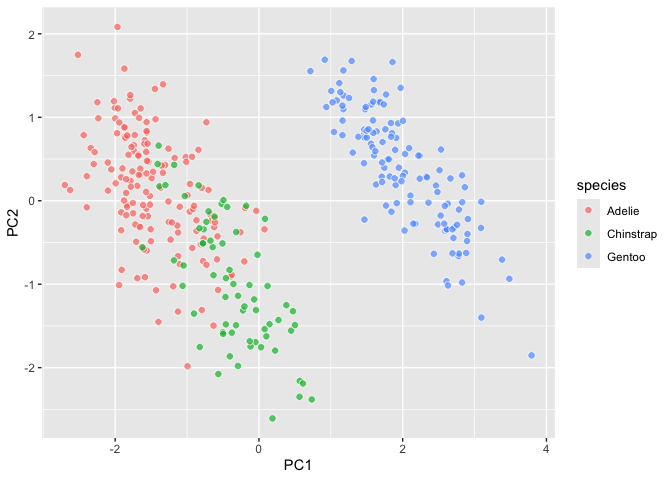<!-- -->

``` r

pp30 <- ggplot(data = two_clusters) + 
  aes(dims = dims(dim1:dim2)) +
  geom_tsne(perplexity = 30) + 
  labs(title = "perplexity = 30"); pp30
```

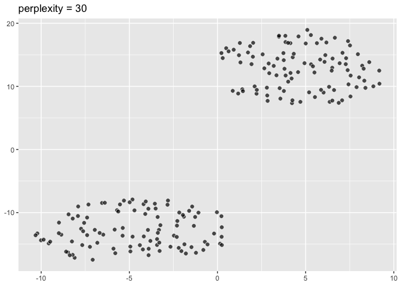<!-- -->

``` r

pp50 <- ggplot(data = two_clusters) + 
  aes(dims = dims(dim1:dim2)) +
  geom_tsne(perplexity = 50) + 
  labs(title = "perplexity = 50")

pp100 <- ggplot(data = two_clusters) + 
  aes(dims = dims(dim1:dim2)) +
  geom_tsne(perplexity = 100) + 
  labs(title = "perplexity = 100")


library(patchwork)
original + pp2 + pp5 + pp30 + pp50 + pp100 &
  theme_ggdims() 
```

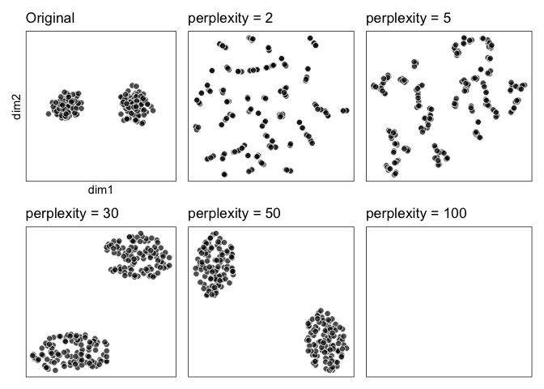<!-- -->

``` r

# with group id
last_plot() & 
  aes(fill = type) &
  guides(fill = "none")
```

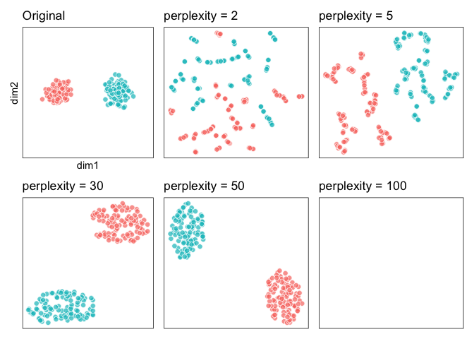<!-- -->

``` r


panel_of_six_tsne_two_cluster <- last_plot()
```

### 2. ‘Cluster sizes in a t-SNE plot mean nothing’

Let’s try to reproduce this (we’ll shortcut but switching out the data
across plot specifications): 

``` r
panel_of_six_tsne_two_cluster & 
  ggplyr::data_replace(big_and_small_cluster)
```

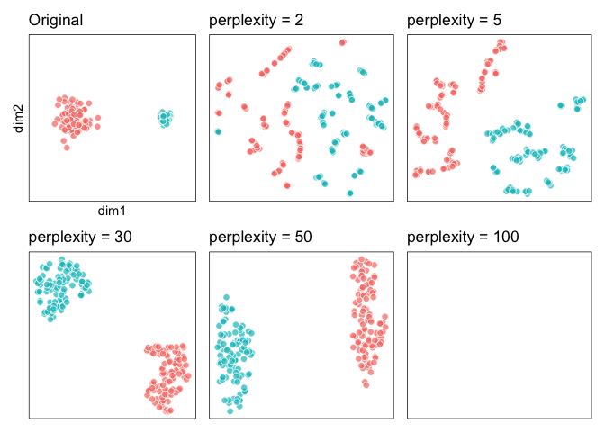<!-- -->

#### Side note on ggplyr::data_replace X google gemini quick search


### 3. ‘Distances between clusters might not mean anything’

Now let’s look at these three clusters, where one cluster is far out:


``` r


panel_of_six_tsne_two_cluster & 
  ggplyr::data_replace(two_close_and_one_far)
```

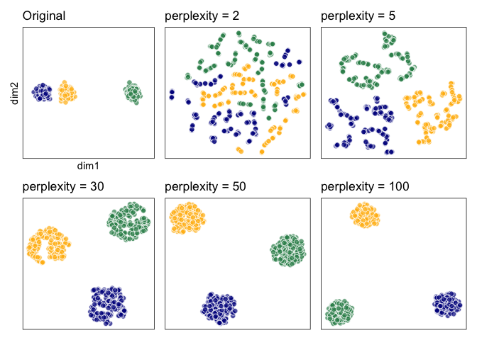<!-- -->

### 4. ‘Random noise doesn’t always look random’


``` r
panel_of_six_tsne_two_cluster & 
  ggplyr::data_replace(random_noise) &
  aes(fill = I("midnightblue"))
```

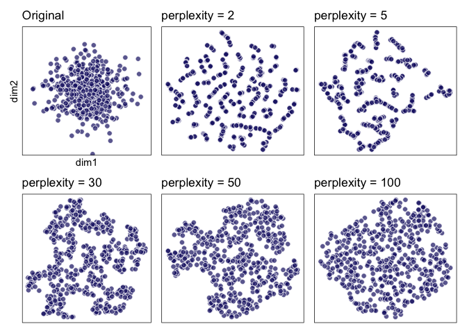<!-- -->

------------------------------------------------------------------------

``` r
palmerpenguins::penguins |> 
  sample_n(size = 200) |>
  remove_missing() |> 
  ggplot() + 
  aes(dims = dims(bill_length_mm:body_mass_g)) + 
  geom_umap() 
```

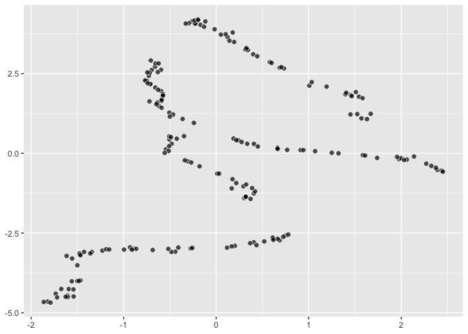<!-- -->

``` r

last_plot() + 
  aes(fill = species)
```

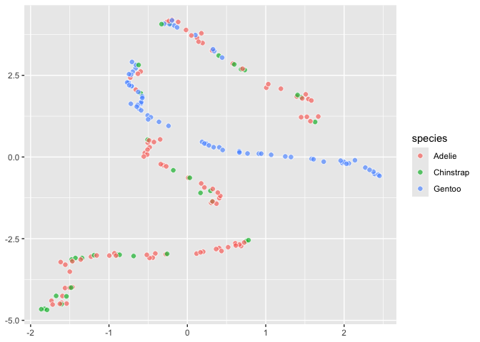<!-- -->

``` r
unvotes::un_votes |> 
  arrange(rcid) |>
  mutate(rcid = paste0("rc",rcid) |> fct_inorder()) |>
  mutate(num_vote = case_when(vote == "yes" ~ 1,
                              vote == "abstain" ~ .5,
                              vote == "no" ~ 0,
                              TRUE ~ .5 )) |>
  # filter(rcid %in% 1:30) |>
  pivot_wider(id_cols = c(country, country_code),
    names_from = rcid, 
              values_from = num_vote,
              values_fill = .5
            ) |>
  mutate(continent = country_code |> 
           countrycode::countrycode(origin = "iso2c", destination = "continent")) |>
  mutate(continent = continent |> is.na() |> ifelse("unknown", continent)) ->
unga_rcid_wide


names(unga_rcid_wide) |> tail()
#> [1] "rc9143"    "rc9144"    "rc9145"    "rc9146"    "rc9147"    "continent"
```

``` r
# maybe too big?
# usethis::use_data(unga_rcid_wide, overwrite = T)
```

``` r
dims_specs <- 
  unga_rcid_wide |>
  ggplot() + 
  aes(dims = dims(rc3:rc9147), 
      fill = continent)
```

``` r
library(patchwork)
(dims_specs + geom_pca() + labs(title = "PCA")) + 
  (dims_specs + geom_tsne() + labs(title = "Tsne")) +  
  (dims_specs + geom_umap() + labs(title = "UMAP")) + 
  patchwork::plot_layout(guides = "collect") + 
  plot_annotation(title = "UN General Assembly voting country projections")
```

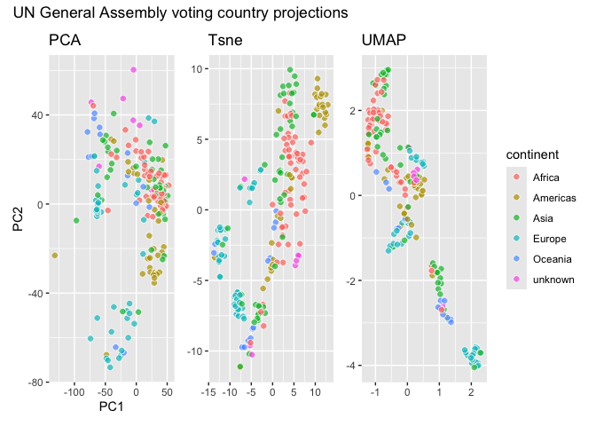<!-- -->

# a features() approach

``` r
# ggplot(alphabet) + 
#   features(a:b, z) + 
#   geom_dimred()


library(rlang)
features <- function(...){
 
    dots <- enquos(...)
    args <- c(dots)
    args <- Filter(Negate(rlang::quo_is_missing), args)
    local({
        aes <- function(...) NULL
        inject(aes(!!!args))
    })
    class_mapping(ggplot2:::rename_aes(args), env = parent.frame())
    
    out <- c()
    
    for(i in 1:length(args)){    
      
      out[i] <- args[[i]][2] |> as.character()
      
      }

    out 
      
# Then grab full list from data
    dims_expand()

    
# Then list all as class mappings feature1, feature2, etc..
    
    
}


features(a:b, x)
```
