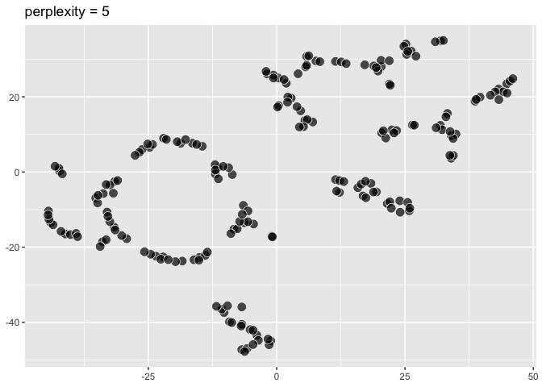
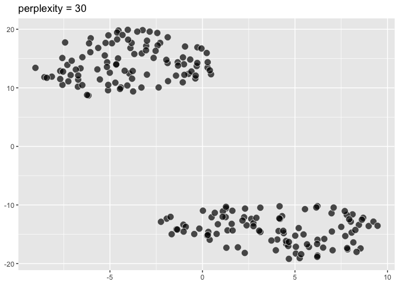
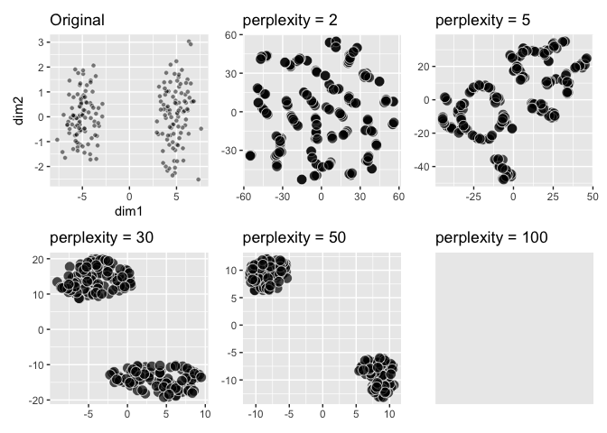
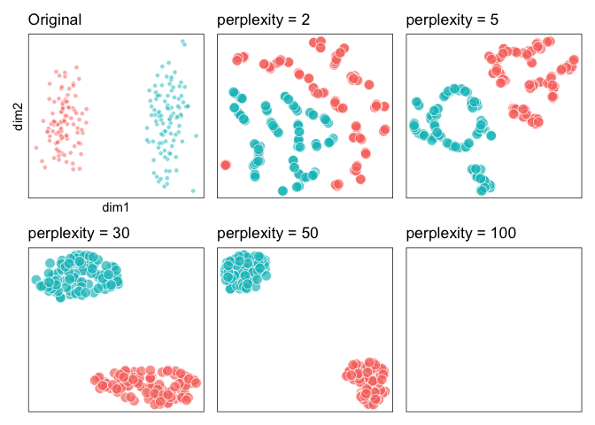
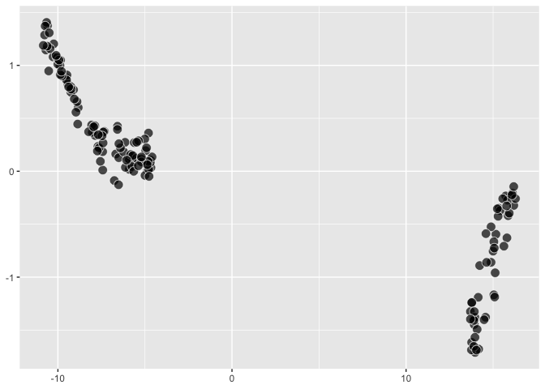
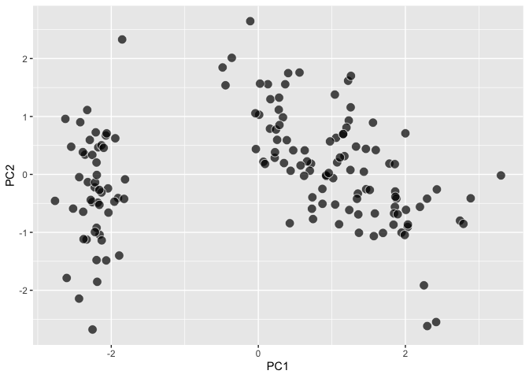

- [ggdims Intro Thoughts](#ggdims-intro-thoughts)
- [Supporting work and discussions](#supporting-work-and-discussions)
- [An implementation](#an-implementation)
  - [but we need these expanded out](#but-we-need-these-expanded-out)
  - [so let’s use some ggplot_add to try to expand, and have these vars
    listed out
    individually](#so-lets-use-some-ggplot_add-to-try-to-expand-and-have-these-vars-listed-out-individually)
  - [dims_expand](#dims_expand)
- [compute_tsne, geom_tsne](#compute_tsne-geom_tsne)
  - [Different perplexity](#different-perplexity)
- [A little UMAP](#a-little-umap)
- [Try to reproduce some of ‘How to Use t-SNE Effectively’
  https://distill.pub/2016/misread-tsne/](#try-to-reproduce-some-of-how-to-use-t-sne-effectively-httpsdistillpub2016misread-tsne)
  - [1. ‘Those hyperparameters really
    matter’](#1-those-hyperparameters-really-matter)
  - [2. ‘Cluster sizes in a t-SNE plot mean
    nothing’](#2-cluster-sizes-in-a-t-sne-plot-mean-nothing)
  - [3. ‘Distances between clusters might not mean
    anything’](#3-distances-between-clusters-might-not-mean-anything)
  - [4. ‘Random noise doesn’t always look
    random’](#4-random-noise-doesnt-always-look-random)

<!-- README.md is generated from README.Rmd. Please edit that file -->
<!-- badges: start -->
<!-- badges: end -->

## ggdims Intro Thoughts

ggplot2 seems to be not to be particularly obvious to extend for
dimensionality reduction. For viz with ggplot2 you generally specify how
each and every variable is to be visualized (which does feel very
intuitive and nice when you have few vars to visualize). But there’s a
whole world of dimension reduction and the visualization that
accompanies it. In this space, because it’s not obvious how to extend,
maybe less consistency might result as to dimensionality reduction APIs,
which could make getting acquainted with a lot of techniques more
challenging that it needs to be.

ggdims proposes the following API:

``` r
ggplot(data = my_high_dimensional_data) + 
  aes(dims = dims(dim1:dim20, dim25)) +      # or similar
  geom_reduction_technique()

last_plot() + 
  aes(color = label)    # indicate category
```

## Supporting work and discussions

Here, doing some further thinking about a dimensionality reduction
framework for ggplot2. Based on some previous work

- [2025-07-18](https://evamaerey.github.io/mytidytuesday/2025-07-18-seurat_tsne_plot/seurat_tsne_plot.html)
- [2025-08-19](https://evamaerey.github.io/mytidytuesday/2025-08-19-umap/umap.html)
- [2025-10-11](https://evamaerey.github.io/mytidytuesday/2025-10-11-ggdims/ggdims.html)

and discussions

- [ggplot-extension-club/discussions/117](https://github.com/ggplot2-extenders/ggplot-extension-club/discussions/117#discussioncomment-14565426)
- [ggplot-extension-club/discussions/18](https://github.com/ggplot2-extenders/ggplot-extension-club/discussions/18#discussioncomment-13850709)

More related:

- <https://distill.pub/2016/misread-tsne/>
- McInnes Bluffer’s guide <https://www.youtube.com/watch?v=9iol3Lk6kyU>
- <https://satijalab.org/seurat/articles/seurat5_sketch_analysis>
- McInnes Learning from Machine Learning
  <https://www.youtube.com/watch?v=6sSOr2Yaq80&t=759s>
- <https://embed.tidymodels.org/>

This is in the experimental/proof of concept phase. 🤔🚧

## An implementation

<details>

``` r
library(tidyverse)

dims <- function(...){}

iris |> 
  ggplot() + 
  aes(dims = dims(Sepal.Length:Sepal.Width, Petal.Width))
```

<!-- -->

``` r

last_plot()$mapping
#> Aesthetic mapping: 
#> * `dims` -> `dims(Sepal.Length:Sepal.Width, Petal.Width)`
```

### but we need these expanded out

Our syntax will actually use mvars, specifying each variable
individually and vars_unpack within our computation.

``` r
iris |> 
  ggplot() + 
  aes(dims = 
        mvars(Sepal.Length, Sepal.Width, 
                Petal.Length, Petal.Width),
      fill = Species) +
  geom_tsne0()
```

``` r
mvars <- function(...) {
  
  varnames <- as.character(ensyms(...))
  vars <- list(...)
  listvec <- asplit(do.call(cbind, vars), 1)
  structure(listvec, varnames = varnames)

  }

vars_unpack <- function(x) {
  pca_vars <- x
  df <- do.call(rbind, pca_vars)
  colnames(df) <- attr(pca_vars, "varnames")
  as.data.frame(df)
  
}
```

### so let’s use some ggplot_add to try to expand, and have these vars listed out individually

``` r
iris |> 
  ggplot() + 
  aes(dims = dims(Sepal.Length:Petal.Length, Petal.Width))
```

<!-- -->

``` r

p <- last_plot()

p$mapping$dims[[2]]  # the unexpanded expression
#> Warning: Subsetting quosures with `[[` is deprecated as of rlang 0.4.0
#> Please use `quo_get_expr()` instead.
#> This warning is displayed once every 8 hours.
#> dims(Sepal.Length:Petal.Length, Petal.Width)

p$mapping$dims |> 
  as.character() |> 
  _[2] |> 
  stringr::str_extract("\\(.+") |> 
  stringr::str_remove_all("\\(|\\)") -> 
selected_var_names_expr
#> Warning: Using `as.character()` on a quosure is deprecated as of rlang 0.3.0. Please use
#> `as_label()` or `as_name()` instead.
#> This warning is displayed once every 8 hours.

selected_var_names <- 
  selected_var_names_expr |> 
  str_split(", ") |> 
  _[[1]]
  
var_names <- c()

for(i in 1:length(selected_var_names)){

  new_var_names <- select(last_plot()$data, !!!list(rlang::parse_expr(selected_var_names[i]))) |> names()
  
var_names <- c(var_names, new_var_names)
  
}

expanded_vars <- var_names |> paste(collapse = ", ") 

new_dim_expr <- paste("mvars(", expanded_vars, ")")

p$mapping$dims[[2]] <- rlang::parse_expr(new_dim_expr)

p$mapping$dims[[2]]
#> mvars(Sepal.Length, Sepal.Width, Petal.Length, Petal.Width)
```

### dims_expand

``` r
#' @export
dims_expand <- function() {

  structure(
    list(
      # data_spec = data,
         # vars_spec = rlang::enquo(vars)
         ), 
    class = "dims_expand"
    )

}

#' @import ggplot2
#' @importFrom ggplot2 ggplot_add
#' @export
ggplot_add.dims_expand <- function(object, plot, object_name) {
  
plot$mapping$dims |> 
  as.character() |> 
  _[2] |> 
  stringr::str_extract("\\(.+") |> 
  stringr::str_remove_all("\\(|\\)") -> 
selected_var_names_expr

selected_var_names <- 
  selected_var_names_expr |> 
  str_split(", ") |> 
  _[[1]]
  
var_names <- c()

for(i in 1:length(selected_var_names)){

  new_var_names <- select(plot$data, !!!list(rlang::parse_expr(selected_var_names[i]))) |> names()
  
var_names <- c(var_names, new_var_names)
  
}

expanded_vars <- var_names |> paste(collapse = ", ") 

new_dim_expr <- paste("mvars(", expanded_vars, ")")

plot$mapping$dims[[2]] <- rlang::parse_expr(new_dim_expr)

plot

}
```

</details>

``` r
p <- iris |> 
  ggplot() + 
  aes(dims = dims(Sepal.Length:Petal.Length, Petal.Width)) + 
  dims_expand()

p$mapping
#> Aesthetic mapping: 
#> * `dims` -> `mvars(Sepal.Length, Sepal.Width, Petal.Length, Petal.Width)`
```

## compute_tsne, geom_tsne

<details>

``` r
# compute_tsne0 allows individually listed variables that are all of the same type
compute_tsne0 <- function(data, scales, perplexity = 20){
  
  set.seed(1345)
  
# identify duplicates just based on tsne data
data |>
  select(dims) |>
  mutate(vars_unpack(dims)) |>
  select(-dims) ->
data_unpacked ; data_unpacked

names_predictors <- names(data_unpacked); names_predictors

data_unpacked |>
   duplicated() ->
dups ; dups
# #
# # #
data_unpacked |>
    bind_cols(data) |>
     _[!dups,] |> 
  remove_missing() ->
clean_data ; clean_data
# # # 
clean_data |>
  _[names_predictors] |>
  as.matrix() |>
  Rtsne::Rtsne(perplexity = perplexity) |>
  _$Y |>
  as_tibble() |>
 rename(x = V1, y = V2) |>
 bind_cols(clean_data)
#   

}


iris |> 
  mutate(dims = mvars(Sepal.Length, Sepal.Width, 
                Petal.Length, Petal.Width)) |>
  select(dims) |>
  compute_tsne0()
#> Warning: The `x` argument of `as_tibble.matrix()` must have unique column names if
#> `.name_repair` is omitted as of tibble 2.0.0.
#> ℹ Using compatibility `.name_repair`.
#> This warning is displayed once every 8 hours.
#> Call `lifecycle::last_lifecycle_warnings()` to see where this warning was
#> generated.
#> # A tibble: 149 × 7
#>         x     y Sepal.Length Sepal.Width Petal.Length Petal.Width dims      
#>     <dbl> <dbl>        <dbl>       <dbl>        <dbl>       <dbl> <list[1d]>
#>  1 -10.3  -19.3          5.1         3.5          1.4         0.2 <dbl [4]> 
#>  2 -11.2  -15.4          4.9         3            1.4         0.2 <dbl [4]> 
#>  3  -9.61 -14.7          4.7         3.2          1.3         0.2 <dbl [4]> 
#>  4 -10.1  -14.5          4.6         3.1          1.5         0.2 <dbl [4]> 
#>  5  -9.57 -19.5          5           3.6          1.4         0.2 <dbl [4]> 
#>  6  -9.59 -22.1          5.4         3.9          1.7         0.4 <dbl [4]> 
#>  7  -8.80 -14.9          4.6         3.4          1.4         0.3 <dbl [4]> 
#>  8  -9.98 -18.2          5           3.4          1.5         0.2 <dbl [4]> 
#>  9 -10.4  -13.4          4.4         2.9          1.4         0.2 <dbl [4]> 
#> 10 -10.8  -15.9          4.9         3.1          1.5         0.1 <dbl [4]> 
#> # ℹ 139 more rows
  

StatTsne0 <- ggproto("StatTsne0", Stat, 
                     compute_panel = compute_tsne0)

GeomPointFill <- ggproto("GeomPointFill", 
                         GeomPoint,
                         default_aes = 
                           modifyList(GeomPoint$default_aes, 
                                      aes(shape = 21, 
                                          color = from_theme(paper),
                                          size = from_theme(pointsize * 2.5),
                                          alpha = .7,
                                          fill = from_theme(ink))))

geom_tsne0 <- make_constructor(GeomPointFill, stat = StatTsne0, perplexity = 30)

iris |> 
  ggplot() + 
  aes(dims = 
        mvars(Sepal.Length, Sepal.Width, 
                Petal.Length, Petal.Width),
      fill = Species) +
  geom_tsne0()
```

<!-- -->

``` r


p$mapping$dims
#> <quosure>
#> expr: ^mvars(Sepal.Length, Sepal.Width, Petal.Length, Petal.Width)
#> env:  global
p + 
  geom_tsne0() + 
  aes(fill = Species)
```

<!-- -->

``` r


theme_dims <- function(ink = "black", paper = "white"){
  
  theme_grey() +
    theme(panel.background = element_blank(),
          panel.grid = element_blank(),
          axis.text = element_blank(),
          axis.ticks = element_blank(),
          panel.border = element_rect(color = ink) 
          )
  
}
```

``` r
geom_tsne <- function(...){
  list(
    dims_expand(),
    geom_tsne0(...)
  )
}
```

</details>

``` r
iris |> 
  ggplot() + 
  aes(dims = dims(Sepal.Length:Petal.Length, Petal.Width)) +
  geom_tsne()

last_plot() + 
  aes(fill = Species)
```


### Different perplexity

``` r
iris |> 
  ggplot() + 
  aes(dims = dims(Sepal.Length:Petal.Length, Petal.Width),
      fill = Species) +
  geom_tsne(perplexity = 10)
```

<!-- -->

# A little UMAP

<details>

``` r
compute_umap <- function(data, scales, n_components = 2, random_state = 15){
  
set.seed(1345)
  
# identify duplicates just based on tsne data
data |>
  select(dims) |>
  mutate(vars_unpack(dims)) |>
  select(-dims) ->
data_unpacked ; data_unpacked

names_predictors <- names(data_unpacked); names_predictors

data_unpacked |>
    bind_cols(data) |>
  remove_missing() ->
clean_data ; clean_data

# # # 
clean_data |>
  _[names_predictors] |>
  umap::umap(n_components = n_components, random_state = random_state)  |>
  _$layout |>
  as_tibble() |>
 rename(x = V1, y = V2) |>
 bind_cols(clean_data)
#   

}

iris |> 
  mutate(dims = 
        mvars(Sepal.Length, Sepal.Width, 
                Petal.Length, Petal.Width)) |>
  select(color = Species, dims) |>
  compute_umap()
#> # A tibble: 150 × 8
#>        x     y Sepal.Length Sepal.Width Petal.Length Petal.Width color  dims    
#>    <dbl> <dbl>        <dbl>       <dbl>        <dbl>       <dbl> <fct>  <list[1>
#>  1  15.7 -4.39          5.1         3.5          1.4         0.2 setosa <dbl[…]>
#>  2  13.7 -4.54          4.9         3            1.4         0.2 setosa <dbl[…]>
#>  3  14.1 -5.12          4.7         3.2          1.3         0.2 setosa <dbl[…]>
#>  4  13.8 -5.22          4.6         3.1          1.5         0.2 setosa <dbl[…]>
#>  5  15.4 -4.27          5           3.6          1.4         0.2 setosa <dbl[…]>
#>  6  15.9 -3.28          5.4         3.9          1.7         0.4 setosa <dbl[…]>
#>  7  14.2 -5.35          4.6         3.4          1.4         0.3 setosa <dbl[…]>
#>  8  15.3 -4.62          5           3.4          1.5         0.2 setosa <dbl[…]>
#>  9  13.5 -5.33          4.4         2.9          1.4         0.2 setosa <dbl[…]>
#> 10  13.8 -4.81          4.9         3.1          1.5         0.1 setosa <dbl[…]>
#> # ℹ 140 more rows

StatUmap <- ggproto("StatUmap", Stat, 
                     compute_panel = compute_umap)

geom_umap0 <- make_constructor(GeomPointFill, stat = StatUmap, random_state = 15, n_components = 4)

geom_umap <- function(...){
  
  list(dims_expand(), 
       geom_umap0())
  
}
```

</details>

``` r
iris |> 
  ggplot() + 
  aes(dims = dims(Sepal.Length:Petal.Width)) + 
  geom_umap()
```

<!-- -->

``` r

last_plot() + 
  aes(fill = Species)
```

<!-- -->

------------------------------------------------------------------------

# Try to reproduce some of ‘How to Use t-SNE Effectively’ <https://distill.pub/2016/misread-tsne/>

### 1. ‘Those hyperparameters really matter’

Let’s try to reproduce the following with our `geom_tsne()`:


``` r
hello_world_of_tsne <- data.frame(dim1 = rnorm(200) + 
                                    c(rep(-5, 100), rep(5, 100)),
                                  dim2 = rnorm(200),
                                  type = c(rep("A", 100), rep("B", 100)))

original <- hello_world_of_tsne |>
  ggplot() + 
  aes(x = dim1, 
      y = dim2) + 
  geom_point(shape = 21, color = "white",
             alpha = .5) + 
  labs(title = "Original") + 
  aes(fill = I("black"))

pp2 <- ggplot(data = hello_world_of_tsne) + 
  aes(dims = dims(dim1:dim2)) +
  geom_tsne(perplexity = 2) + 
  labs(title = "perplexity = 2"); pp2
```

<!-- -->

``` r

pp5 <- ggplot(data = hello_world_of_tsne) + 
  aes(dims = dims(dim1:dim2)) +
  geom_tsne(perplexity = 5) + 
  labs(title = "perplexity = 5"); pp5
```

<!-- -->

``` r

pp30 <- ggplot(data = hello_world_of_tsne) + 
  aes(dims = dims(dim1:dim2)) +
  geom_tsne(perplexity = 30) + 
  labs(title = "perplexity = 30"); pp30
```

<!-- -->

``` r

pp50 <- ggplot(data = hello_world_of_tsne) + 
  aes(dims = dims(dim1:dim2)) +
  geom_tsne(perplexity = 50) + 
  labs(title = "perplexity = 50")

pp100 <- ggplot(data = hello_world_of_tsne) + 
  aes(dims = dims(dim1:dim2)) +
  geom_tsne(perplexity = 100) + 
  labs(title = "perplexity = 100")


library(patchwork)
#> Warning: package 'patchwork' was built under R version 4.4.1
original + pp2 + pp5 + pp30 + pp50 + pp100
#> Warning: Computation failed in `stat_tsne0()`.
#> Caused by error in `.check_tsne_params()`:
#> ! perplexity is too large for the number of samples
```

<!-- -->

``` r

# with group id
last_plot() & 
  aes(fill = type) &
  guides(fill = "none") &
  theme_dims() 
#> Warning: Computation failed in `stat_tsne0()`.
#> Caused by error in `.check_tsne_params()`:
#> ! perplexity is too large for the number of samples
#> Warning: annotation$theme is not a valid theme.
#> Please use `theme()` to construct themes.
```

<!-- -->

``` r


panel_of_six_tsne_two_cluster <- last_plot()
```

### 2. ‘Cluster sizes in a t-SNE plot mean nothing’

Let’s try to reproduce this (we’ll shortcut but switching out the data
across plot specifications): 

``` r
big_and_small_cluster <- data.frame(dim1 = c(rnorm(100), rnorm(100, sd = .1)) + 
                                    c(rep(-5, 100), rep(5, 100)),
                                  dim2 = c(rnorm(100), rnorm(100, sd = .1)),
                                  type = c(rep("A", 100), rep("B", 100)))


panel_of_six_tsne_two_cluster & 
  ggplyr::data_replace(big_and_small_cluster)
#> Warning: Computation failed in `stat_tsne0()`.
#> Caused by error in `.check_tsne_params()`:
#> ! perplexity is too large for the number of samples
#> Warning: annotation$theme is not a valid theme.
#> Please use `theme()` to construct themes.
```

<!-- -->

#### Side note on ggplyr::data_replace X google gemini quick search


### 3. ‘Distances between clusters might not mean anything’

Now let’s look at these three clusters, where one cluster is far out:


``` r
two_close_and_one_far <- data.frame(dim1 = rnorm(150) + 
                                    c(rep(-5, 50), 
                                      rep(5, 50),
                                      rep(50, 50)),
                                    dim2 = rnorm(150),
                                    type = c(rep("A", 50), 
                                           rep("B", 50),
                                           rep("C", 50)))

panel_of_six_tsne_two_cluster & 
  ggplyr::data_replace(two_close_and_one_far)
#> Warning: Computation failed in `stat_tsne0()`.
#> Computation failed in `stat_tsne0()`.
#> Caused by error in `.check_tsne_params()`:
#> ! perplexity is too large for the number of samples
#> Warning: annotation$theme is not a valid theme.
#> Please use `theme()` to construct themes.
```

<!-- -->

### 4. ‘Random noise doesn’t always look random’


``` r
random_noise <- data.frame(dim1 = rnorm(500),
                           dim2 = rnorm(500))

original + pp2 + pp5 + pp30 + pp50 + pp100 & 
  ggplyr::data_replace(random_noise) &
  aes(fill = I("darkblue")) &
  theme_dims()
#> Warning: annotation$theme is not a valid theme.
#> Please use `theme()` to construct themes.
```

<!-- -->

------------------------------------------------------------------------

------------------------------------------------------------------------
