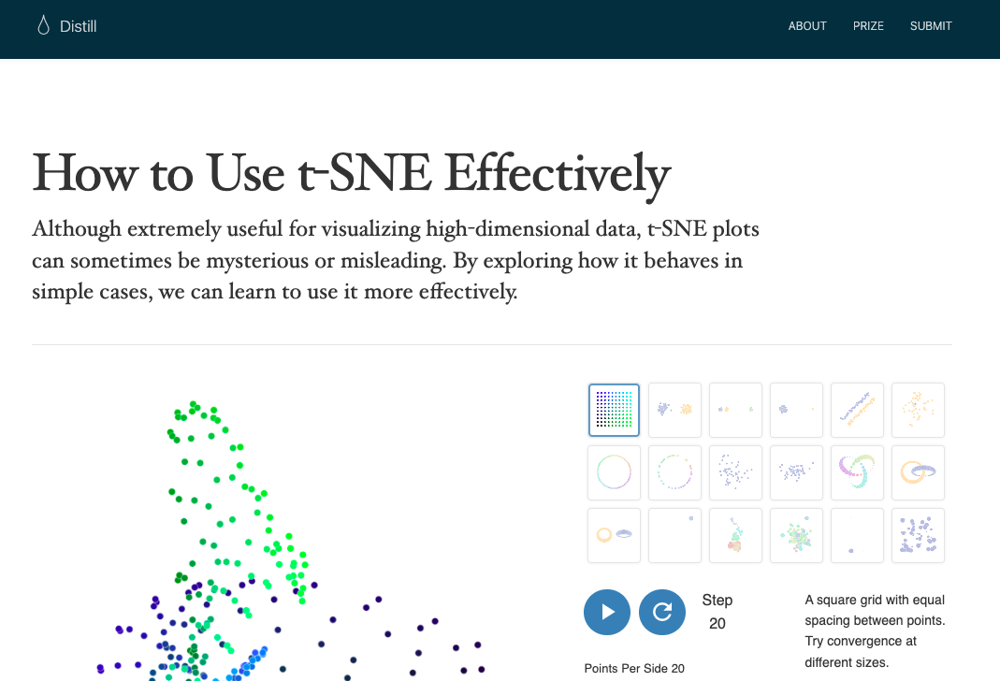
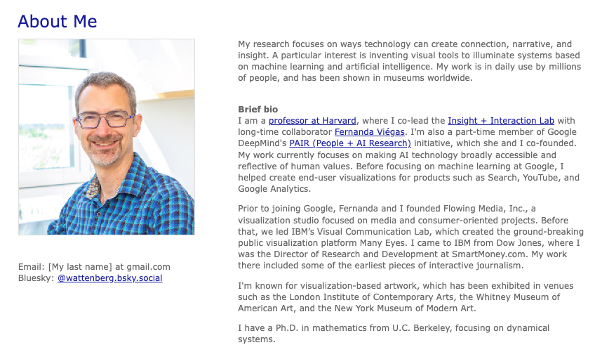
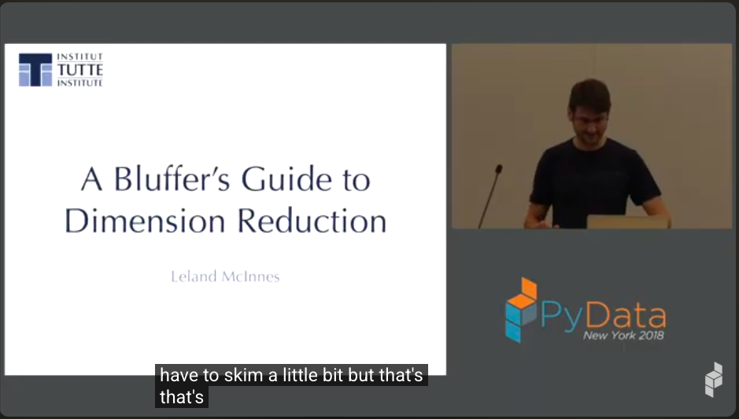
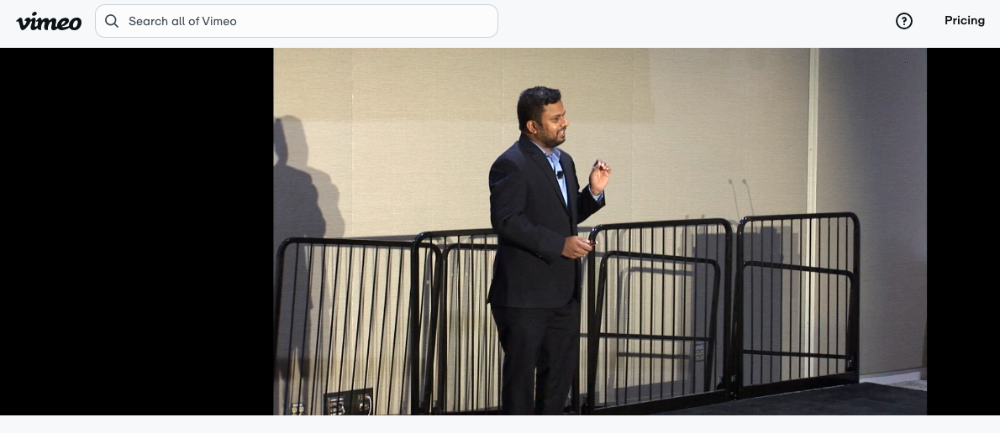
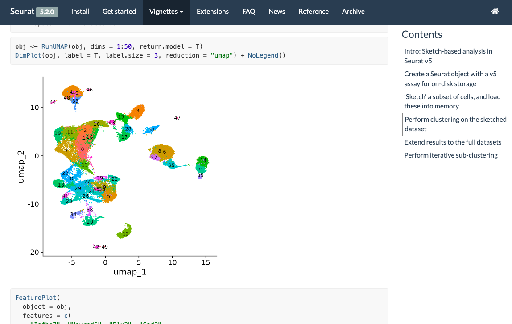
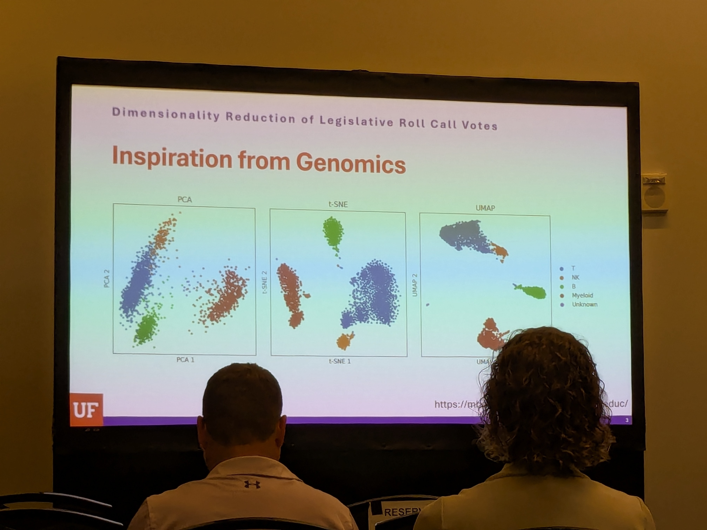
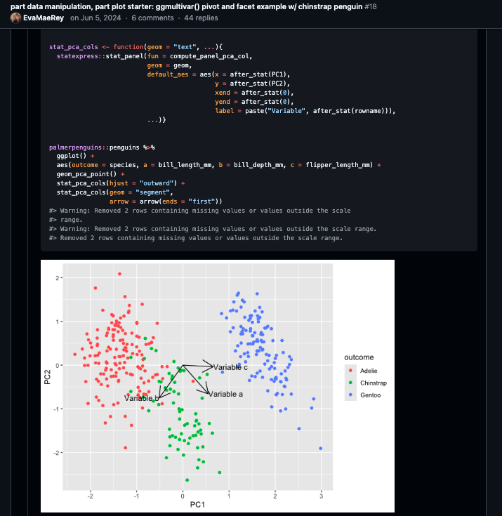
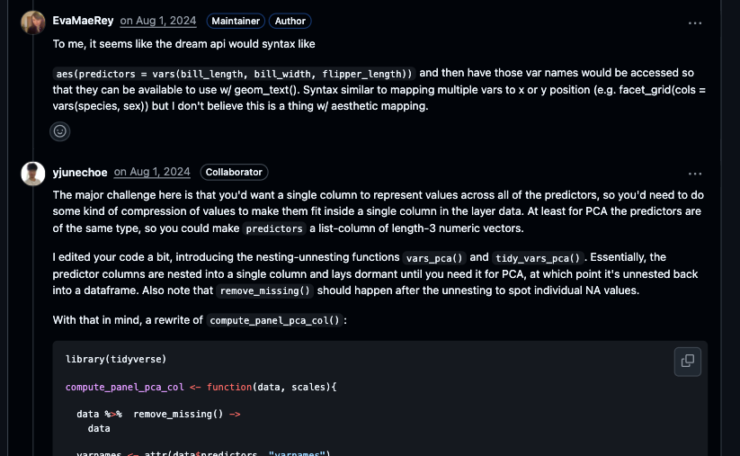
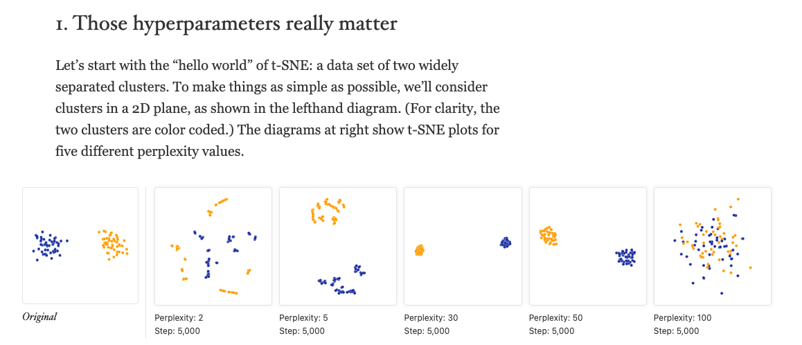

class: inverse, bottom
background-image: url(https://plus.unsplash.com/premium_photo-1686050878751-89499d28d153?ixlib=rb-4.1.0&ixid=M3wxMjA3fDB8MHxzZWFyY2h8MXx8bmlnaHRza3l8ZW58MHx8MHx8fDA%3D&auto=format&fit=crop&q=60&w=500)
background-size: cover

# .Large[{ggdims}]
## .small[Toward a viz- and code-first hitchhiker’s guide to dimensionality reduction]
## .small[github.com/EvaMaeRey/ggdims]
#### .tiny[Gina (Evangeline) Reynolds | 2025-11-14 | ASA, COWY, Image credit: Ales Krivec, Upsplash]


```{r, include = F}
# This is the recommended set up for flipbooks
# you might think about setting cache to TRUE as you gain practice --- building flipbooks from scratch can be time consuming
knitr::opts_chunk$set(fig.width = 6, message = FALSE, warning = FALSE, comment = "", cache = T)
library(flipbookr)
library(tidyverse)
```


```{css, eval = TRUE, echo = FALSE}
/* Change default body text size */
.remark-slide-content {
  font-size: 32px; /* Or use em, rem, or viewport units like 2vw */
}

/* Change font size for a specific class (e.g., for larger text) */
.large-text {
  font-size: 1.5em;
}

/* Change font size for code blocks */
.remark-code {
  font-size: 0.9em;
}

/* Change font size for inline code */
.remark-inline-code {
  font-size: 0.9em;
}


```


---

### cliffnotes for talk

---

This pattern for ggplot2 extension ...

--

```{r, eval = F}
library(ggplot2)

ggplot(data = my_high_dimensional_data) + 
  aes(dims = dims(var1:var200, var205)) +      
  geom_dim_red_technique()  # geom_pca(), geom_tsne            
```

--

... isn't a pattern ...

--

And maybe it should be. 


---

`aes(dims = dims(var1:var200, var205))`


---
class: inverse, middle, center

{ggdims} explores viz- and code- first dimensionality reduction 

--

- A 3-week-old github repo/package 

--

Rest of talk: how we got here (a longer time coming)


---
class: inverse, middle, center

# ggplot2 (2007) lets you intuitively translate variables to visual representation.

---

`gplot(my_data) +`


`aes(x <- age) + `

`aes(color <- sex) +`

`aes(linetype <- employment status) +`

`geom_point()`


<!-- --- -->
<!-- class: inverse, middle -->

<!-- # You specify how variables (e.g. sex, age, employment status) ... -->

<!-- -- -->

<!-- # ... are to be communicated via visual channels (x position, y position, color, transparency, etc).  -->


---
class: inverse

# But... ggplot2 allows individual-variable- 
--
to- individual-visual-channel mapping


---
class: inverse

# A problem with 1-to-1:

--

## Doesn't lend itself easily to visualizations in the world of dimension reduction (e.g. PCA, t-SNE, UMAP)


???

## However, in ggplot2 these specifications are individual-variable-to-individual-visual-channel which does not lend itself easily to visualizations in the world of dimension reduction (e.g. PCA, T-sne, UMAP). 


---

```{r, eval = F}
library(ggplot2)

ggplot(data = my_high_dimensional_data) + 
  aes(dims = dims(var1:var200, var205)) +   # <<   
  geom_dimred_technique()  # e.g. geom_pca(), geom_tsne(), geom_umap()             
```


---

> "You really should 'algorithm' first, and then use the results in a data-viz."

--

(algorithm used as a verb here)

---

# 2016
https://distill.pub/2016/misread-tsne/



---



---

Martin Wattenberg 'How to use t-SNE effectively' 2016: 

> Paraphrase: 'it's worth taking the time to get a feel for what the algorithm does with some familiar, well understood distributions' 

--

> Further paraphrase: Jump right in. Do some dimensionality reduction. Visualize. 


---


---

> "Wattenberg is wrong - not rigorous, not a mathematician"

---

Leland McInnes "Bluffer's Guide"

> "I'm gonna try and give as much of a whirlwind tour of the 
entire field of dimention reduction as I can in the time available." 



---


--

> 'The similarities are greater than the differences' ?...


---

> Shouldn't we be able to visually fly (hitchhike) through trying out some of these techniques?

--

> Should we have to learn a different paradigm/syntax for every technique?

--

> What if the syntax were something already familiar (2D viz - ggplot2 scatterplot)?


---

`r chunk_reveal("scatter")`

```{r scatter, include=F}
library(ggplot2)

# data 
ggplot(cars) +     
  # variable mapping
  aes(x = speed,   
      y = dist) + 
  # layer
  geom_point()     
```

---

```{r, eval = F}
ggplot(cars) + # data
  aes(????)    # var mapping
  geom_pca()   # layer - options inside parentheses

ggplot(cars) + # data
  aes(????)    # var mapping
  geom_tsne()  # layer

ggplot(cars) + # data
  aes(????)    # var mapping
  geom_umap()  # layer
```

---

# Online Posit Conf speaker training, July 22, 2025: "Give a Ted Talk"

Sathiya Manivannan, Center for Cardiovascular and Pulminary Research



---


---

> "It's easier to type thing which are smaller, but when things are getting bigger and bigger you prefer to click on buttons and work [with a GUI]." (made a shiny wrapper for {seurat})

--

Question the premise: Maybe there isn't a good ggplot2 extension to handle this?

---



---

## Nashville JSM Talk, "Developments in Statistical Graphics" panel, Tuesday, August 5


---


<https://phhp.ufl.edu/about/departments/biostatistics/about/faculty/>


---



---

```{r, eval = F}
ggplot(voting_data) + # data
  aes(????)    # var mapping
  geom_pca()   # layer - options inside

ggplot(voting_data) + # data
  aes(????)    # var mapping
  geom_tsne()  # layer

ggplot(voting_data) + # data
  aes(????)    # var mapping
  geom_umap()  # layer
```


---

### June-Sept 2024... `geom_pca_point()`




---

```{r, eval = F}
palmerpenguins::penguins %>% 
  ggplot() + 
  aes(outcome = species, 
      pred1 = bill_length_mm, 
      pred2 = bill_depth_mm, 
      pred3 = flipper_length_mm) +
  geom_pca_point()  
```

---



---


```{r, eval = F}
palmerpenguins::penguins %>% 
  ggplot() + 
  aes(outcome = species, 
      dims = vars(bill_length_mm,  
                  bill_depth_mm, 
                  flipper_length_mm)) +
  geom_pca_point()
```

---

tsne, umpa - big data (lots of variables)

> "It's easier to type thing which are smaller, but when things are getting bigger and bigger you prefer to click on buttons and work [with a GUI]."

--

`aes(dims = vars(var1, var2, var3, var4, var5, var6)`

--

`aes(dims = dims(var1:var6))`


---


---

```{r, eval = F}
library(ggplot2)

ggplot(data = my_high_dimensional_data) + 
  aes(dims = dims(var1:var200, var205)) + # or similar
  geom_reduction_technique() 
```

---

### utilities

```{r, eval = F}
ggdims::dims_listed()
ggdims::data_vars_unpack()
ggdims::dims_expand()  #<< expand var1:var20
```

--

### for defining compute w/ var1 & var20 shortcut syntax and those in-between

```{r, eval = F}
ggdims::compute_pca()
ggdims::compute_tsne()
ggdims::compute_umap()
```

---

### user-facing functions

```{r eval = F}
ggdims::geom_pca()
ggdims::geom_tsne()
ggdims::geom_umap()
```

---

# Does it work? 


---

```{r, echo = F, message=F, warning=F}
library(tidyverse)

unvotes::un_votes |> 
  arrange(rcid) |>
  mutate(rcid = paste0("rc",rcid) |> fct_inorder()) |>
  mutate(num_vote = case_when(vote == "yes" ~ 1,
                              vote == "abstain" ~ .5,
                              vote == "no" ~ 0,
                              TRUE ~ .5 )) |>
  # filter(rcid %in% 1:30) |>
  pivot_wider(id_cols = c(country, country_code),
    names_from = rcid, 
              values_from = num_vote,
              values_fill = .5
            ) |>
  mutate(continent = country_code |> 
           countrycode::countrycode(origin = "iso2c", destination = "continent")) |>
  mutate(continent = continent |> is.na() |> ifelse("unknown", continent)) ->
un_ga_country_wide_rcid


# names(un_ga_country_wide_rcid) |> tail()
```


# concise, consistent, 'graphical poems'

```{r, out.width="100%"}
library(ggdims)
ggplot(un_ga_country_wide_rcid) + 
  aes(dims = dims(rc3:rc9147)) + #<<
  geom_pca() + #<<
  aes(fill = continent) +
  labs(title = "PCA") ->
unga_pca
```

---

# concise, consistent, 'graphical poems'

```{r}
library(ggdims)
ggplot(un_ga_country_wide_rcid) + 
  aes(dims = dims(rc3:rc9147)) + #<<
  geom_tsne() + #<<
  aes(fill = continent) +
  labs(title = "t-SNE") ->
unga_tsne
```

---

# concise, consistent, 'graphical poems'

```{r}
library(ggdims)
ggplot(un_ga_country_wide_rcid) + 
  aes(dims = dims(rc3:rc9147)) + #<<
  geom_umap() + #<<
  aes(fill = continent) +
  labs(title = "UMAP") ->
unga_umap
```


---

```{r, fig.width=10, fig.height=4}
library(patchwork)

unga_pca + unga_tsne + unga_umap + 
  plot_layout(guides = "collect") + 
  plot_annotation(title = "UN General Assembly voting projections")

```


---


---

## Across-methods fly-over (pca, tsne, umap)

--

## Within-method fly-over? (tsne specifications, data)

---


---





---

```{r, echo = F}
library(tidyverse)
library(ggdims)
hello_world_of_tsne <- data.frame(dim1 = 
                                    rnorm(101, mean = -.5,
                                          sd = .1) |>
                                    c(rnorm(101, mean = .5,
                                            sd = .1)),
                                   
                                  dim2 = rnorm(202, sd = .1),
                                  type = c(rep("A", 101), rep("B", 101)))

original <- hello_world_of_tsne |>
  ggplot() + 
  aes(x = dim1, 
      y = dim2) + 
  geom_point(shape = 21, color = "white",
             alpha = .7, 
             aes(size = from_theme(pointsize * 1.5))) + 
  labs(title = "Original") + 
  aes(fill = type) + 
  coord_equal(xlim = c(-1,1), ylim = c(-1,1)) 
  

original + 
  labs(title = "Hello World of t-SNE")

```


---

`r chunk_reveal("pp2")`

```{r pp2, include= F}
hello_world_of_tsne |>
  ggplot() + 
  aes(dims = dims(dim1:dim2)) +
  geom_tsne(perplexity = 2) + 
  labs(title = "perplexity = 2") + 
  aes(fill = type) -> 
pp2; pp2
```

---

`r chunk_reveal("pp5", break_type = 2)`

```{r pp5, include=F}
hello_world_of_tsne |>
  ggplot() + 
  aes(dims = dims(dim1:dim2)) +
  geom_tsne(perplexity = 5) + 
  labs(title = "perplexity = 5") + 
  aes(fill = type) -> 
pp5; pp5
```

---

`r chunk_reveal("pp30", break_type = 2)`

```{r pp30, include=F}
hello_world_of_tsne |>
  ggplot() + 
  aes(dims = dims(dim1:dim2)) +
  geom_tsne(perplexity = 30) + 
  labs(title = "perplexity = 30") + 
  aes(fill = type) -> 
pp30; pp30
```


---

`r chunk_reveal("pp50", break_type = 2)`

```{r pp50, include=F}
hello_world_of_tsne |>
  ggplot() + 
  aes(dims = dims(dim1:dim2)) +
  geom_tsne(perplexity = 50) + 
  labs(title = "perplexity = 50") + 
  aes(fill = type) -> 
pp50; pp50
```


---

`r chunk_reveal("pp100", break_type = 2)`

```{r pp100, include=F}
hello_world_of_tsne |>
  ggplot() + 
  aes(dims = dims(dim1:dim2)) +
  geom_tsne(perplexity = 100) + 
  labs(title = "perplexity = 100") + 
  aes(fill = type) -> 
pp100; pp100
```

---

```{r , fig.height=3}
library(patchwork)

original + pp2 + pp5 + pp30 + pp50 + pp100 &
  theme_ggdims() + 
  plot_layout(guides = "collect")


```


---


---

```{r, fig.height=3}
two_close_and_one_far <- 
  data.frame(dim1 = c(rnorm(150, -.75, .05), rnorm(150, -.35, .05), rnorm(150, .75, .05)),
             dim2 = rnorm(450, sd = .05),
             type = c(rep("A", 150), rep("B", 150), rep("C", 150)))

last_plot() & # contains all six of the 'hello world of tsne' specifications
  ggplyr::data_replace(two_close_and_one_far) # change data
```

---

# Is this the right implementation?  

--

Maybe not

--

# Are there some known fragilities

--

Yes

--

# Are you the right person to be writing things like `geom_umap`

--

Maybe not..

---
class: inverse, middle, center


Thank you!

---


```{css, eval = TRUE, echo = FALSE}
.remark-code{line-height: 1.5; font-size: 70%}

@media print {
  .has-continuation {
    display: block;
  }
}

code.r.hljs.remark-code{
  position: relative;
  overflow-x: hidden;
}


code.r.hljs.remark-code:hover{
  overflow-x:visible;
  width: 500px;
  border-style: solid;
}


```
