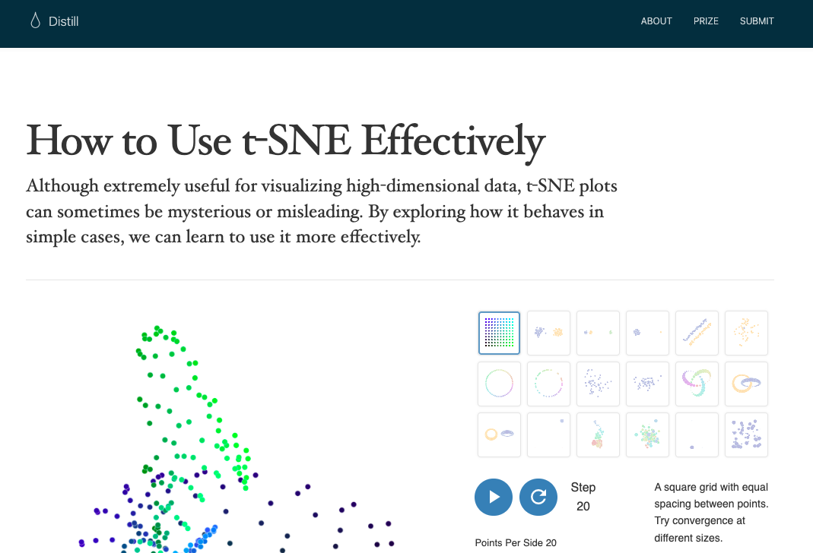
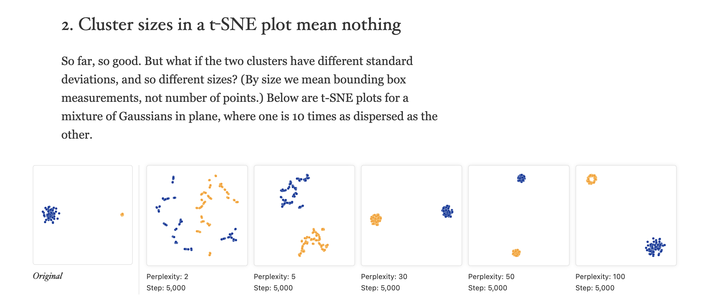
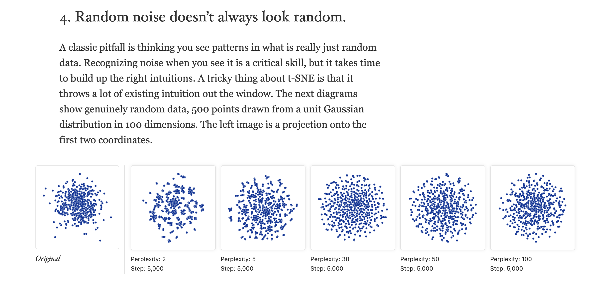

```{r, include = F}
# This is the recommended set up for flipbooks
# you might think about setting cache to TRUE as you gain practice --- building flipbooks from scratch can be time consuming
knitr::opts_chunk$set(fig.width = 6, message = FALSE, warning = FALSE, comment = "", cache = F)
library(flipbookr)
library(tidyverse)
```


```{css, eval = TRUE, echo = FALSE}
/* Change default body text size */
.remark-slide-content {
  font-size: 32px; /* Or use em, rem, or viewport units like 2vw */
}

/* Change font size for a specific class (e.g., for larger text) */
.large-text {
  font-size: 1.5em;
}

/* Change font size for code blocks */
.remark-code {
  font-size: 0.9em;
}

/* Change font size for inline code */
.remark-inline-code {
  font-size: 0.9em;
}


```

--

## Within-method fly-over? (tsne specifications, data)

---



---


---


---

```{r, echo = F}
library(tidyverse)
library(ggdims)

original <- two_clusters |>
  ggplot() + 
  aes(x = dim1, 
      y = dim2) + 
  geom_point(shape = 21, color = "white",
             alpha = .7, 
             aes(size = from_theme(pointsize * 1.5))) + 
  labs(title = "Original") + 
  aes(fill = type) + 
  coord_equal(xlim = c(-1,1), ylim = c(-1,1)) 
  

original + 
  labs(title = "Hello World of t-SNE")

```


---

`r chunk_reveal("pp2", widths = c(1,1))`

```{r pp2, include= F}
two_clusters |>
  ggplot() + 
  aes(dims = dims(dim1:dim2)) +
  geom_tsne(perplexity = 2) + 
  labs(title = "perplexity = 2") + 
  aes(fill = type) -> 
pp2; pp2
```

---

`r chunk_reveal("pp5", break_type = 2, widths = c(1,1))`

```{r pp5, include=F}
two_clusters |>
  ggplot() + 
  aes(dims = dims(dim1:dim2)) +
  geom_tsne(perplexity = 5) + 
  labs(title = "perplexity = 5") + 
  aes(fill = type) -> 
pp5; pp5
```

---

`r chunk_reveal("pp30", break_type = 2, widths = c(1,1))`

```{r pp30, include=F}
two_clusters |>
  ggplot() + 
  aes(dims = dims(dim1:dim2)) +
  geom_tsne(perplexity = 30) + 
  labs(title = "perplexity = 30") + 
  aes(fill = type) -> 
pp30; pp30
```


---

`r chunk_reveal("pp50", break_type = 2, widths = c(1,1))`

```{r pp50, include=F}
two_clusters |>
  ggplot() + 
  aes(dims = dims(dim1:dim2)) +
  geom_tsne(perplexity = 50) + 
  labs(title = "perplexity = 50") + 
  aes(fill = type) -> 
pp50; pp50
```


---

`r chunk_reveal("pp100", break_type = 2, widths = c(1,1))`

```{r pp100, include=F}
two_clusters |>
  ggplot() + 
  aes(dims = dims(dim1:dim2)) +
  geom_tsne(perplexity = 100) + 
  labs(title = "perplexity = 100") + 
  aes(fill = type) -> 
pp100; pp100
```

---


```{r , fig.height=4.5, fig.width=6}
library(patchwork)

original + pp2 + pp5 + pp30 + pp50 + pp100

```


---


```{r , fig.height=4.5, fig.width=6}
library(patchwork)

original + pp2 + pp5 + pp30 + pp50 + pp100 &
  guides(fill = "none") 


```


---


```{r , fig.height=4.5, fig.width=6}
library(patchwork)

original + pp2 + pp5 + pp30 + pp50 + pp100 &
  guides(fill = "none") &
  theme_ggdims() 


```


---


```{r , fig.height=4.5, fig.width=6}
library(patchwork)

original + pp2 + pp5 + pp30 + pp50 + pp100 & 
  guides(fill = "none") &
  theme_ggdims()  ->
two_clusters_5_perplexities_tsne
```

---


---

```{r, fig.height=4.5, fig.width=6}
two_clusters_5_perplexities_tsne & # contains all six of the 'hello world of tsne' specifications
  ggplyr::data_replace(two_close_and_one_far) #<< # change data
```


---



---

```{r, fig.height=4.5, fig.width=6}
two_clusters_5_perplexities_tsne & #contains all six of the 'hello world of tsne' specifications
  ggplyr::data_replace(big_and_small_cluster) # change data
```

---




---

```{r, fig.height=4.5, fig.width=6}
two_clusters_5_perplexities_tsne  & # contains all six of the 'hello world of tsne' specifications
  ggplyr::data_replace(random_noise) & # change data
  aes(fill = I("navy"))
```


```{css, eval = TRUE, echo = FALSE}
.remark-code{line-height: 1.5; font-size: 70%}

@media print {
  .has-continuation {
    display: block;
  }
}

code.r.hljs.remark-code{
  position: relative;
  overflow-x: hidden;
}


code.r.hljs.remark-code:hover{
  overflow-x:visible;
  width: 500px;
  border-style: solid;
}


```
